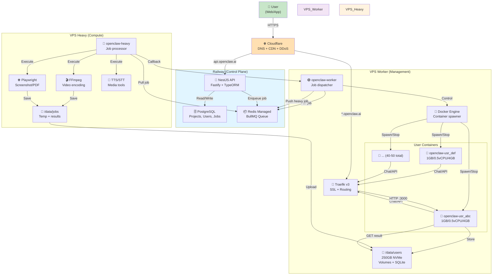
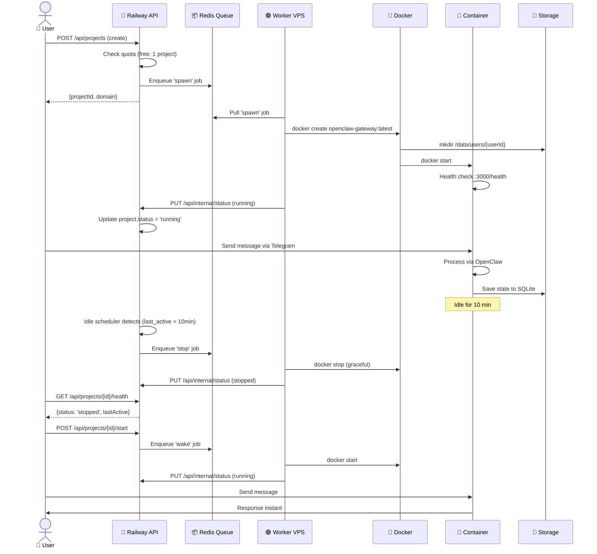
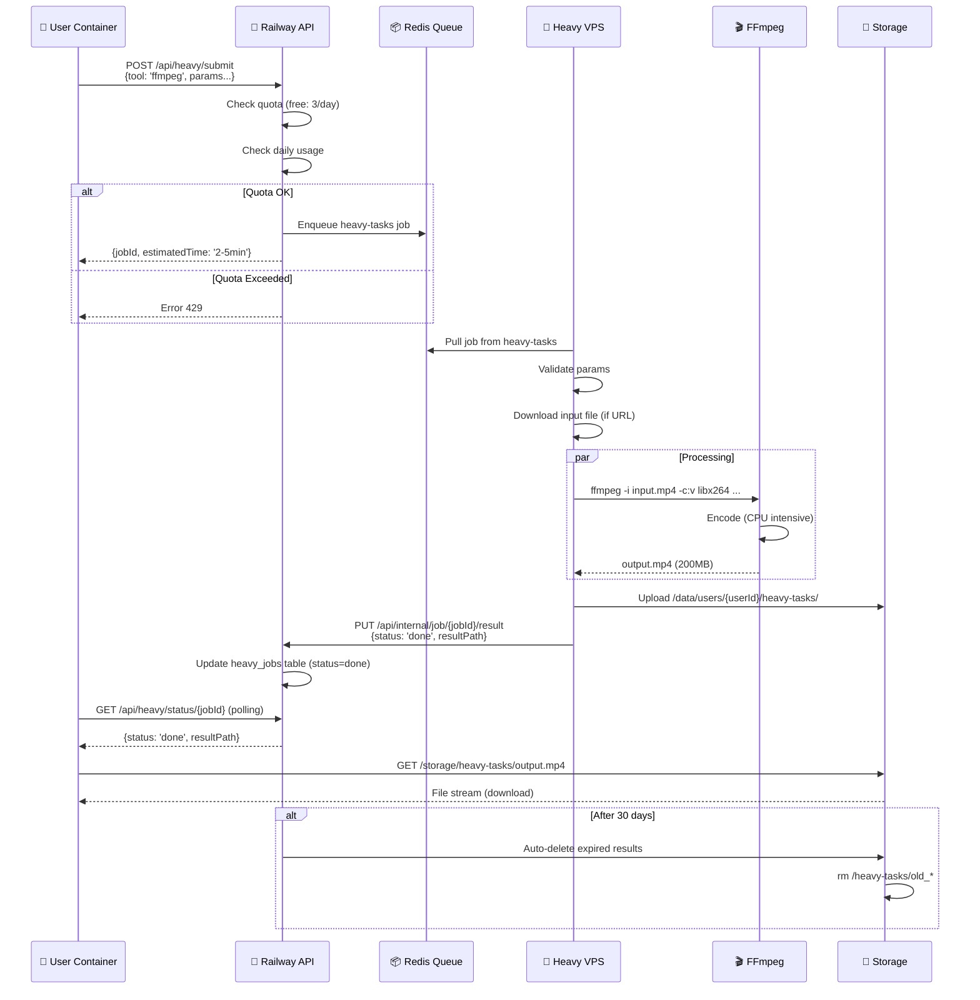
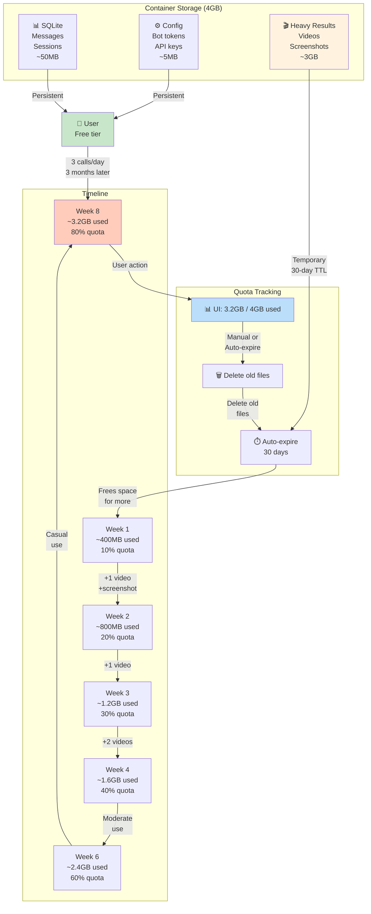
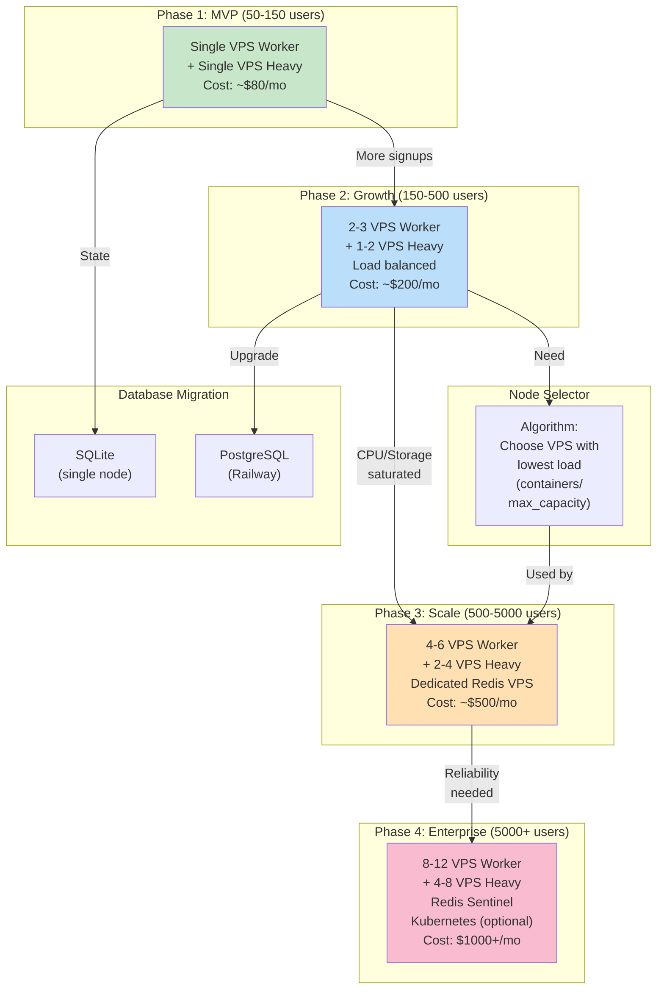
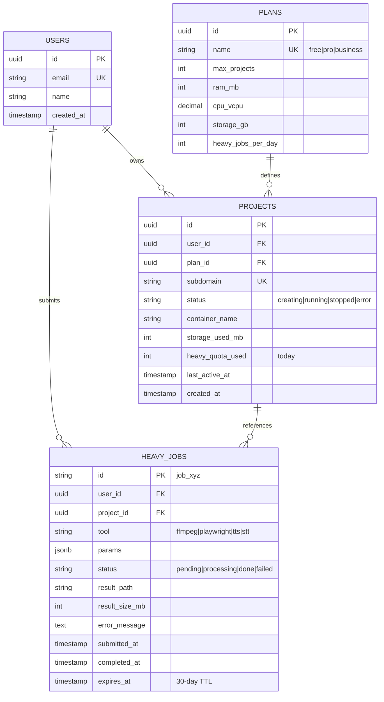
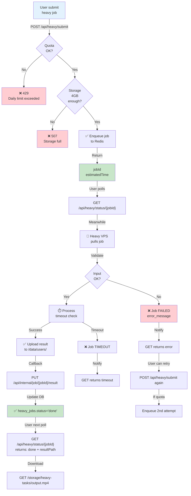

# OpenClaw SaaS — Architecture Diagrams (Mermaid)

---

## 1. System Architecture Overview (MVP)



---

## 2. User Container Lifecycle



---

## 3. Heavy Task Processing Flow



---

## 4. Version Management & Update Workflow

```mermaid
graph LR
    subgraph "Month 1"
        Check["📅 Week 1<br/>Monitor upstream<br/>git log origin/main"]
        Review["📋 Week 2<br/>Review changes<br/>git diff"]
        Build["🔨 Week 3<br/>Build images<br/>./build.sh 2026.5.0"]
        Test["✅ Week 3<br/>Test locally<br/>docker run"]
        Deploy["🚀 Week 4<br/>Deploy to prod<br/>./deploy.sh"]
    end
    
    Check -->|Found v2026.5.0| Review
    Review -->|Approved| Build
    Build -->|Success| Test
    Test -->|Pass| Deploy
    
    subgraph "Images"
        WorkerImg["🟢 openclaw-worker<br/>v2026.5.0<br/>~400MB"]
        HeavyImg["🔴 openclaw-heavy<br/>v2026.5.0<br/>~800MB"]
    end
    
    Build -->|Create| WorkerImg
    Build -->|Create| HeavyImg
    
    subgraph "Deployment"
        PushReg["📤 Push to registry"]
        DeployWorker["🟢 Deploy Worker VPS"]
        DeployHeavy["🔴 Deploy Heavy VPS"]
        Monitor["📊 Monitor 24h"]
        Done["✨ Complete"]
    end
    
    Deploy -->|Push| PushReg
    PushReg -->|docker pull| DeployWorker
    DeployWorker -->|docker pull| DeployHeavy
    DeployHeavy -->|Health check| Monitor
    Monitor -->|No issues| Done
    
    subgraph "Rollback"
        Issue["⚠️ Issue found"]
        Rollback["🔄 Rollback 2026.4.5"]
        Alert["🚨 Post-mortem"]
    end
    
    Monitor -->|Failure| Issue
    Issue -->|./rollback.sh| Rollback
    Rollback -->|Fix + retest| Alert
    
    style WorkerImg fill:#c3e9ff
    style HeavyImg fill:#ffe0b2
    style Done fill:#c8e6c9
    style Issue fill:#ffcdd2
```

---

## 5. Storage & Quota Management



---

## 6. Scaling: MVP → Multi-VPS



---

## 7. Database Schema Relationships



---

## 8. Request Flow: Submit Heavy Job



---

## 9. Idle Detection & Auto-Wake

```mermaid
timeline
    title Container Lifecycle with Idle Detection
    
    section Day 1
    00:00 : Container created : Status: running
    08:00 : User chat : last_active_at updated
    12:00 : User idle (4h) : Still running
    
    section Day 2
    06:00 : Idle check (last_active > 10min) : Scheduler runs
    06:05 : Auto-stop triggered : docker stop (graceful)
          : Status changed to: stopped
    
    section Day 3
    10:00 : User returns : GET /health
          : Status: stopped
    10:01 : User action : POST /projects/{id}/start
          : docker start (10s)
    10:02 : Container healthy : Status: running
    10:03 : User instant response : Chat works
    
    section Day 4
    (repeat idle → stop → wake cycle)
```

---

## 10. Cost Breakdown (MVP Phase)


---

## 11. Error Handling & Retry Logic

```mermaid
stateDiagram-v2
    [*] --> Submitted: POST /submit
    
    Submitted --> Queued: Enqueued to Redis
    Queued --> Processing: Worker pulls job
    
    Processing --> Success: Job completes
    Processing --> Timeout: >5min (FFmpeg)
    Processing --> Failed: Error (codec, OOM, etc)
    
    Success --> Done: Result uploaded
    Timeout --> Failed: Retry? (user decision)
    Failed --> Retryable: User retries<br/>(counts quota)
    
    Retryable --> Queued: Resubmit job
    
    Done --> [*]: Download result
    
    Failed --> [*]: Show error
    
    note right of Timeout
        User sees:
        "Job timeout after 5min"
        Can retry now or later
    end
    
    note right of Failed
        User sees:
        Error details from Heavy VPS
        Example: "Unsupported codec H.265"
    end
```

---

Generated: April 18, 2026  
All diagrams are Mermaid-compatible  
Copy-paste directly into:
- GitHub README
- Mermaid Live Editor (mermaid.live)
- Notion, Confluence, etc
