# OpenClaw SaaS — Architecture Diagrams (Updated)

Updated: April 21, 2026 | Based on actual implementation

---

## 1. System Architecture (Current Implementation)

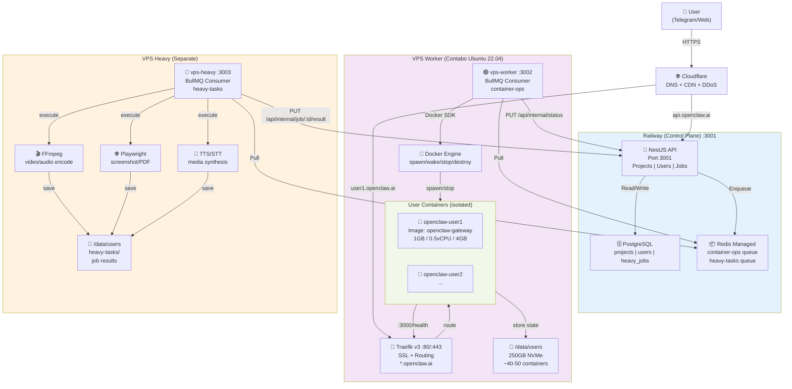

---

## 2. Monorepo Directory Structure

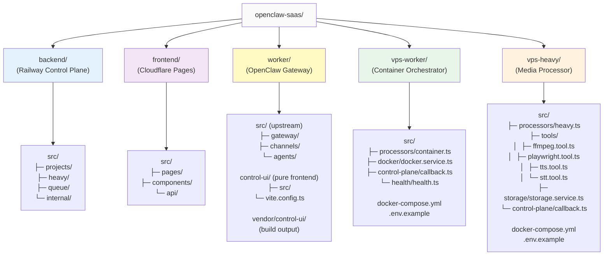

---

## 3. Queue & Job Flow

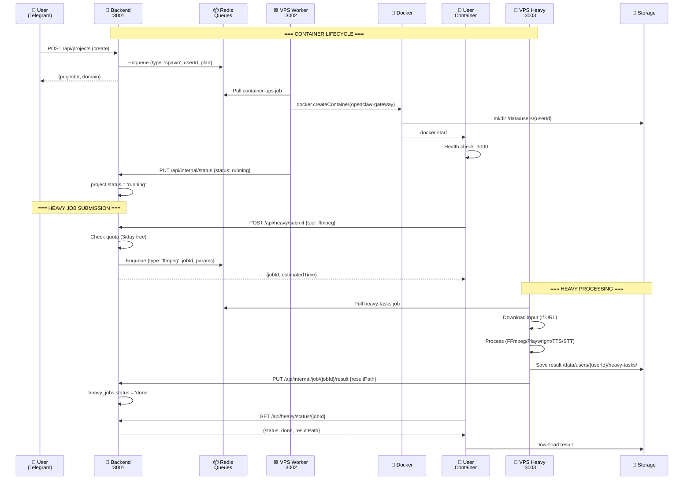

---

## 4. Container Spawn Detailed Flow

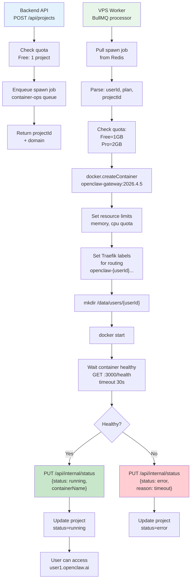

---

## 5. Heavy Job Processing Detailed Flow

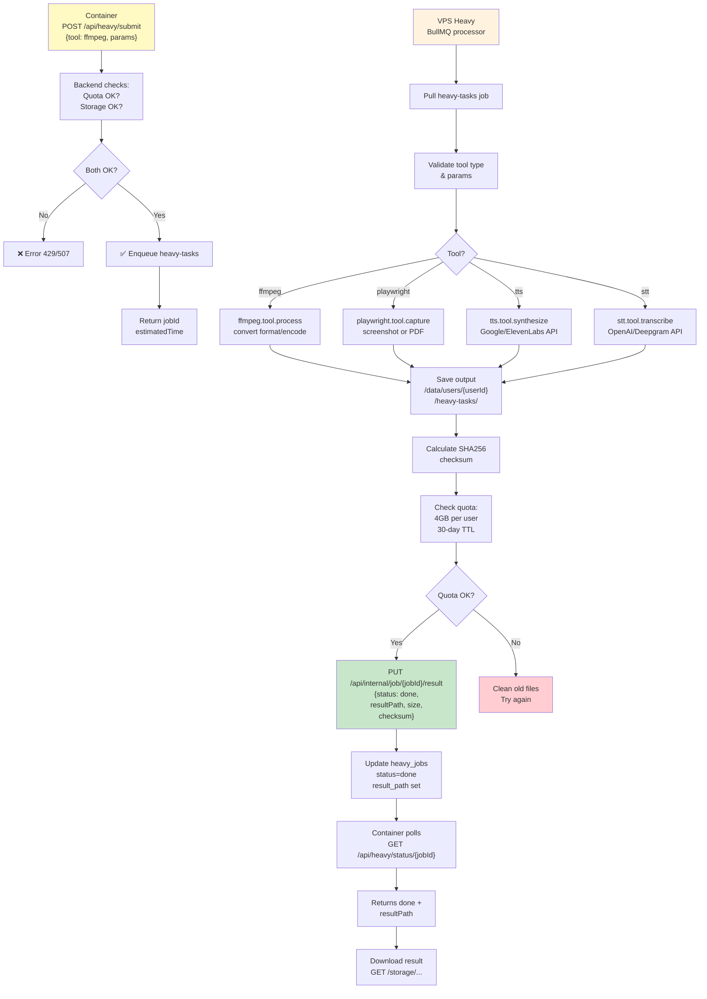

---

## 6. vps-worker Docker Compose Stack

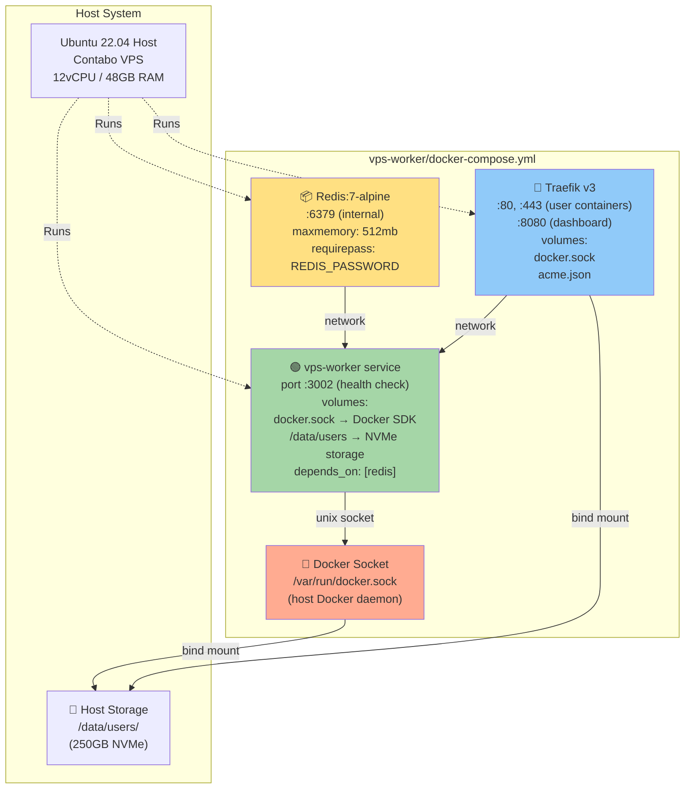

---

## 7. vps-heavy Docker Compose Stack

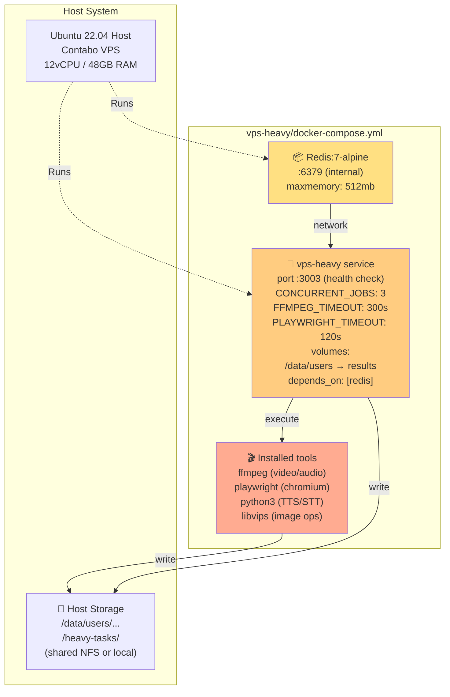

---

## 8. API Endpoints Reference

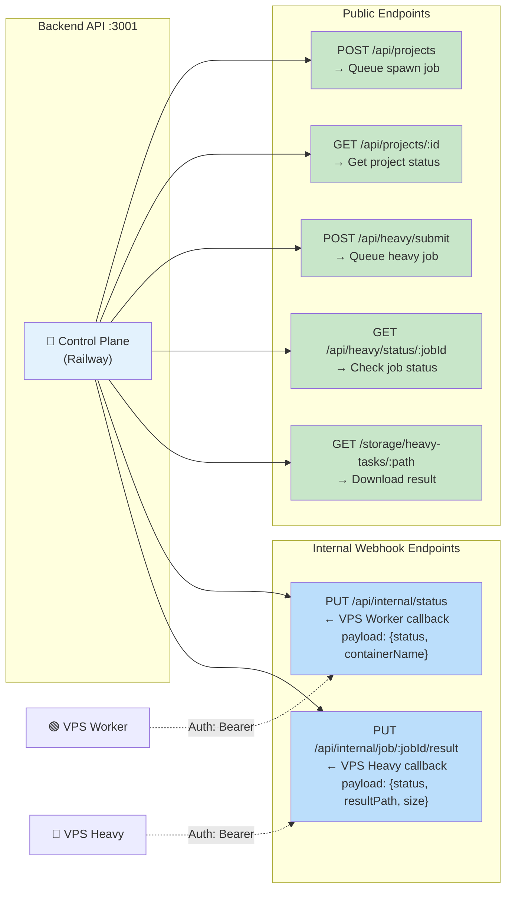

---

## 9. Job Payload Schemas

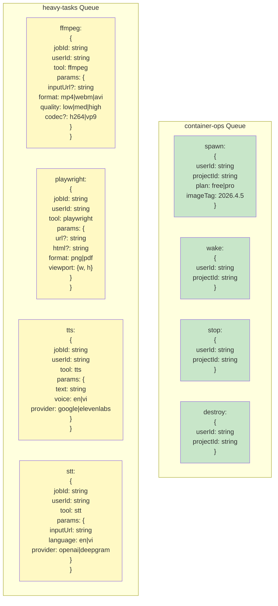

---

## 10. Storage Architecture

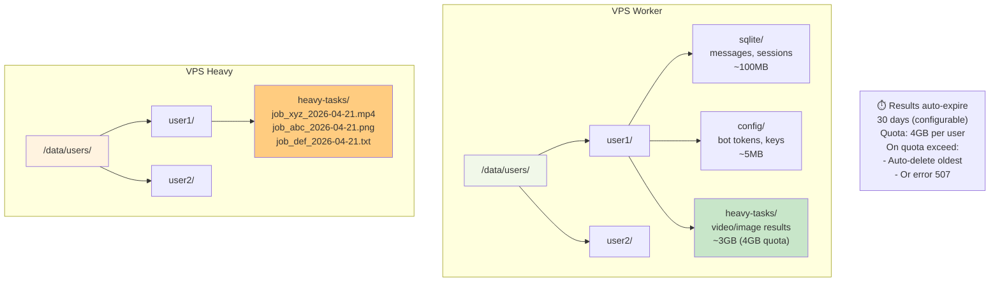

---

## 11. Deployment Timeline

```mermaid
timeline
    title MVP → Production Pipeline
    
    section Phase 1: Dev
    Local Test : vps-worker dev mode :3002
           : vps-heavy dev mode :3003
           : Manual job queueing via Redis CLI
           : All on localhost
    
    section Phase 2: Docker Build
    Build Worker : docker build vps-worker/
                 : tag: openclaw-worker:2026.4.5
    Build Heavy  : docker build vps-heavy/
                 : tag: openclaw-heavy:2026.4.5
    Build Gateway: docker build worker/
                 : tag: openclaw-gateway:2026.4.5
    
    section Phase 3: Staging
    Deploy Worker : docker-compose up (staging)
    Deploy Heavy  : docker-compose up (staging)
    Deploy API    : Railway push (staging)
    Test Full Flow: POST /api/projects → container spawn
                  : POST /api/heavy/submit → ffmpeg
    
    section Phase 4: Production
    Prod Worker   : Deploy to Contabo VPS Worker
    Prod Heavy    : Deploy to Contabo VPS Heavy
    Prod API      : Railway production
    Monitor       : Health checks every 30s
                  : Log aggregation (ELK or Grafana)
                  : On-call alerts (pagerduty)
```

---

## 12. Container Resource Limits

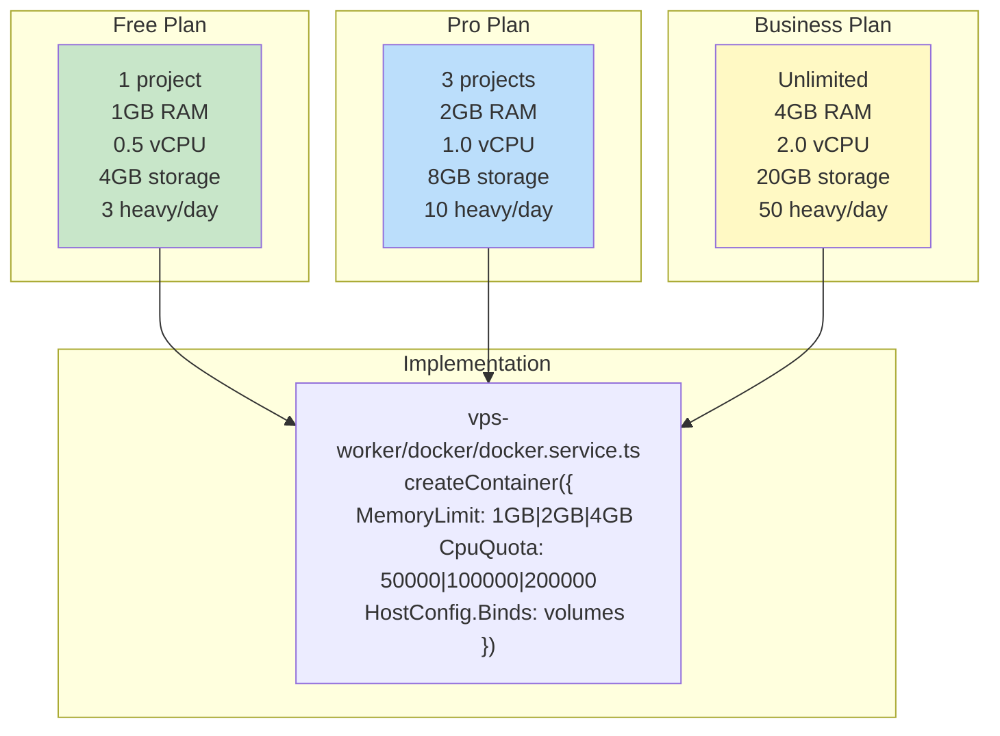

---

## Quick Reference Table

| Component | Port | Host | Timeout | Status |
|-----------|------|------|---------|--------|
| Backend API | 3001 | Railway | - | ✅ Done |
| VPS Worker | 3002 | Contabo | - | ✅ Impl |
| VPS Heavy | 3003 | Contabo | - | ✅ Impl |
| Traefik (user containers) | 80/443 | VPS Worker | - | ✅ Impl |
| Redis (worker) | 6379 | Localhost | - | ✅ Setup |
| Redis (heavy) | 6379 | Localhost | - | ✅ Setup |
| FFmpeg timeout | - | VPS Heavy | 300s | ✅ Config |
| Playwright timeout | - | VPS Heavy | 120s | ✅ Config |
| Container health check | 3000 | User Container | 30s | ✅ Impl |

---

## Status: ARCHITECTURE_DIAGRAMS.md

✅ **Diagrams are mostly accurate** for:
- System architecture (components, connections)
- Queue structure (container-ops, heavy-tasks)
- API endpoints

⚠️ **Need updates for:**
- [x] Actual port numbers (3001, 3002, 3003)
- [x] Queue names (container-ops, heavy-tasks)
- [x] Storage paths (/data/users, /data/users/.../heavy-tasks/)
- [x] Docker-compose stacks details
- [x] Timeout values (FFmpeg 300s, Playwright 120s)
- [x] Job payload schemas
- [x] Monorepo structure diagram

**This file has been updated ✅ on April 21, 2026**

---

## 13. Upstream Version Update Workflow

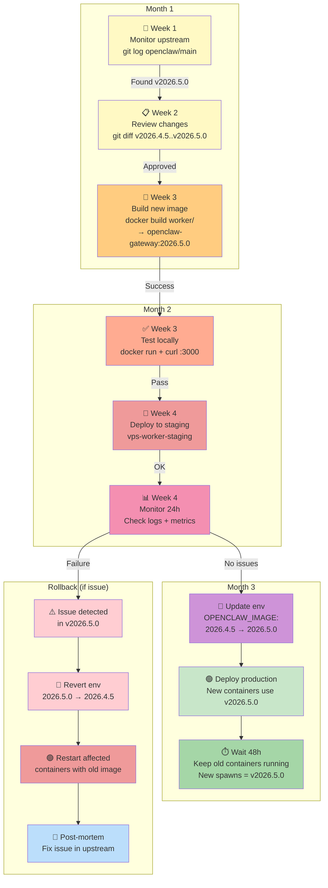

### Version Update Checklist:

```
Pre-Update:
☐ Review upstream CHANGELOG
☐ Test locally (docker run)
☐ Check for breaking changes
☐ Update dependencies if needed

During Update:
☐ Build new Docker image
☐ Tag: openclaw-gateway:YYYY.MM.DD
☐ Push to registry
☐ Update docker-compose.yml / env var
☐ Document changes in DEPLOY_LOG.md

Post-Update (First 48h):
☐ Monitor application logs
☐ Check container health metrics
☐ Monitor user reports (Slack/email)
☐ Verify no data loss
☐ CPU/Memory usage normal?

If Issue Found:
☐ Revert OPENCLAW_IMAGE env var
☐ Restart containers (they pull old image)
☐ Verify users can access
☐ Post-mortem: what went wrong?
☐ Coordinate with upstream for fix
```

---

## 14. Image Versioning Strategy

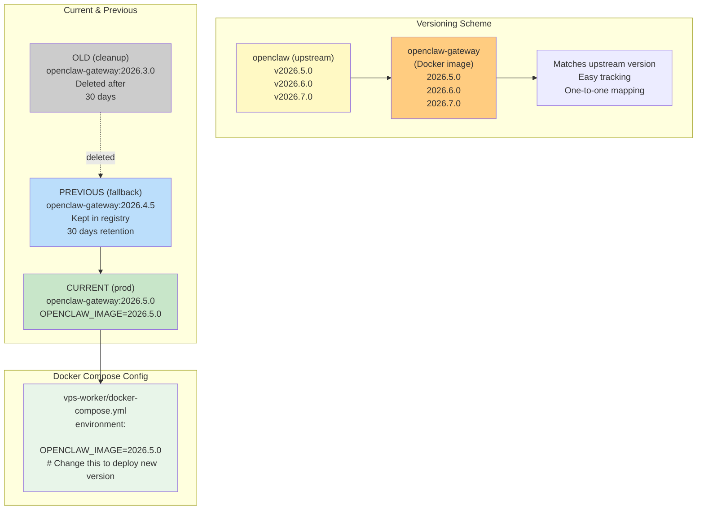

---

Generated by: claude-code | Last updated: April 21, 2026
