# OpenClaw Gateway Architecture Explained (ELI5)

**Simplified guide to understand: worker, vps-worker, vps-heavy, and backend communication**

---

## The Big Picture (Dễ hiểu nhất)

Imagine a restaurant:

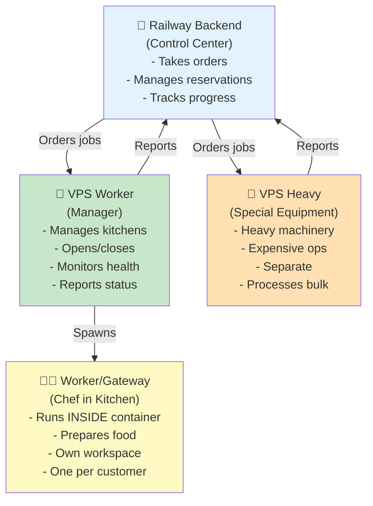

---

## Real Architecture Mapping

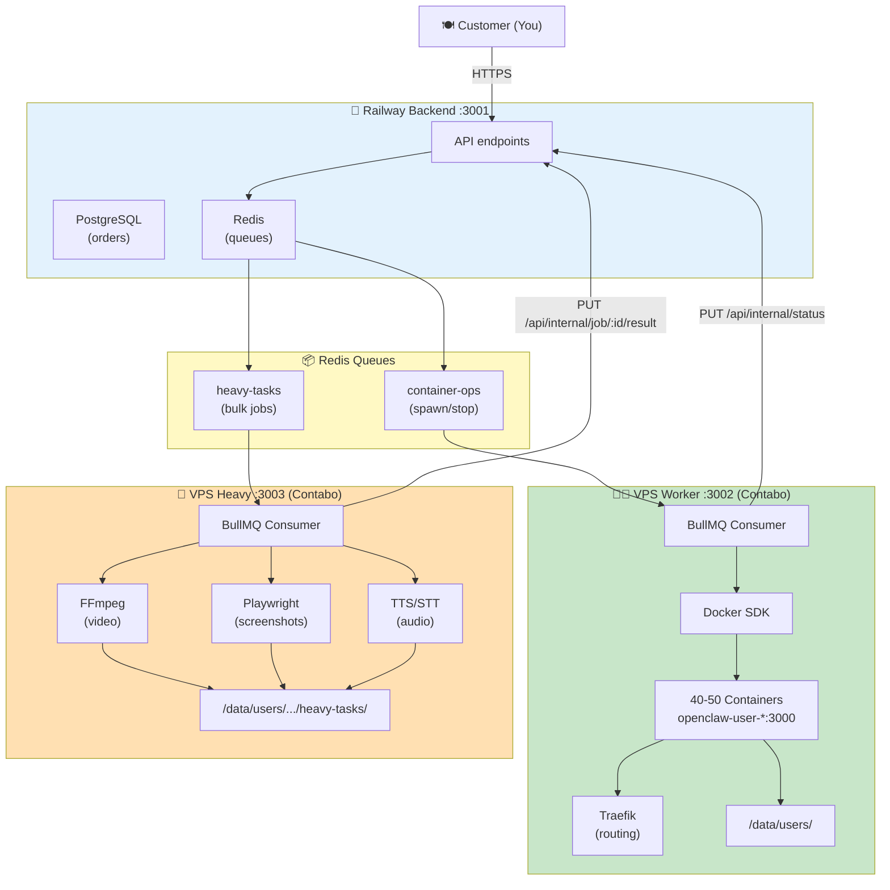

---

## Three Services Explained

### 1. 👨‍🍳 WORKER (Gateway Application)

**What it is:**
- OpenClaw gateway app that runs INSIDE user containers
- Provided by upstream OpenClaw project
- Not built by us, we just pull upstream updates

**Where it lives:**
```
worker/src/          ← Source code from upstream
  ├─ gateway/        ← HTTP server
  ├─ channels/       ← Telegram, Discord, etc integrations
  ├─ agents/         ← AI logic
  └─ ...
  
↓ docker build worker/
↓ (creates image)

📦 Docker Image Registry
   openclaw-gateway:2026.4.5
   (1.2GB, ready to run)
```

**What it does (at runtime):**
```
User sends message via Telegram
  ↓
Message reaches backend
  ↓
Backend routes to container via Traefik
  ↓
👨‍🍳 Gateway app processes message
  ├─ Parse intent
  ├─ Call AI models
  ├─ Generate response
  └─ Save to SQLite
  ↓
Response sent back to user
```

**Environment:**
```
Gateway container runs at :3000
Port :3000 (internal, inside container)
  ↓ NOT accessible directly
  ↓ Only via Traefik routing (user1.openclaw.ai → container:3000)
```

**Database:**
```
Each container has own SQLite at:
/data/users/{userId}/db/messages.db
  ├─ User messages history
  ├─ Sessions
  ├─ Config
  └─ Isolated from other users ✅
```

**Control-UI Dashboard:**
```
Gateway also serves the web dashboard
GET user1.openclaw.ai/
  ↓
Gateway serves /vendor/control-ui/ (static files)
  ├─ index.html (built by Vite)
  ├─ src/main.ts (JS app)
  └─ ...assets
  ↓
Browser runs control-ui (frontend)
  ↓
control-ui calls /api/* endpoints
  ↓
Gateway processes requests
```

---

### 2. 🟢 VPS-WORKER (Container Orchestrator)

**What it is:**
- Service that MANAGES containers
- Runs on Contabo VPS Worker (12vCPU, 48GB RAM)
- Our code (not upstream)
- Listens to Redis queue for container operations

**What it does:**

#### A. Spawn (Create Container)

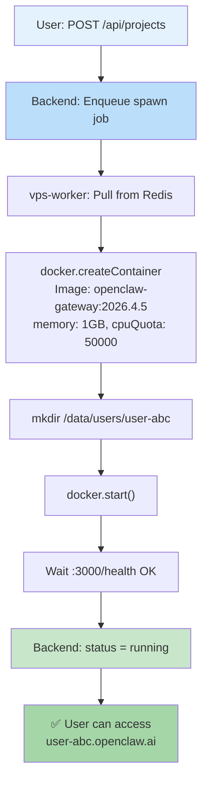

#### B. Wake (Start Stopped Container)

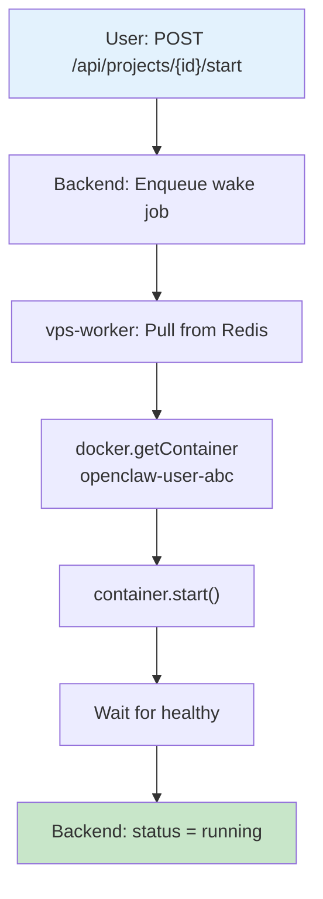

#### C. Stop (Graceful Shutdown)

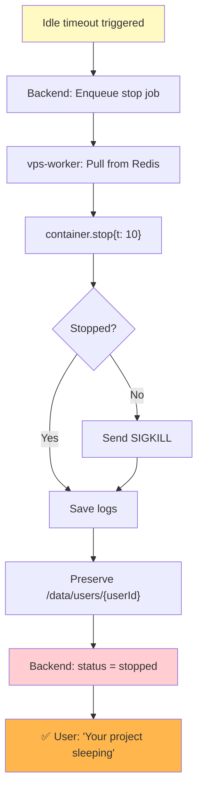

#### D. Destroy (Delete Container)

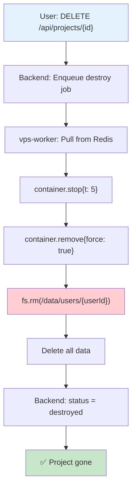

**Network Architecture:**

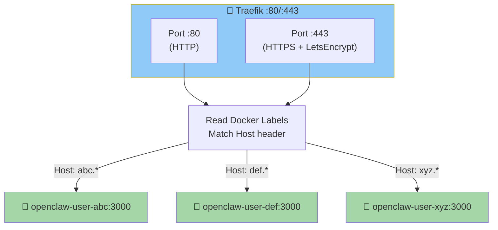

**Storage:**

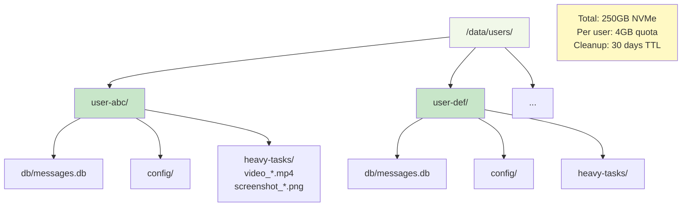

---

### 3. 🔴 VPS-HEAVY (Expensive Processor)

**What it is:**
- Separate service for CPU-intensive tasks
- Runs on Contabo VPS Heavy (12vCPU, 48GB RAM)
- Our code (not upstream)
- Listens to Redis queue for heavy-tasks

**What it does:**

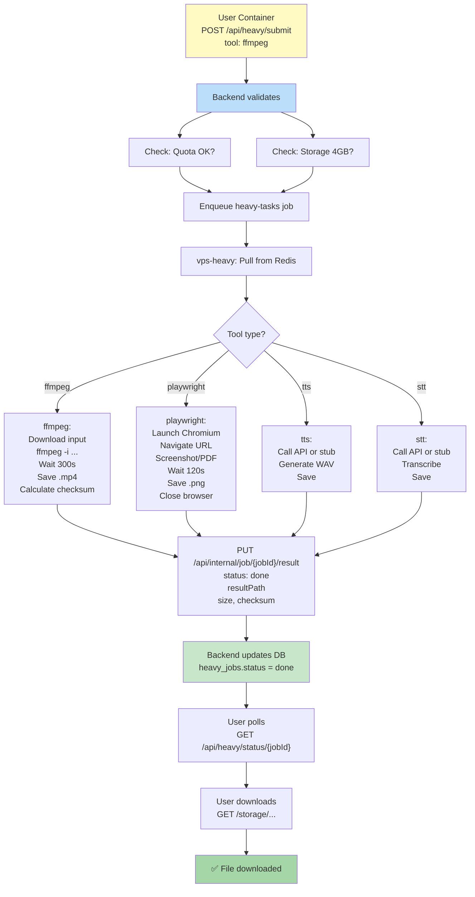

**Concurrency:**
```
Max 3 concurrent jobs (configurable)
Each job gets timeout:
  FFmpeg: 300s (5 min)
  Playwright: 120s (2 min)
  TTS: 120s (2 min)
  STT: 300s (5 min)

If job times out:
  ├─ Process killed
  ├─ Callback: {status: 'failed', error: 'timeout'}
  └─ User can retry (counts toward quota)
```

---

## Communication Flow (Complete)

### Scenario: User Creates Project

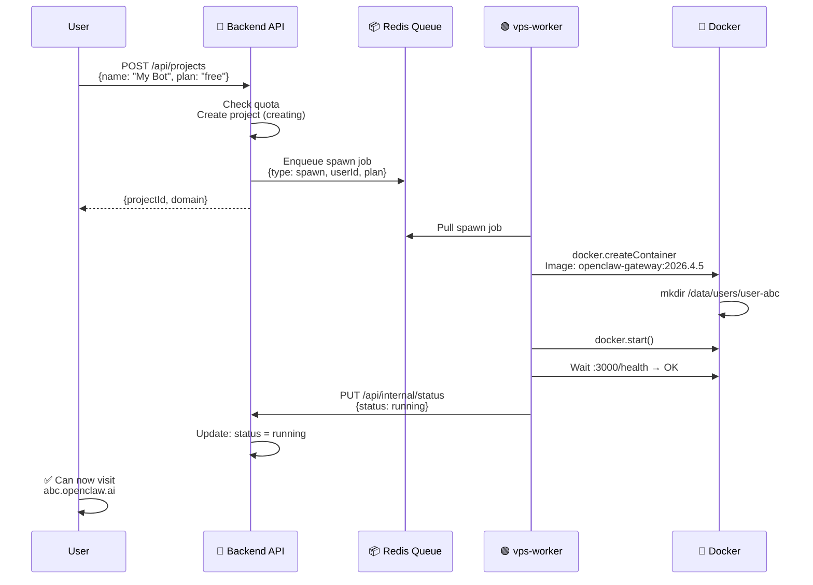

### Scenario: User Submits Heavy Job

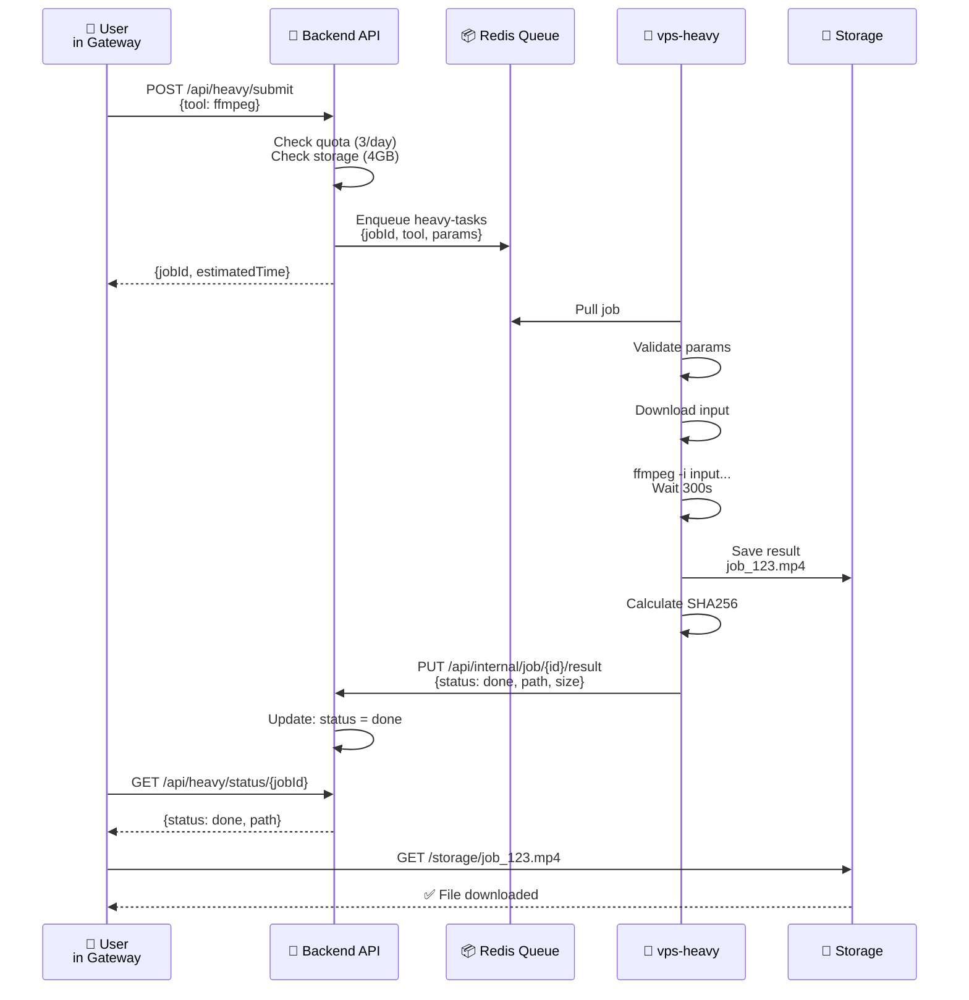

---

## Key Separation of Concerns

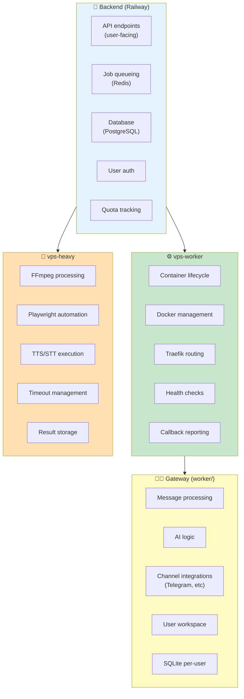

---

## Important: They Don't Import Each Other

```
❌ WRONG:
vps-worker/package.json imports worker/src
vps-heavy/package.json imports vps-worker/src

✅ RIGHT:
worker/     → built to Docker image (independent)
vps-worker  → references image by NAME only
vps-heavy   → standalone service
backend     → manages all via queues

Communication: Redis queues + HTTP webhooks only!
```

---

## Summary Table

| Component | Runs On | Language | Purpose | Talks To |
|-----------|---------|----------|---------|----------|
| **worker** | User Container | TypeScript | Process messages | Backend (API calls) |
| **vps-worker** | VPS Worker | TypeScript | Manage containers | Redis, Docker, Backend |
| **vps-heavy** | VPS Heavy | TypeScript | Heavy processing | Redis, Backend |
| **backend** | Railway | NestJS | Control plane | All services, Users |

---

## Visual: Complete Message Flow

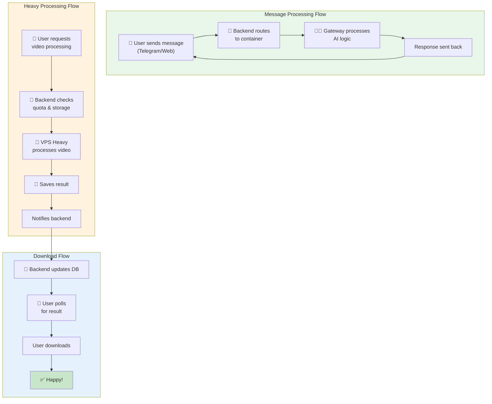

---

**Next Steps:**
- Read: [ARCHITECTURE_DIAGRAMS.md](./ARCHITECTURE_DIAGRAMS.md) for detailed diagrams
- Read: [UPSTREAM_UPDATE_GUIDE.md](./UPSTREAM_UPDATE_GUIDE.md) for updating gateway
- Read: [vps-worker/README.md](./vps-worker/README.md) for container details
- Read: [vps-heavy/README.md](./vps-heavy/README.md) for processing details
