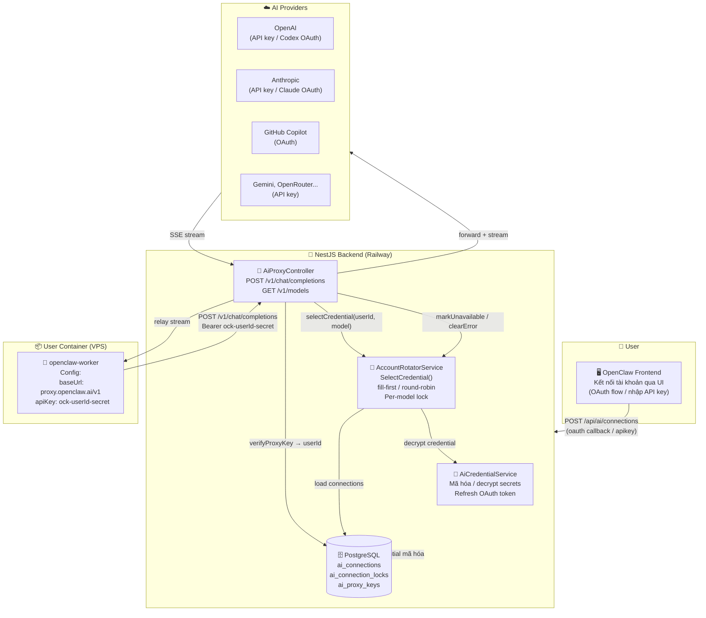
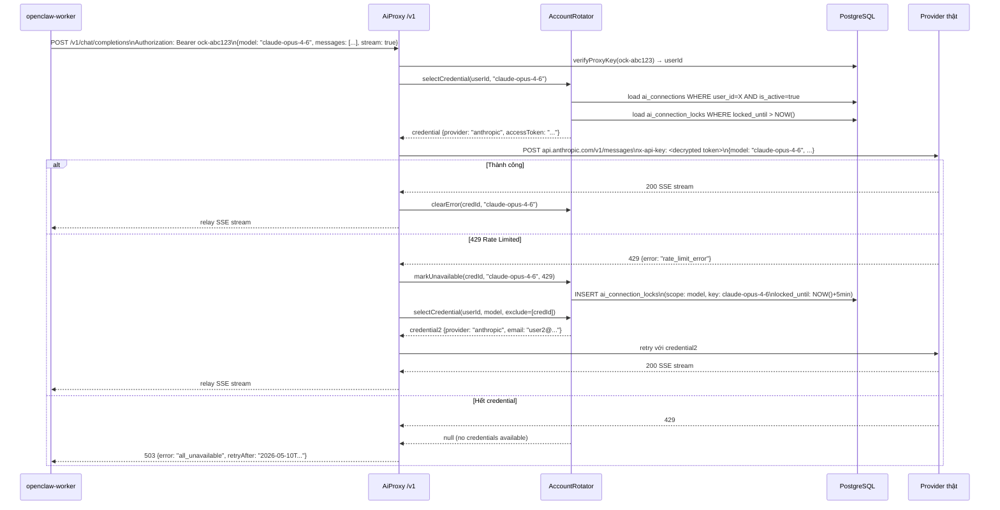
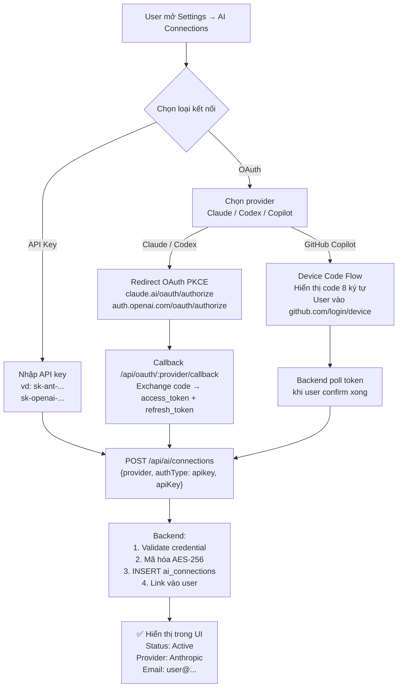
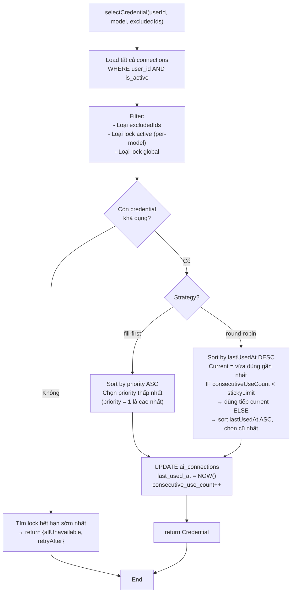

# OpenClaw AI Rotation Plan

> Cập nhật: 2026-05-10  
> Mục tiêu: User kết nối tài khoản AI (OAuth hoặc API key) qua UI. Hệ thống tự xoay credential, failover khi hết quota. Container không cần biết provider thật — chỉ trỏ vào 1 proxy endpoint trung tâm.

---

## 1. Kiến trúc tổng thể



---

## 2. Luồng request end-to-end



---

## 3. Luồng user kết nối tài khoản



---

## 4. Rotation logic (AccountRotatorService)



---

## 5. Data Model (PostgreSQL)

### `ai_connections` — credentials của user

| Column | Type | Mô tả |
|---|---|---|
| `id` | uuid PK | |
| `user_id` | uuid FK, index | |
| `provider` | text | `openai`, `anthropic`, `github`, `google`... |
| `auth_type` | text | `oauth` \| `apikey` |
| `display_name` | text | Tên hiển thị (email hoặc user đặt) |
| `access_token_enc` | text nullable | OAuth access token, mã hóa AES-256 |
| `refresh_token_enc` | text nullable | OAuth refresh token, mã hóa AES-256 |
| `api_key_enc` | text nullable | API key, mã hóa AES-256 |
| `expires_at` | timestamptz | Token hết hạn |
| `is_active` | boolean | default true |
| `priority` | int | default 100 (số thấp = ưu tiên cao) |
| `last_used_at` | timestamptz | |
| `consecutive_use_count` | int | |
| `last_error` | text | |
| `last_error_at` | timestamptz | |
| `backoff_level` | int | 0-4, tính backoff duration |
| `created_at`, `updated_at` | timestamptz | |

### `ai_connection_locks` — per-model / per-provider cooldown

| Column | Type | Mô tả |
|---|---|---|
| `id` | uuid PK | |
| `connection_id` | uuid FK, index | |
| `scope_type` | text | `model` \| `provider` \| `global` |
| `scope_key` | text | Vd: `claude-opus-4-6`, `anthropic`, `*` |
| `locked_until` | timestamptz, index | Tự expire |
| `error_code` | int | HTTP status gây ra lock |
| `reason` | text | Error message gốc |
| `created_at` | timestamptz | |

### `ai_proxy_keys` — virtual key của container

| Column | Type | Mô tả |
|---|---|---|
| `id` | uuid PK | |
| `user_id` | uuid FK | |
| `project_id` | uuid FK nullable | Gắn vào project/container cụ thể |
| `key_hash` | text unique | SHA-256 của key thật |
| `key_prefix` | text | `ock-` + 8 chars để hiển thị |
| `is_active` | boolean | |
| `created_at`, `last_used_at` | timestamptz | |

---

## 6. Services NestJS

### `AiProxyController`
- `POST /v1/chat/completions` — main endpoint, nhận request từ container
- `GET /v1/models` — trả danh sách model khả dụng theo pool của user
- Verify proxy key → gọi `proxyWithRotation()`

### `AccountRotatorService`
- `selectCredential(userId, model, options)` — chọn credential tốt nhất
- `markUnavailable(credId, model, status, reason)` — tạo lock + tăng backoff
- `clearError(credId, model)` — xóa lock đã hết hạn
- `getSoonestExpiry(userId, model)` — trả retry-after cho client
- Strategy: `fill-first` (default) hoặc `round-robin` + sticky limit

### `AiCredentialService`
- Mã hóa/decrypt AES-256-GCM với master key từ env
- `refreshOAuthToken(connection)` — gọi token endpoint, cập nhật DB
- Auto-refresh trước khi token hết hạn 5 phút

### `ProviderForwarderService`
- `buildRequest(model, body, cred)` — map sang format của provider thật
- Handle Anthropic Messages API (khác format OpenAI)
- Relay SSE stream về client
- Normalize model name (bỏ prefix nếu có)

---

## 7. Proxy function — pseudocode

```typescript
async proxyWithRotation(userId, body, res, excludedIds = new Set(), attempt = 1) {
  const MAX_ATTEMPTS = 5
  if (attempt > MAX_ATTEMPTS) {
    return res.status(503).json({ error: 'max_retries_exceeded' })
  }

  const cred = await rotator.selectCredential(userId, body.model, { excludedIds })

  if (!cred || cred.allUnavailable) {
    return res.status(503).json({
      error: 'all_credentials_unavailable',
      retryAfter: cred?.retryAfter ?? null,
    })
  }

  const upstream = forwarder.buildRequest(body.model, body, cred)

  const providerRes = await fetch(upstream.url, upstream.options)

  if ([429, 401, 403, 503].includes(providerRes.status)) {
    const errText = await providerRes.text()
    await rotator.markUnavailable(cred.id, body.model, providerRes.status, errText)
    excludedIds.add(cred.id)
    return proxyWithRotation(userId, body, res, excludedIds, attempt + 1)
  }

  await rotator.clearError(cred.id, body.model)
  return forwarder.relayStream(providerRes, res)
}
```

---

## 8. Backoff rules

| HTTP Status | Loại lỗi | Scope lock | Backoff |
|---|---|---|---|
| `429` | Rate limit | Per-model | 1m → 5m → 25m → 60m |
| `401` | Unauthorized | Provider | Trigger refresh → fallback nếu fail |
| `403` | Quota / forbidden | Provider hoặc global | 30m → 2h → 6h |
| `5xx` | Server error | Per-model | 30s → 2m |
| Thành công | - | Xóa lock model này | Reset nếu không còn lock |

---

## 9. Container config (inject khi spawn)

```json5
// openclaw.json được inject vào container khi spawn
{
  models: {
    providers: {
      openai: {
        baseUrl: "https://proxy.openclaw.ai/v1",
        apiKey: "ock-{userId}-{secret}",
      }
    }
  },
  agents: {
    defaults: {
      model: {
        primary: "openai/claude-opus-4-6",   // proxy tự route đến Anthropic
        fallbacks: ["openai/gpt-5.5"]        // proxy tự route đến OpenAI
      }
    }
  }
}
```

Container không biết gì về provider thật. Proxy key được gen khi tạo project, lưu hash vào `ai_proxy_keys`, inject một lần khi spawn.

---

## 10. API endpoints

| Endpoint | Auth | Mô tả |
|---|---|---|
| `POST /api/ai/connections` | user JWT | Thêm credential (API key hoặc OAuth) |
| `GET /api/ai/connections` | user JWT | Liệt kê connections của user |
| `PATCH /api/ai/connections/:id` | user JWT | Bật/tắt, đổi priority |
| `DELETE /api/ai/connections/:id` | user JWT | Xóa credential |
| `GET /api/oauth/:provider` | user JWT | Bắt đầu OAuth flow |
| `GET /api/oauth/:provider/callback` | public | OAuth callback |
| `POST /v1/chat/completions` | proxy key | Proxy endpoint cho container |
| `GET /v1/models` | proxy key | Danh sách model khả dụng |

---

## 11. Kế hoạch triển khai

### Day 1-2 — Nền tảng
- Migration: `ai_connections`, `ai_connection_locks`, `ai_proxy_keys`
- CRUD connections (API key path trước)
- Mã hóa/decrypt AES-256-GCM

### Day 3 — Rotation core
- `AccountRotatorService`: `selectCredential`, `markUnavailable`, `clearError`
- Lock/backoff logic + test concurrency

### Day 4 — Proxy endpoint
- `AiProxyController`: `/v1/chat/completions`, `/v1/models`
- `ProviderForwarderService`: OpenAI + Anthropic format
- SSE stream relay

### Day 5 — OAuth
- OAuth flow cho Claude Code (PKCE)
- OAuth flow cho OpenAI Codex (PKCE)
- GitHub Copilot Device Code Flow
- Token refresh tự động

### Day 6 — Wiring với container
- Inject proxy config vào `openclaw.json` khi spawn
- Gen và lưu proxy key khi tạo project
- Test end-to-end: container → proxy → provider thật

### Day 7 — Hardening
- Test hết quota: xoay sang credential khác
- Test 401: trigger refresh, fallback nếu fail
- Test nhiều request đồng thời (race condition)
- Logs + metrics cơ bản

---

## 12. Out of scope (để sau)

- MITM proxy cho desktop tools
- Dashboard usage/cost chi tiết
- Cross-user shared pool
- Multi-region provider routing
- Provider: Gemini, Kiro, iFlow (thêm sau khi có core)
