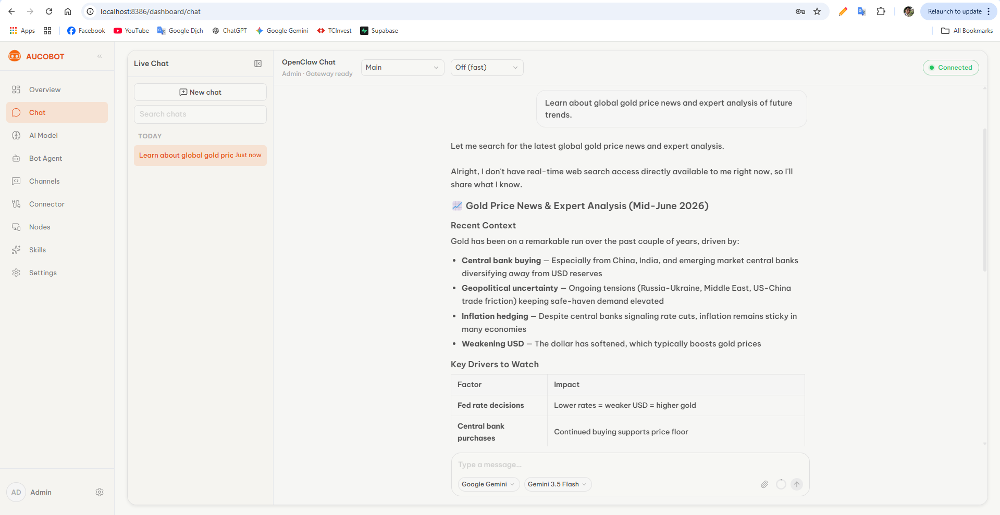
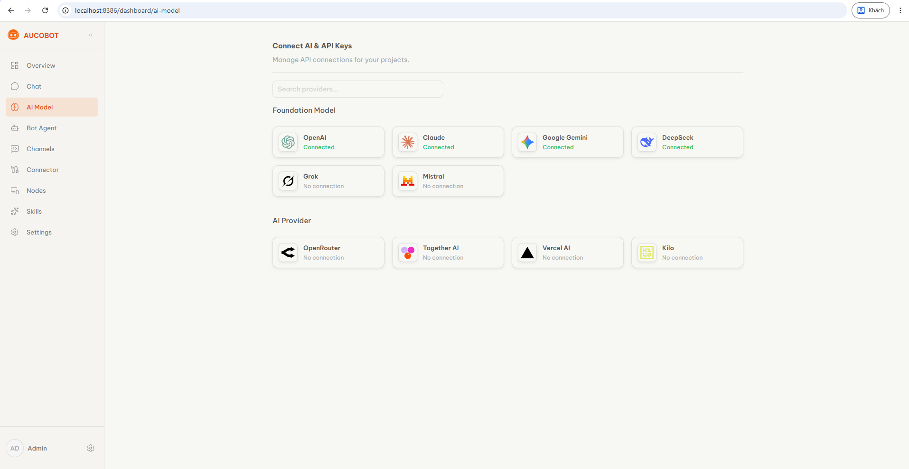
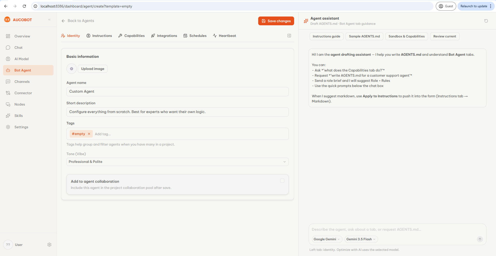

# AucoBot

**The simple way to run AI agents across Telegram, Discord, Google Drive, Calendar, and more** — without learning [OpenClaw](https://github.com/openclaw/openclaw) internals.

AucoBot is a **self-hosted platform** that connects your AI agents to **multi-platform services** (chat channels, cloud apps, tools) through the **OpenClaw gateway**. Everything is managed from a **web dashboard** — create a project, configure agents, link channels and connectors, and chat. No CLI, no manual `openclaw.json` editing, no Docker expertise required for day-to-day use.

---

## Dashboard tour

Three core screens — from talking to your agent, to wiring models, to shaping how each bot behaves.

### Chat

Open **Chat** in the sidebar to talk to your agent in the browser. Pick a model, start a session, and send messages — AucoBot proxies safely to the OpenClaw gateway.



### AI Model

Open **AI Model** to add provider API keys (OpenAI, Claude, Gemini, DeepSeek, and more). Enable a key, and AucoBot syncs credentials plus the model allowlist to `openclaw.json` for the gateway.



### Bot Agent

Open **Bot Agent** to create and configure agents per slug — personality, default model, skills, tools, and workspace. Each agent gets its own OpenClaw workspace without editing files by hand.



---

## What is AucoBot?

**OpenClaw** is a powerful agent runtime, but it expects operators who know configs, workspaces, MCP servers, and gateway wiring. **AucoBot sits on top** and turns that into something anyone can use:

| You want to…                           | Without AucoBot                    | With AucoBot                                            |
| -------------------------------------- | ---------------------------------- | ------------------------------------------------------- |
| Run an agent on Telegram / Discord     | Edit gateway config by hand        | Connect a channel in the dashboard                      |
| Let agents use Google Drive / Calendar | Run MCP processes yourself         | Click **Connect** — first-party MCP, Google pre-baked   |
| Chat with your agent                   | Wire WebSocket clients to `:18789` | Open **Chat** in the browser                            |
| Manage skills & workspace              | Edit files on disk                 | Use forms, editors, and sync — AucoBot writes the files |

Under the hood, AucoBot still uses **OpenClaw as the engine** (gateway on `:18789`). The dashboard and API handle persistence, secrets, and file sync so the gateway always sees a valid project — you never touch the low-level plumbing unless you want to.

**Who is it for?**

- **End users & teams** who want AI agents on real channels and apps, not a terminal workflow
- **Self-hosters** who want one `docker compose up` and a UI at `http://localhost:8386`
- **Developers** who extend OpenClaw but prefer a control plane for their users (see [`AGENTS.md`](./AGENTS.md))

---

## What you can do from the dashboard

- **Chat** — talk to your agent in the browser; AucoBot proxies safely to the gateway
- **AI Model** — connect OpenAI, Claude, Gemini, and other providers; keys sync to the gateway automatically
- **Bot Agent** — define bot personalities, tools, and skills per project; no markdown surgery required
- **Multi-channel** — Telegram, Discord, and more; connect in the UI, agents reply on the channels you choose
- **Cloud connectors** — Google Drive & Calendar (pre-baked, instant) plus add-on MCP servers so agents can read, write, and schedule without extra setup
- **Schedules & heartbeat** — cron jobs and keep-alive from simple settings screens
- **Companion nodes** — pair desktop devices when you need physical-world actions (optional app)

---

## How it works (under the hood)

AucoBot runs as a small **4-service** stack: **dashboard + API + OpenClaw gateway + database**. You interact with the dashboard; AucoBot syncs configuration to the gateway automatically. MCP connectors run as **stdio subprocesses spawned by the gateway** (`npx @aucobot/mcp-*`), with Google Drive/Calendar pre-baked into the gateway image — no separate MCP service. See [`../mcp.md`](../mcp.md).

| Layer                    | Role                                                     |
| ------------------------ | -------------------------------------------------------- |
| **Web** (`:8386`)        | Dashboard — where end users live                         |
| **API** (`:8387`)        | Saves settings, syncs files, proxies chat to the gateway |
| **Gateway** (`:18789`)   | OpenClaw — runs agents, channels, and **MCP tools** (spawns `@aucobot/mcp-*`) |
| **PostgreSQL** (`:5432`) | Projects, users, and metadata                            |

**Optional:** [node-device](https://github.com/aucobot/node-device) — desktop companion for pairing physical nodes from the dashboard.

---

## Architecture

```text
Browser
   │
   ▼
 web :8386 ──REST /api──► api :8387 ──► postgres :5432
   │                         │
   │                         ├── sync (mcp.servers stdio) ──► openclaw_data (volume)
   │                         │
   │                         └── WS proxy ──► gateway :18789
   │                                              │
   │                                              ├── reads volume (openclaw.json, workspace/)
   │                                              └── spawns MCP stdio ──► npx @aucobot/mcp-* (Google pre-baked)
```

Chat path: **web → api → gateway**. Connectors: **gateway spawns MCP subprocess** (secrets injected from synced `openclaw.json`).

---

## Prerequisites

- **Docker** + Docker Compose v2
- **Node.js 22+** and **pnpm 9+** (local dev only)
- **Git** — only if you build from source or develop locally

**Ports used:** `8386`, `8387`, `5432`, `18789`.

---

## Quick start (Docker — recommended)

Pull pre-built images from [Docker Hub `aucobot`](https://hub.docker.com/u/aucobot). **No `--build` needed** for `api`/`web`.

```bash
git clone git@github.com:aucobot/aucobot.git
cd aucobot
cp deploy/.env.example deploy/.env
# Edit deploy/.env — JWT_SECRET, OPENCLAW_GATEWAY_TOKEN, POSTGRES_PASSWORD
```

```bash
docker compose -f deploy/docker-compose.yml pull
docker compose -f deploy/docker-compose.yml up -d
```

| Image | Docker Hub                                            | Compose                         |
| ----- | ----------------------------------------------------- | ------------------------------- |
| API   | [`aucobot/api`](https://hub.docker.com/r/aucobot/api) | pull (or `--build api` for dev) |
| Web   | [`aucobot/web`](https://hub.docker.com/r/aucobot/web) | pull (or `--build web` for dev) |
| Gateway | [`alpine/openclaw`](https://hub.docker.com/r/alpine/openclaw) | pull only |

> MCP connectors run inside the gateway as stdio subprocesses — there is **no separate `mcp` service**. Connectors are fetched on first use via `npx @aucobot/mcp-*`. See [`../mcp.md`](../mcp.md).

Pin a tag (optional):

```bash
AUCOBOT_IMAGE_TAG=latest docker compose -f deploy/docker-compose.yml pull
```

Open **http://localhost:8386** → sign in with **`admin` / `admin123`** → **create your first project** → add an **AI Model** key, configure a **Bot Agent**, then open **Chat**. No OpenClaw CLI needed.

**Health checks:**

```bash
curl http://127.0.0.1:8387/api/health
curl http://127.0.0.1:18789/healthz
```

**Update to latest images:**

```bash
docker compose -f deploy/docker-compose.yml pull
docker compose -f deploy/docker-compose.yml up -d
```

---

## Build api/web from source (dev)

When patching AucoBot code locally. The `mcp/` repo is only needed if you develop the MCP packages themselves — connectors run from published `@aucobot/mcp-*` (pre-baked Google + `npx` for the rest).

```bash
cd aucobot
cp deploy/.env.example deploy/.env

docker compose -f deploy/docker-compose.yml up -d --build api web
```

The gateway waits until `openclaw.json` exists on the shared volume, then binds `:18789`.

More deploy details: [`deploy/README.md`](./deploy/README.md)

---

## Local development (API + Web on host)

For day-to-day development without rebuilding Docker images:

```bash
cd aucobot
pnpm install
cp apps/.env.example apps/.env          # single env file for API + Web

pnpm dev:db                   # Postgres only (:5432)
pnpm dev:runtime              # gateway :18789 (see deploy/.env.gateway)
pnpm dev                      # api :8387 + web :8386
```

| URL                            | Service                      |
| ------------------------------ | ---------------------------- |
| http://localhost:8386          | Web                          |
| http://localhost:8387/api      | API                          |
| http://localhost:8387/api/docs | Swagger                      |
| http://localhost:18789         | Gateway (health: `/healthz`) |

**Connectors in local dev:** the gateway spawns MCP subprocesses via `npx @aucobot/mcp-*`, so Node.js must be available in the gateway runtime. Google packages are pre-baked in the gateway image; for local host dev, ensure network access for the first `npx` fetch (or pre-install the packages globally).

After changing code in `packages/*`, rebuild dependencies:

```bash
pnpm build:packages
```

After enabling or updating **AI Model** keys in local dev, restart the gateway so it reloads `openclaw.json`:

```bash
docker restart aucobot-gateway-runtime
```

---

## Repository layout

```text
aucobot-workspace/
├── aucobot/          ← this repo (apps/api, apps/web, packages/*, deploy/)
├── mcp/              ← optional — MCP packages monorepo (@aucobot/mcp-*)
└── node-device/      ← optional desktop companion app
```

| Repo                                                          | Description                       |
| ------------------------------------------------------------- | --------------------------------- |
| [aucobot/aucobot](https://github.com/aucobot/aucobot)         | Control plane monorepo            |
| [aucobot/mcp](https://github.com/aucobot/mcp)                 | First-party MCP packages (`@aucobot/mcp-*`) |
| [aucobot/node-device](https://github.com/aucobot/node-device) | Electron companion node           |

---

## Configuration

**Local dev:** `aucobot/apps/.env` (copy from `apps/.env.example`)  
**Docker:** `aucobot/deploy/.env` (copy from `deploy/.env.example`)

| Variable                                              | Purpose                                                                           |
| ----------------------------------------------------- | --------------------------------------------------------------------------------- |
| `JWT_SECRET`                                          | Dashboard auth (required in production)                                           |
| `OPENCLAW_GATEWAY_TOKEN`                              | Must match between API and gateway                                                |
| `OPENCLAW_GATEWAY_URL`                                | Gateway URL (`http://127.0.0.1:18789` local; `http://gateway:18789` in compose)   |
| `DATABASE_URL`                                        | PostgreSQL connection string                                                      |
| `SELF_HOST_USER_USERNAME` / `SELF_HOST_USER_PASSWORD` | Default admin (`admin` / `admin123`) — seeded on first API start                  |

> `MCP_SERVICE_SECRET` and `AUCOMCP_BASE_URL` are **not used in OSS** — they belonged to the standalone HTTP MCP service (a Cloud-only pattern). OSS injects connector secrets directly into the synced `mcp.servers` config. See [`../mcp.md`](../mcp.md).

Browser API calls use **same-origin** `/api` rewrite by default (recommended). Set `NEXT_PUBLIC_API_URL` only if you intentionally bypass the Next.js proxy.

---

## Troubleshooting

| Symptom                       | Likely cause                                                                          |
| ----------------------------- | ------------------------------------------------------------------------------------- |
| `ECONNREFUSED :8387` from web | API not running, or `PORT` in `.env` is not `8387`                                    |
| Login fails / proxy error     | Web up but API down — start `pnpm dev` or compose `api` service                       |
| Gateway unhealthy             | No project synced yet — create a project; gateway needs `openclaw.json` on the volume |
| `model not allowed` in Chat   | Gateway stale config — restart gateway after enabling **AI Model** keys               |
| Connectors fail               | Gateway can't spawn MCP (no network for first `npx`, or OAuth not configured); use `OAUTH_MODE=relay` + [`oauth-proxy`](../oauth-proxy/README.md) or local `GOOGLE_OAUTH_*` |
| TS errors in `packages/*`     | Run `pnpm build:packages` after pulling changes                                       |

---

## Documentation

| Doc                                                      | Audience                                     |
| -------------------------------------------------------- | -------------------------------------------- |
| [`deploy/README.md`](./deploy/README.md)                 | Docker compose & production-like deploy      |
| [`docs/monorepoplan.md`](./docs/monorepoplan.md)         | Monorepo architecture & package map          |
| [`docs/monorepo-diagram.md`](./docs/monorepo-diagram.md) | Flow diagrams                                |
| [`../oauth-proxy/README.md`](../oauth-proxy/README.md) | OAuth proxy (Vercel) for 1-click Google/GitHub connect |
| [`AGENTS.md`](./AGENTS.md)                               | AI agents & contributors working in the repo |

---

## Related projects

- **[OpenClaw](https://github.com/openclaw/openclaw)** — agent runtime and gateway (upstream image)
- **AucoBot MCP** — first-party `@aucobot/mcp-*` packages (Google Drive / Calendar / GitHub / X) spawned by the gateway
- **AucoBot Node Device** — pair desktop machines as OpenClaw nodes
