# AucoBot monorepo — sơ đồ luồng

Tài liệu trực quan bổ sung cho [`monorepoplan.md`](./monorepoplan.md).  
Mỗi mục dùng **Mermaid** (render trên GitHub, VS Code, Cursor).

---

## Mục lục

| # | Chủ đề | Trạng thái |
|---|--------|------------|
| 1 | [Runtime (OSS vs Cloud)](#1-runtime-oss-vs-cloud) | ✅ |
| 2 | [Database / Prisma](#2-database--prisma) | ✅ |
| 3 | Workspace sync → OpenClaw | 🔜 |
| 3b | [Connectors MCP](#3b-connectors-mcp) | ✅ |
| 4 | Auth + session (web ↔ api) | 🔜 |
| 5 | Full stack compose | 🔜 |

---

## 1. Runtime (OSS vs Cloud)

### 1.1 Câu hỏi chung & ai trả lời

Mọi mode đều cần biết: **project này nói với Gateway ở đâu?** (HTTP/WS URL + token).

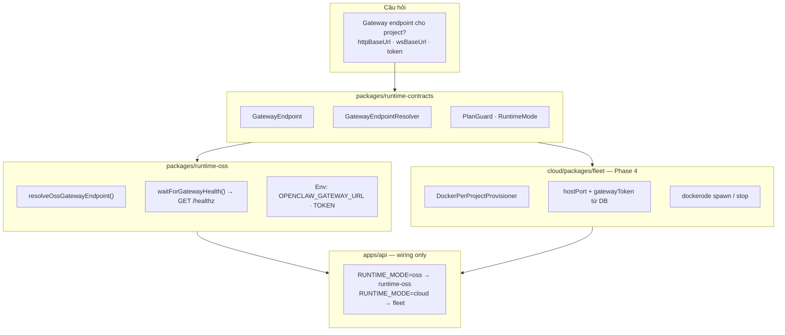

### 1.2 Vị trí trong monorepo

```text
aucobot/
├── apps/
│   ├── api/          ← import runtime-oss + contracts; HTTP/Nest
│   └── web/
├── packages/
│   ├── runtime-contracts/   ← interface (OSS + cloud dùng chung)
│   └── runtime-oss/           ← implementation OSS only
├── cloud/
│   ├── api/                   ← import contracts; KHÔNG import runtime-oss
│   └── packages/
│       └── fleet/             ← implementation Cloud (sau)
└── deploy/                    ← gateway = pull image openclaw-worker:*
```

### 1.3 OSS vs Cloud — so sánh

| | **OSS** (`runtime-oss`) | **Cloud** (`cloud/fleet`) |
|---|-------------------------|---------------------------|
| Gateway | **1 shared** `:18789` | **1 container / project** |
| URL | `OPENCLAW_GATEWAY_URL` (env) | `http://127.0.0.1:{hostPort}` |
| Token | `OPENCLAW_GATEWAY_TOKEN` (env) | `project.gatewayToken` (DB) |
| Docker spawn | ❌ | ✅ |
| Package | `@aucobot/runtime-oss` | `@aucobot-cloud/fleet` |

### 1.4 Dependency import

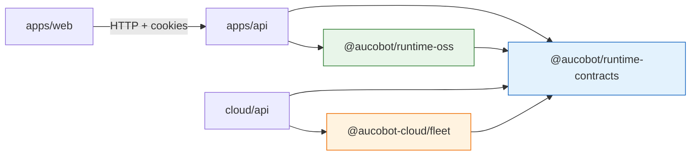

`runtime-oss` và `fleet` **song song** — cùng implement contracts, **không** import lẫn nhau.

### 1.5 Luồng OSS: tạo project → gateway sẵn sàng

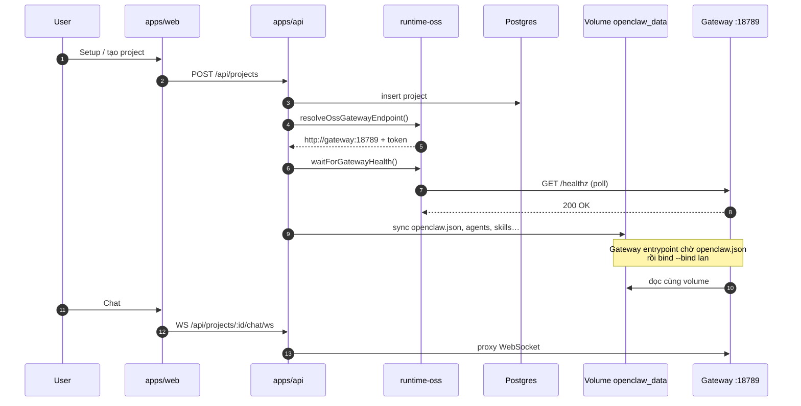

### 1.6 Luồng Cloud (dự kiến — Phase 4)

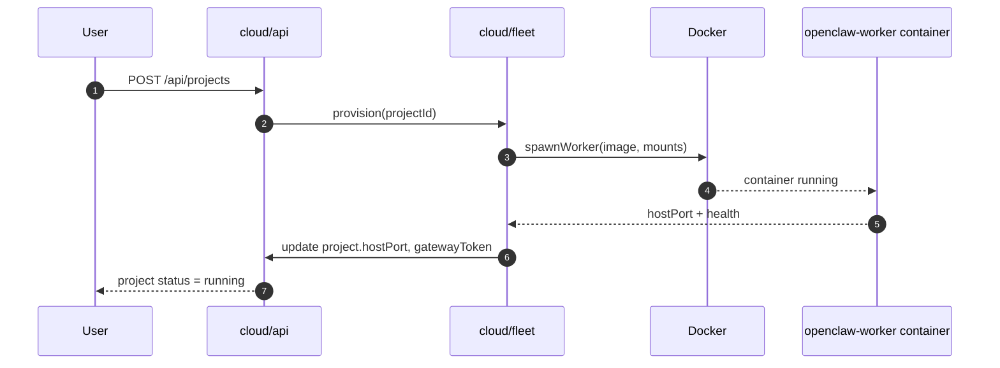

### 1.7 Code map (hiện tại)

| Package / file | Vai trò |
|----------------|---------|
| `packages/runtime-contracts/src/runtime-mode.ts` | `RUNTIME_MODE`, `isOssRuntime()` |
| `packages/runtime-contracts/src/gateway-endpoint.ts` | Types + `GatewayConfigError` |
| `packages/runtime-oss/src/oss-gateway.ts` | OSS URL/token resolve |
| `packages/runtime-oss/src/gateway-health.ts` | Poll `/healthz` |
| `apps/api/.../runtime/gateway-endpoint.ts` | Cloud branch + map lỗi → `BadRequestException` |
| `apps/api/.../projects.service.ts` | Gọi resolver + health khi create/start |

---

## 3b. Connectors MCP

Hosted MCP service ở sibling [`../mcp/`](../mcp/) — service thứ 5 trong OSS compose.

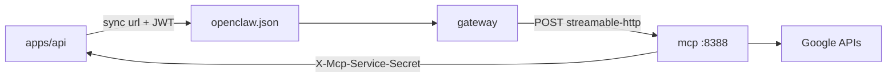

| Thành phần | Path |
|------------|------|
| MCP server | `mcp/src/main.ts` |
| Connectors | `mcp/src/connectors/google/*` |
| Internal secrets API | `apps/api/src/features/internal/mcp-internal.controller.ts` |
| Remote sync | `packages/workspace-sync/src/connector-mcp.ts` |
| Token signing | `packages/control-plane-core/src/mcp/mcp-project-token.ts` |

Unset `AUCOMCP_BASE_URL` on API → fallback `npx` MCP on gateway volume.

---

## 2. Database / Prisma

Package **`@aucobot/database`** = schema + migrations + generated client.  
Nest **`apps/api`** injects **`PrismaService`** (thin wrapper) — business logic stays in services.

### 2.1 Package layout & build

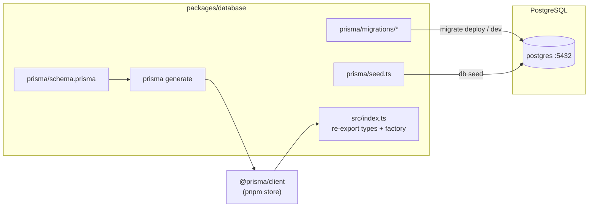

| Script (root) | Command |
|---------------|---------|
| Migrate dev | `pnpm db:migrate` |
| Seed templates | `pnpm db:seed` |
| Docker start | `pnpm --filter @aucobot/database exec prisma migrate deploy` |

### 2.2 Nest wiring — how `apps/api` gets DB access

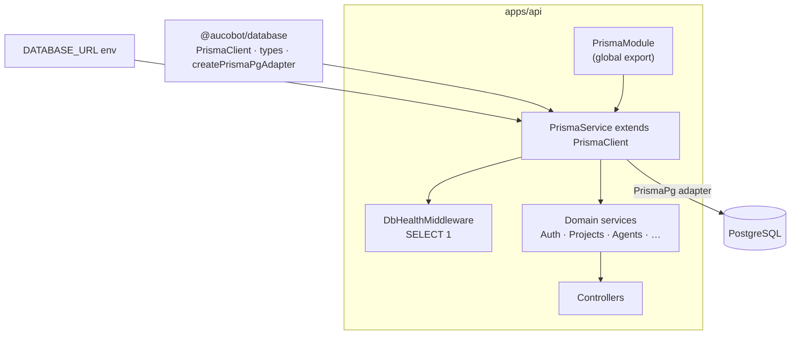

```typescript
// apps/api/src/core/database/prisma.service.ts — only Nest-specific DB code
PrismaService extends PrismaClient {
  constructor() {
    super({ adapter: createPrismaPgAdapter(process.env.DATABASE_URL!) });
  }
}
```

**Import rules:**

| Import from | Used for |
|-------------|----------|
| `@aucobot/database` | Types, enums (`Project`, `ProjectStatus`, …) |
| `PrismaService` (local) | All queries (`this.prisma.project.findMany`, …) |

### 2.3 ER — OSS tables (current schema)

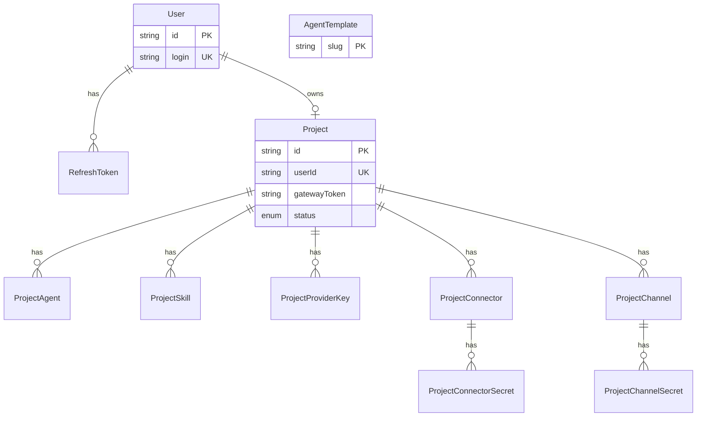

| Domain | Tables | Service in `apps/api` |
|--------|--------|------------------------|
| Auth | `users`, `refresh_tokens` | `AuthService`, `DefaultUserService` |
| Project shell | `projects` | `ProjectsService` |
| Agents | `agent_templates`, `project_agents` | `ProjectAgentsService` |
| Skills | `project_skills` | `ProjectSkillsService` |
| AI keys | `project_provider_keys` | `ProviderKeysService` |
| Connectors (MCP/OAuth) | `project_connectors`, `…_secrets` | `ProjectConnectorsService` |
| Channels (Telegram, …) | `project_channels`, `…_secrets` | *(schema ready — API TBD)* |

### 2.4 Sequence — create project (DB + disk)

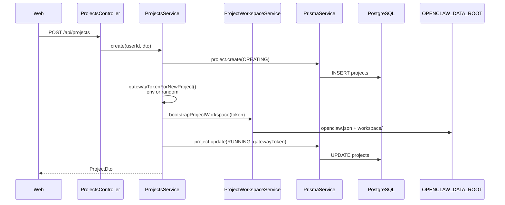

**Gateway token resolution at runtime** (not a separate table):

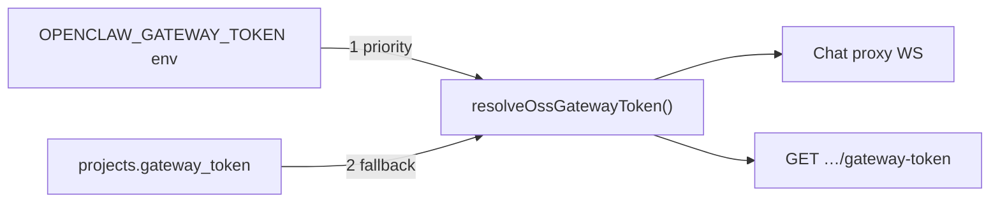

### 2.5 Sequence — sync config (read DB → write disk)

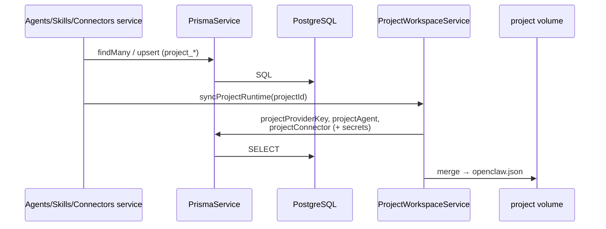

DB holds **source of truth** for dashboard config; **OpenClaw gateway** reads **`openclaw.json`** on shared volume — not Prisma directly.

---

## 3. Workspace sync → OpenClaw

🔜 *Sẽ bổ sung khi tách `@aucobot/workspace-sync`.*

---

## 4. Auth + session (web ↔ api)

🔜 *Sẽ bổ sung (cookie, `API_INTERNAL_URL`, middleware).*

---

## 5. Full stack compose

🔜 *Sẽ bổ sung (postgres, api, web, gateway pull).*

---

*Cập nhật diagram: thêm section mới vào mục lục + nội dung tương ứng.*
