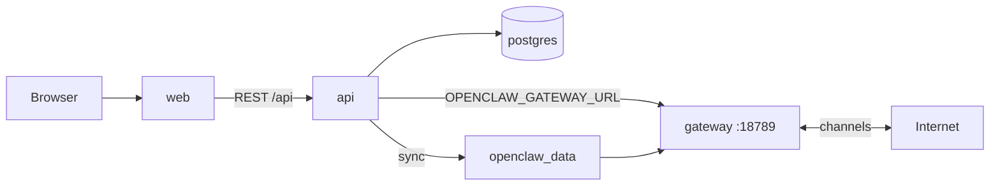
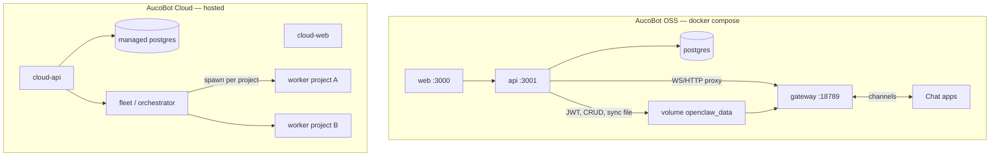
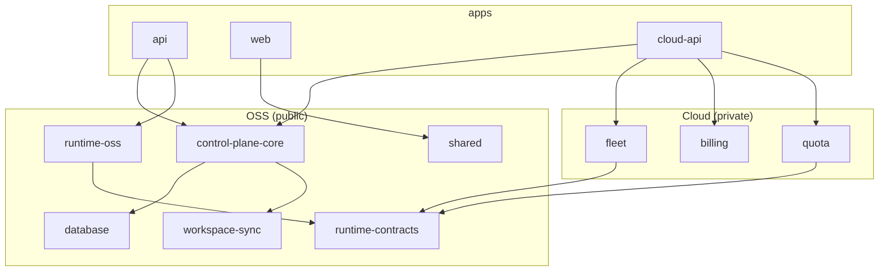
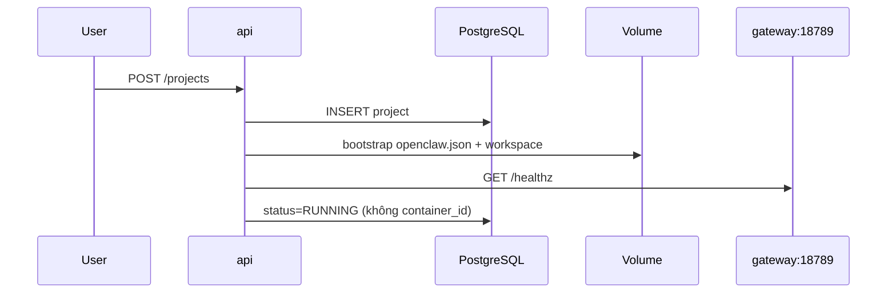
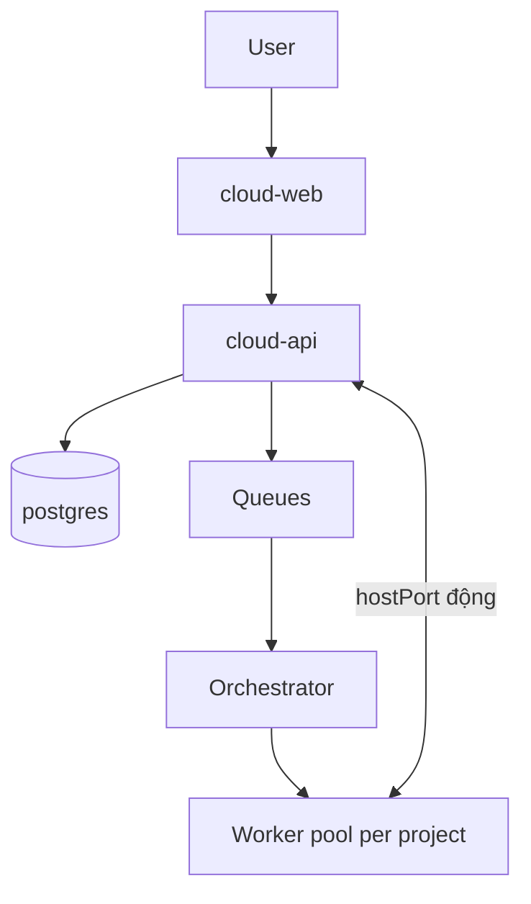
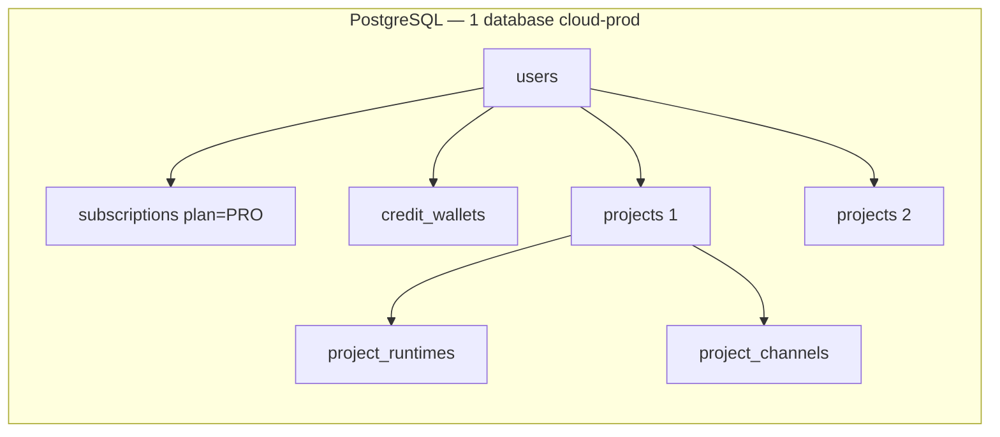

# AucoBot — Kế hoạch Monorepo (pnpm)

> **Tên dự án:** AucoBot  
> **Cập nhật:** 2026-05-25  
> **Tham chiếu:** [`workflow.md`](../../workflow.md) (SSOT tính năng AucoBot), [`openclaw-architecture.md`](../../openclaw-architecture.md) (SSOT worker), `billing-plan.md`  
> **Mô hình thị trường:** Engine mở (OSS self-host) + Cloud trả phí (Supabase / n8n style)

---

## 1. Tóm tắt

AucoBot là monorepo **pnpm** gồm:

| Sản phẩm | Ai vận hành | Runtime gateway |
| -------- | ----------- | ----------------- |
| **OSS** | Người dùng tự host (`docker compose up`) | **Một** service `gateway` cố định cổng **18789** — cùng stack với API, DB, UI |
| **Cloud** | Nhà cung cấp (hosted) | **Một container OpenClaw / project** — spawn qua Docker API / fleet |

**Điểm quan trọng (đã chỉnh so với sketch cũ trong `workflow.md`):**

- **Spawn container per project = chỉ Cloud.** Code hiện tại (`DockerService.spawnWorker`, `hostPort` động) là mô hình Cloud.
- **OSS = Supabase-style:** `docker compose` dựng **hết** service (`postgres`, `api`, `web`, `gateway`); backend **không** cần `docker.sock`, truy cập gateway qua `OPENCLAW_GATEWAY_URL` (ví dụ `http://gateway:18789`).
- **Sync file DB → volume** giữ nguyên cho cả OSS và Cloud (Phase 1 — [`workflow.md`](../../workflow.md) §5.6).

> **OSS compose = 4 services:** `web` + `api` (AucoBot) + `gateway` + `postgres` (upstream pull). **+1 volume** `openclaw_data`. Không Redis / BullMQ / fleet. LLM / OAuth / kênh chat = cấu hình + API bên ngoài.

---

## 2. Ranh giới service OSS (4 container + volume)

OSS self-host **đủ** với **bốn container** trong `docker compose`. Chỉ **`web`** (frontend) và **`api`** (backend) là **code AucoBot** — build từ repo. **`postgres`** và **`gateway`** (OpenClaw) **pull image upstream**; fork để pin tag/commit, **không sửa** runtime upstream.

### 2.1 Bốn service compose

| Service | Tên compose gợi ý | Image | Sở hữu | Port mặc định | Vai trò |
| ------- | ----------------- | ----- | ------- | ------------- | ------- |
| Dashboard | `web` | Build `frontend/` | **AucoBot** | 3000 | UI; gọi API (`NEXT_PUBLIC_API_URL`) |
| Control plane | `api` | Build `backend/` | **AucoBot** | 3001 | JWT, CRUD, sync file, proxy WS chat → gateway |
| Gateway | `gateway` | Pull OpenClaw (fork pin) | **Upstream** | **18789** | Agent, kênh chat, đọc volume |
| Database | `postgres` | `postgres:16-alpine` | **Upstream** | 5432 | Users, projects, skills metadata… |



- **Frontend không** kết nối trực tiếp `:18789` — chat đi **web → api → gateway**.
- **API không** mount `docker.sock` trên OSS — spawn per project thuộc **Cloud**.

### 2.2 Không phải service — nhưng bắt buộc

| Thành phần | Mô tả |
| ---------- | ----- |
| **Volume `openclaw_data`** | `api` ghi `{OPENCLAW_DATA_ROOT}/{projectId}/…`; `gateway` đọc cùng dữ liệu (`openclaw.json`, `workspace/`). Thiếu volume chung → gateway chạy nhưng không thấy config. |
| **Env nối stack** | `DATABASE_URL`, `JWT_SECRET`, `OPENCLAW_GATEWAY_URL=http://gateway:18789`, `OPENCLAW_GATEWAY_TOKEN` (khớp `gateway.auth`), `OPENCLAW_DATA_ROOT`, `NEXT_PUBLIC_API_URL` |

### 2.3 Ranh giới sở hữu code

```text
AucoBot (build image)
├── frontend/  → service web
└── backend/   → service api (+ Prisma migrate/seed)

Upstream (pull image — fork pin, không patch runtime)
├── postgres:16-alpine
└── openclaw/openclaw (tag cố định)  → service gateway

Compose / hạ tầng (bạn viết, không phải app logic)
├── deploy/docker-compose.yml
├── volume openclaw_data
└── .env
```

- Gateway/postgres là **image upstream** (`OPENCLAW_IMAGE`, `postgres:16-alpine`) — fork OpenClaw giữ ở `../openclaw-worker/` ngoài monorepo, không copy vào `aucobot/`.
- `skill-hub/`: catalog skill mẫu — **không** chạy như container.

### 2.4 Không có trong compose OSS (MVP)

| Hạng mục | OSS MVP |
| -------- | ------- |
| Redis / BullMQ / `vps-worker` | Không |
| Traefik / ingress fleet | Không bắt buộc (tuỳ chọn production) |
| Docker socket trên `api` | Không |
| Service `skill-hub` | Không |
| Mail server, MinIO, object storage riêng | Không (trừ khi tự thêm sau) |

### 2.5 Phụ thuộc bên ngoài stack (không container AucoBot)

| Tính năng | Cần gì | Bắt buộc? |
| --------- | ------ | --------- |
| Chat AI | API key LLM (OpenAI, Anthropic, …) — sync vào `openclaw.json` | Có nếu dùng chat |
| Connectors Google | `GOOGLE_OAUTH_*` + Google Cloud Console | Chỉ khi bật Drive/Calendar |
| Telegram, Discord, … | Token kênh — cấu hình trong gateway (sync qua api) | Tuỳ user |
| HTTPS công khai | Caddy / Nginx / Traefik phía trước | Tuỳ triển khai |

### 2.6 Tuỳ chọn production (không đếm service app thứ 5)

| Lớp | Vai trò |
| --- | ------- |
| Reverse proxy | TLS, một domain cho web + api |
| Backup Postgres | `pg_dump` / snapshot volume DB |
| `prisma migrate` | Init/mỗi deploy — thường entrypoint `api` |

### 2.7 Dev local vs OSS production

| Môi trường | Stack |
| ---------- | ----- |
| **OSS production (đích)** | 4 service + volume |
| **Dev nhanh** | `postgres` container (`docker-compose.deps.yml`) + `api`/`web` trên host + `gateway` container hoặc local `:18789` |

### 2.8 Checklist “còn thiếu service không?”

| Câu hỏi | Trả lời |
| ------- | ------- |
| Đủ 4 container? | **Có** |
| Thiếu Redis/queue? | **Không** (OSS) |
| Thiếu volume api ↔ gateway? | **Cần** (không phải container) |
| Code repo đã khớp? | **Chưa** — `backend/` vẫn spawn Docker; Phase 2: `RUNTIME_MODE=oss` + compose `gateway` |

---

## 3. Mental model



### Quy tắc một dòng

| Gateway cần thấy để chạy? | Chỉ tính năng app (billing, tenant…)? |
| ------------------------- | ------------------------------------- |
| **Sync DB → volume / `openclaw.json`** | **Giữ trên DB** — API đọc trực tiếp |

- **Control plane** = PostgreSQL + Nest API + Dashboard (JWT).
- **OpenClaw worker** không đọc PostgreSQL — chỉ đọc file + `openclaw.json` trên volume.
- **Auth:** JWT (dashboard) ≠ `gateway.auth` (operator worker).

---

## 4. OSS vs Cloud — bảng so sánh

| Tiêu chí | OSS (community, public) | Cloud (hosted, proprietary) |
| -------- | ------------------------ | ---------------------------- |
| **Triển khai** | `docker compose up` một lần | Đăng ký cloud, không tự cài worker |
| **Gateway** | Service `gateway` trong compose, **18789** cố định | Container riêng / project, port động |
| **Backend → gateway** | `OPENCLAW_GATEWAY_URL=http://gateway:18789` | `http://127.0.0.1:{hostPort}` từ DB |
| **Docker socket trên API** | **Không** | **Có** (hoặc remote Docker) |
| **DB `container_id` / `host_port`** | Không dùng (nullable) | Bắt buộc |
| **API start/stop/respawn project** | Không (restart stack / `compose restart gateway`) | Có |
| **`vps-worker` / BullMQ / billing** | Không trong OSS core | Có |
| **Mã nguồn** | Monorepo public | Package/repo đóng import lõi OSS |

---

## 5. Cấu trúc monorepo AucoBot

```text
aucobot/                              # root monorepo (repo public OSS)
├── pnpm-workspace.yaml
├── package.json                        # scripts: dev, build, lint, docker:*
├── pnpm-lock.yaml
├── turbo.json                          # (khuyến nghị) pipeline build
├── .npmrc
│
├── apps/
│   ├── api/                            # ← migrate từ backend/ (NestJS)
│   └── web/                            # ← migrate từ frontend/ (Next.js)
│
├── cloud/                              # PRIVATE — hosted Cloud (Phase 4)
│   ├── api/                            # Nest, import @aucobot/*
│   ├── web/                            # shell branded / extend apps/web
│   ├── packages/
│   │   ├── billing/                    # Stripe, plans, credits (billing-plan.md)
│   │   ├── fleet/                      # DockerPerProjectProvisioner, vps-worker
│   │   ├── quota/                      # PlanGuard impl
│   │   └── ingress/                    # Traefik, worker callbacks
│   └── deploy/                         # K8s, fleet templates
│
├── packages/                           # shared OSS — cloud cũng import
│   ├── shared/                         # types, constants — FE + BE (✅ v1)
│   ├── database/                       # Prisma schema + client (✅)
│   ├── control-plane-core/             # pure helpers — gateway token (🟡 started)
│   ├── runtime-contracts/              # RuntimeProvisioner, GatewayEndpoint (✅)
│   ├── runtime-oss/                    # StaticGatewayProvisioner (✅)
│   ├── workspace-sync/               # agent compile, openclaw.json merge (✅)
│   └── ui-kit/                         # (tuỳ chọn) components dùng chung
│
├── deploy/                             # OSS compose + Dockerfiles (api/web only)
│   ├── docker-compose.yml              # postgres + api + web + gateway (pull image)
│   ├── docker-compose.deps.yml         # chỉ postgres (dev local)
│   ├── Dockerfile.api
│   └── Dockerfile.web
│
├── catalogs/
│   └── skill-hub/                      # ← skill-hub/ (skill mẫu OSS)
│
└── docs/
    ├── workflow.md
    ├── billing-plan.md
    └── monorepoplan.md                 # file này
```

`workflow.md` và `openclaw-architecture.md` nằm ở **repo root** — SSOT tính năng AucoBot vs worker upstream.

### Mapping từ repo hiện tại (`openclaw-saas`)

| Hiện tại | Sau migrate (AucoBot) |
| -------- | ------------------------ |
| `backend/` | `apps/api` + tách `packages/*` |
| `frontend/` | `apps/web` |
| `openclaw-worker/` | **Pull image** — repo gốc ở parent, không vendored trong `aucobot/` |
| `skill-hub/` | `catalogs/skill-hub/` |
| Docs root | `workflow.md`, `openclaw-architecture.md` (repo root) + `aucobot/docs/` |
| Cloud (chưa có) | `cloud/{api,web,packages,deploy}` hoặc repo `aucobot-cloud` riêng |

---

## 6. `pnpm-workspace.yaml` (root)

```yaml
packages:
  - "apps/*"
  - "packages/*"
  - "cloud/api"
  - "cloud/web"
  - "cloud/packages/*"          # chỉ clone nội bộ / submodule private
```

**Lưu ý:**

- Giữ **nested workspace** của OpenClaw — không flatten `extensions/*` lên root.
- Scope package gợi ý: `@aucobot/shared`, `@aucobot/database`, `@aucobot/control-plane-core`, …
- Cloud private: `@aucobot-cloud/billing`, `@aucobot-cloud/fleet`.

---

## 7. Package graph & quy tắc dependency



| Quy tắc | Mô tả |
| ------- | ----- |
| `cloud/packages/*` | **Không** được import bởi package OSS public |
| `control-plane-core` | Không biết Docker vs static gateway — chỉ gọi `RuntimeProvisioner` |
| `api` | Wire `StaticGatewayProvisioner` + `NoopPlanGuard`; **không** `dockerode` |
| `cloud-api` | Wire `DockerPerProjectProvisioner` + `StripePlanGuard` |
| `workspace-sync` | Một implementation — OSS và Cloud chỉ khác volume path / orchestration |

---

## 8. Runtime contracts

### 8.1 `RuntimeProvisioner`

```typescript
// packages/runtime-contracts

export interface RuntimeProvisioner {
  /** OSS: sync disk + đợi gateway compose healthy. Cloud: tạo container. */
  provision(projectId: string, opts: ProvisionOpts): Promise<RuntimeHandle>;
  start(handle: RuntimeHandle): Promise<void>;
  stop(handle: RuntimeHandle): Promise<void>;
  destroy(handle: RuntimeHandle): Promise<void>;
  getStatus(handle: RuntimeHandle): Promise<RuntimeStatus>;
}

export interface GatewayEndpoint {
  /** http://gateway:18789 hoặc http://127.0.0.1:54321 */
  baseUrl: string;
  token: string;
}
```

| Implementation | Package | Dùng bởi |
| -------------- | ------- | -------- |
| `StaticGatewayProvisioner` | `@aucobot/runtime-oss` | `api` — ping `OPENCLAW_GATEWAY_URL`, không Docker API |
| `DockerPerProjectProvisioner` | `@aucobot-cloud/fleet` | `cloud-api` — logic `DockerService.spawnWorker` hiện tại |
| `NoopPlanGuard` | `runtime-contracts` hoặc `api` | OSS — không quota |
| `StripePlanGuard` | `@aucobot-cloud/quota` | Cloud — `billing-plan.md` |

### 8.2 `GatewayEndpointResolver`

Chat proxy và health check dùng resolver thay vì `project.hostPort` trực tiếp:

| Mode | Nguồn endpoint |
| ---- | -------------- |
| `RUNTIME_MODE=oss` | `process.env.OPENCLAW_GATEWAY_URL` + `OPENCLAW_GATEWAY_TOKEN` |
| `RUNTIME_MODE=cloud` | `project.hostPort` + `project.gatewayToken` từ DB |

---

## 9. OSS — Docker Compose (Supabase-style)

### 9.1 Services

| Service | Port | Vai trò |
| ------- | ---- | ------- |
| `postgres` | 5432 | Nguồn sự thật app |
| `api` | 3001 | NestJS control plane |
| `web` | 3000 | Next.js dashboard |
| `gateway` | **18789** | Image `openclaw-worker:*` (pull, `OPENCLAW_IMAGE`) |

### 9.2 `deploy/docker-compose.yml` (sketch)

```yaml
services:
  postgres:
    image: postgres:16-alpine
    healthcheck: ...

  gateway:
    image: ${OPENCLAW_IMAGE:-aucobot-gateway:local}
    container_name: aucobot-gateway
    command: ["node", "openclaw.mjs", "gateway", "--bind", "lan"]
    environment:
      OPENCLAW_GATEWAY_TOKEN: ${OPENCLAW_GATEWAY_TOKEN}
      OPENCLAW_STATE_DIR: /home/node/.openclaw
      OPENCLAW_CONFIG_PATH: /home/node/.openclaw/openclaw.json
    volumes:
      - openclaw_data:/home/node/.openclaw
    ports:
      - "18789:18789"
    healthcheck:
      test: ["CMD-SHELL", "wget -q -O- http://127.0.0.1:18789/healthz || exit 1"]

  api:
    build: ...
    depends_on:
      postgres: { condition: service_healthy }
      gateway: { condition: service_healthy }
    environment:
      RUNTIME_MODE: oss
      DATABASE_URL: ...
      OPENCLAW_DATA_ROOT: /data/projects
      OPENCLAW_GATEWAY_URL: http://gateway:18789
      OPENCLAW_GATEWAY_TOKEN: ${OPENCLAW_GATEWAY_TOKEN}
    volumes:
      - openclaw_data:/data/projects
    # KHÔNG mount /var/run/docker.sock

  web:
    depends_on: [api]

volumes:
  openclaw_data:
```

### 9.3 Volume & sync

- Backend ghi: `{OPENCLAW_DATA_ROOT}/{projectId}/` → `openclaw.json`, `workspace/skills/…`, `AGENTS.md`, …
- Gateway đọc cùng volume (mount vào `/home/node/.openclaw`).
- **MVP OSS:** 1 user ≈ 1 project — volume có thể map 1:1 project subfolder hoặc root volume cho instance đơn giản.
- **Sync khi:** user lưu / bật skill / đổi config — **không** sync mỗi tin nhắn chat.

### 9.4 Luồng tạo project (OSS)



- Token gateway OSS: dùng `OPENCLAW_GATEWAY_TOKEN` **global** từ compose (không random per project trừ khi sau này multi-gateway).
- Không endpoint `respawn` / start-stop container trên OSS (hoặc trả 501 + hướng dẫn `docker compose restart gateway`).

### 9.5 Env OSS (`apps/api`)

```env
RUNTIME_MODE=oss
DATABASE_URL=postgresql://...
OPENCLAW_GATEWAY_URL=http://gateway:18789
OPENCLAW_GATEWAY_TOKEN=...
OPENCLAW_DATA_ROOT=/data/projects
JWT_SECRET=...
FRONTEND_URL=http://localhost:3000

# Dev trên host (không compose): OPENCLAW_GATEWAY_URL=http://127.0.0.1:18789
# KHÔNG dùng trên OSS: OPENCLAW_IMAGE spawn, docker.sock
```

---

## 10. Cloud — Hosted

| Thành phần | Gợi ý |
| ---------- | ----- |
| Control plane | API + DB managed; tenant isolation |
| Runtime | `DockerPerProjectProvisioner` — 1 container / project |
| Kinh doanh | `cloud/packages/billing` — `billing-plan.md` |
| Queue / heavy | `vps-heavy`, BullMQ (tuỳ sản phẩm) |
| Mã nguồn | Import `@aucobot/control-plane-core`; fleet/billing **proprietary** |



### 10.1 Database — OSS core + Cloud extension (cùng Postgres)

Cloud **không** tạo database “wrapper” bọc OSS. Tận dụng OSS = **cùng** package `@aucobot/database`, **cùng instance Postgres** trên môi trường cloud prod, **mở rộng** bằng bảng/cột mới nối **khóa ngoại** — không phải kế thừa OOP trong SQL.

| Khái niệm | OSS self-host | Cloud hosted |
| --------- | ------------- | ------------ |
| **Instance Postgres** | Riêng từng deploy (`docker compose`) | Riêng do bạn quản lý (RDS, Neon, …) |
| **Schema / Prisma** | `@aucobot/database` | **Cùng schema** + bảng billing/fleet |
| **Auth** | `users`, `refresh_tokens` | **Cùng bảng** — module auth trong `cloud-api` |
| **Billing** | Không dùng (`NoopPlanGuard`) | Bảng extension FK → `users.id` |
| **Runtime fleet** | Gateway compose chung; không ghi `container_id` | Extension FK → `projects.id` hoặc cột optional |

**Nguyên tắc** (theo [`billing-plan.md`](../../billing-plan.md)):

- Plan gắn **User** (`subscriptions`), không gắn `plan_id` trên `projects`.
- Quota credit: **một ví / user** (`credit_wallets`).
- Runtime: **1 project = 1 container** — metadata fleet gắn **Project**.

#### Sơ đồ quan hệ (ER) — ví dụ

```mermaid
erDiagram
  users ||--o{ refresh_tokens : has
  users ||--o{ projects : owns
  projects ||--o{ project_channels : has
  projects ||--o{ project_agents : has
  projects ||--o{ project_provider_keys : has

  users {
    cuid id PK
    string username UK
    string password_hash
  }

  projects {
    cuid id PK
    cuid user_id FK
    string subdomain UK
    string gateway_token
    enum status
  }

  project_channels {
    cuid id PK
    cuid project_id FK
    string channel_id
    json config
  }

  users ||--o| subscriptions : "1 active"
  users ||--o| credit_wallets : "1 wallet"
  users ||--o| billing_customers : "Stripe"
  projects ||--o| project_runtimes : "1 container"

  subscriptions {
    cuid id PK
    cuid user_id FK UK
    enum plan "FREE|PRO"
    string stripe_subscription_id
    datetime current_period_end
  }

  credit_wallets {
    cuid id PK
    cuid user_id FK UK
    int monthly_balance
    int purchased_balance
    datetime monthly_reset_at
  }

  billing_customers {
    cuid id PK
    cuid user_id FK UK
    string stripe_customer_id UK
  }

  project_runtimes {
    cuid id PK
    cuid project_id FK UK
    string container_id
    int host_port
    int ram_mb
    float cpu_limit
  }
```

| Kiểu bảng | Ví dụ | Gắn vào |
| --------- | ----- | ------- |
| **OSS core** | `users`, `projects`, `project_channels`, … | Self-host + Cloud |
| **Cloud extension (User)** | `subscriptions`, `credit_wallets`, `billing_customers` | `user_id` → `users.id` |
| **Cloud extension (Project)** | `project_runtimes` (hoặc cột trên `projects`) | `project_id` → `projects.id` |

#### Luồng dữ liệu — ví dụ user Pro



1. Đăng ký → `users` (+ `refresh_tokens`) — logic auth OSS.
2. Onboarding cloud → `subscriptions`, `credit_wallets` — module billing.
3. Tạo bot → `projects`, `project_channels` — logic OSS.
4. Start worker → `project_runtimes` (hoặc `projects.container_id` / `host_port`) — module fleet.

#### Hai pattern mở rộng schema

**A — Bảng phụ 1–1** (tách domain rõ, khuyến nghị cho billing/fleet):

```prisma
model Subscription {
  id     String @id @default(cuid())
  userId String @unique @map("user_id")
  plan   Plan   @default(FREE)
  user   User   @relation(fields: [userId], references: [id])
  @@map("subscriptions")
}

model ProjectRuntime {
  projectId   String  @unique @map("project_id")
  containerId String? @map("container_id")
  hostPort    Int?    @map("host_port")
  project     Project @relation(...)
  @@map("project_runtimes")
}
```

**B — Cột thêm trên bảng OSS** (ít JOIN; OSS để `null`):

```prisma
model Project {
  // … fields OSS
  containerId String? @map("container_id")
  hostPort    Int?    @map("host_port")
}
```

#### Evolution OSS → Cloud (multi-project)

Schema hiện tại có thể `Project.userId` `@unique` (1 user ≈ 1 project). Cloud Pro cần nhiều project/user — **bỏ `@unique`**, thêm `@@index([userId])` trên cùng bảng `projects` (không tạo DB mới).

```diff
 model Project {
-  userId String @unique @map("user_id")
+  userId String @map("user_id")
+  @@index([userId])
 }
```

#### Không dùng

```text
❌ Postgres thứ hai “wrap” / sync copy từ OSS
❌ users_cloud kế thừa users_oss (OOP inheritance)
❌ plan_id trên projects — plan nằm ở subscriptions.user_id
```

Service auth/billing **tách code** (module hoặc `cloud-api`) vẫn có thể dùng **chung `DATABASE_URL`** — tách microservice + DB riêng chỉ khi scale/team buộc phải tách (xem §16).

### Env Cloud (sketch)

```env
RUNTIME_MODE=cloud
OPENCLAW_IMAGE=...
# Docker socket hoặc DOCKER_HOST remote
OPENCLAW_SPAWN_TIMEOUT_MS=60000
```

---

## 11. Apps

### 11.1 `apps/api` (public)

- Nest `AppModule` + `@aucobot/control-plane-core`.
- Providers: `StaticGatewayProvisioner`, `NoopPlanGuard`.
- Không dependency `dockerode` trong production OSS build.

### 11.2 `apps/web` (public)

- Dashboard self-host đầy đủ.
- Chat WS proxy tới API → gateway cố định.

### 11.3 `cloud/api` / `cloud/web` (private)

- Composition root mỏng: import OSS core + override provisioner/plan guard.
- UI: branding + billing + quota; có thể extend `apps/web` qua feature flags / route groups.

---

## 12. Repo & license

| Artifact | Repo | License |
| -------- | ---- | ------- |
| Monorepo OSS AucoBot | `aucobot` (public, rename từ `openclaw-saas`) | Apache-2.0 / MIT |
| `cloud/packages/*`, `cloud/api`, `cloud/web` | Cùng monorepo (git submodule) **hoặc** `aucobot-cloud` riêng | Proprietary |

**Khuyến nghị:**

- **Giai đoạn 1:** OSS monorepo sạch; Cloud repo riêng `pnpm link` / GitHub Packages `@aucobot/*`.
- **Giai đoạn 2:** Submodule `cloud/` nếu team nhỏ muốn một clone.

---

## 13. Dev workflow (root scripts)

```json
{
  "scripts": {
    "dev": "turbo run dev --parallel --filter=@aucobot/api --filter=@aucobot/web",
    "dev:deps": "docker compose -f deploy/docker-compose.deps.yml up -d",
    "dev:stack": "docker compose -f deploy/docker-compose.yml up",
    "build": "turbo run build",
    "db:migrate": "pnpm --filter @aucobot/api exec prisma migrate dev"
  }
}
```

**Dev local (không full compose):**

1. `pnpm dev:deps` — Postgres.
2. Chạy gateway riêng hoặc `docker compose up gateway` — port **18789**.
3. `pnpm dev` — api + web; `OPENCLAW_GATEWAY_URL=http://127.0.0.1:18789`.

---

## 14. Lộ trình migrate

> **Thứ tự ưu tiên:** hoàn thành **packages OSS** (§14.1) → **Channels E2E** (§14.2) → **Runtime OSS** (§14.3) → **control-plane-core extract** (§14.4) → Cloud (§14.5).

### 14.1 Packages OSS — trạng thái & thứ tự hoàn thành

| # | Package | Trạng thái | Nội dung |
| - | ------- | ---------- | -------- |
| 1 | `@aucobot/database` | ✅ Done | Prisma schema, migrations, `createPrismaClient` |
| 2 | `@aucobot/workspace-sync` | ✅ Done | openclaw.json merge, agents/skills/connectors/channels |
| 3 | `@aucobot/runtime-contracts` | ✅ Done | `RuntimeProvisioner`, `GatewayEndpoint`, `NoopPlanGuard` |
| 4 | `@aucobot/runtime-oss` | ✅ Done | `StaticGatewayProvisioner`, health poll, OSS endpoint |
| 5 | `@aucobot/shared` | ✅ Done (v1) | Channel/connector/project types; Telegram access validation |
| 6 | `@aucobot/control-plane-core` | 🟡 Started | gateway token, secret-crypto, chat upstream, JWT OSS auth |
| 7 | `@aucobot/ui-kit` | ⬜ Optional | Chỉ khi Cloud UI lệch >3 màn hình |

**Quy tắc package**

- `packages/*` — **không** import NestJS / Fastify.
- `apps/api` — Nest bootstrap + controllers + wire `StaticGatewayProvisioner` + `NoopPlanGuard`.
- `apps/web` — import `@aucobot/shared` cho types/helpers; Zod schemas giữ ở web.

**Phase 3b — còn lại trong `control-plane-core`**

- [x] `secret-crypto.ts` (encrypt/mask)
- [x] Chat gateway upstream + RPC whitelist + `sessionKeyForAgent`
- [x] Auth utils (JWT sign/verify, refresh hash, cookie specs, self-host default user)
- [ ] Project mapper DTO types → `@aucobot/shared` nếu FE cần

### 14.2 Channels & product (sau packages v1)

| Sprint | Mục tiêu | Tasks |
| ------ | -------- | ----- |
| **A** — E2E Telegram | Dashboard + gateway thật | Channel list từ API (bỏ `localStorage`); E2E compose checklist; cập nhật `monorepo-diagram.md` |
| **B** — Telegram hardening | Production-ready DM | Pairing UX (docs link); optional `channels.status` RPC; group policy (tuỳ chọn) |
| **C** — Kênh #2 | Discord hoặc Zalo | Thêm `*.channel.ts` adapter; UI setup page; `plugins.entries` cho bundled plugin |
| **D** — OSS runtime | Khớp compose đích | `RUNTIME_MODE=oss` guard docker spawn; chat proxy ổn định; health gateway trong API |

Chi tiết kiến trúc channels: `workflow.md` §5.5.

### 14.3 Phase 0 — Chuẩn bị (1–2 ngày)

- [x] Root `package.json`, `pnpm-workspace.yaml`, `.npmrc`, `turbo.json`
- [x] Chuyển frontend/backend sang **pnpm**
- [ ] CI: `pnpm install --frozen-lockfile`

### 14.4 Phase 1 — Di chuyển cơ học (3–5 ngày)

- [x] `backend/` → `apps/api`
- [x] `frontend/` → `apps/web`
- [x] `skill-hub/` → `catalogs/skill-hub`
- [x] Docs → `docs/`
- [x] Compose → `deploy/`
- [ ] Xóa legacy root `backend/`, `frontend/` (sau E2E OK)

### 14.5 Phase 2 — Runtime OSS vs Cloud (1 tuần)

- [x] `RUNTIME_MODE` + `GatewayEndpointResolver` (partial)
- [x] `packages/runtime-contracts` + `packages/runtime-oss` + `StaticGatewayProvisioner`
- [x] OSS: `ProjectsService.create` — bootstrap disk + health (không spawn)
- [ ] Chat proxy: harden `OPENCLAW_GATEWAY_URL` path
- [x] Compose OSS: service `gateway` :18789
- [ ] Cập nhật `.env.example` đầy đủ OSS / Cloud split
- [x] `workflow.md` §3–§6, §5.5 channels

### 14.6 Phase 3 — Tách packages OSS (1–2 tuần)

- [x] `packages/database`
- [x] `packages/workspace-sync`
- [x] `packages/shared` (v1)
- [x] `packages/control-plane-core` (started)
- [ ] `api` chỉ còn bootstrap + wiring (sau control-plane-core extract)
- [ ] Web dùng `@aucobot/shared` cho provider catalogs (dedupe `lib/ai-models`)

### 14.7 Phase 4 — Cloud skeleton (private)

- [ ] `cloud/packages/fleet` — port `DockerService` hiện tại
- [ ] `cloud/packages/billing` — theo `billing-plan.md`
- [ ] `cloud/api` import `@aucobot/control-plane-core`

### 14.8 Phase 5 — Polish

- [ ] Publish `@aucobot/control-plane-core` (optional)
- [ ] E2E checklist skills + channels (`workflow.md`)
- [ ] Rename repo / branding AucoBot trên UI và README

---

## 14 (legacy checklist — tham chiếu nhanh)

<details>
<summary>Checklist cũ (đã gộp vào §14.1–14.8)</summary>

### Phase 0 — Chuẩn bị

- [ ] CI frozen lockfile

### Phase 1 — Di chuyển

- [x] apps/api, apps/web, catalogs, deploy

### Phase 2 — Runtime

- [x] Static gateway provisioner

### Phase 3 — Packages

- [x] database, workspace-sync, shared v1, runtime-*

</details>

---

## 15. Refactor code hiện tại (ghi chú)

**Trước migrate monorepo**, có thể làm ngay trên `backend/`:

| File / vùng | Thay đổi OSS |
| ----------- | ------------ |
| `projects.service.ts` | `create`: bootstrap disk only; không `docker.spawnWorker` khi `RUNTIME_MODE=oss` |
| `docker.service.ts` | Chỉ load module Cloud; hoặc guard `RUNTIME_MODE !== 'oss'` |
| `chat.gateway-proxy.service.ts` | Resolver URL từ env |
| `gateway-upstream.ts` | Hỗ trợ `baseUrl` thay chỉ `hostPort: number` |
| Prisma `Project` | `containerId`, `hostPort` optional — OSS không ghi |
| `.env.example` | Tách block OSS / Cloud |

---

## 16. Rủi ro & quyết định

| Chủ đề | Quyết định |
| ------ | ---------- |
| Gateway upstream | Pull `openclaw-worker:*`; fork/patch ở `../openclaw-worker/` — **không** vendored trong `aucobot/` |
| Prisma schema | Một schema OSS; Cloud thêm bảng extension FK (§10.1) — không DB wrapper |
| Multi-project OSS | Một gateway + multi-agent / workspace path — không spawn N container |
| `workflow.md` “1 project = 1 container” | Chỉ áp dụng **Cloud** |
| FE Cloud | Bắt đầu extend `apps/web`; tách `ui-kit` khi >3 màn hình khác biệt |

---

## 17. Kết quả mong đợi

Sau khi hoàn tất Phase 2+:

```bash
git clone https://github.com/<org>/aucobot
cd aucobot
pnpm install
cp deploy/.env.example .env
docker compose -f deploy/docker-compose.yml up
```

→ **Postgres + API + Dashboard + Gateway :18789** chạy cùng nhau; user không cần Docker socket trên máy để spawn worker.

Team Cloud thêm repo/package riêng, **import lõi AucoBot OSS**, không fork logic sync file.

---

## 18. Liên kết tài liệu

| Chủ đề | File |
| ------ | ---- |
| Gateway upstream | [`openclaw-architecture.md`](../../openclaw-architecture.md) |
| Sync, channels, chat WS proxy | [`workflow.md`](../../workflow.md) (§5.5–5.7) |
| Luồng vận hành OSS / Cloud | `workflow.md` §2 |
| Billing Cloud | `billing-plan.md` |
| DB OSS + Cloud extension (ER, luồng) | `monorepoplan.md` §10.1 |
| Kế hoạch monorepo (file này) | `monorepoplan.md` §2 (4 service) |
| Sơ đồ luồng (Mermaid) | `monorepo-diagram.md` |
| AI / agent conventions | `../AGENTS.md` |

---

*AucoBot — OSS: 4 services (`web`, `api`, `gateway`, `postgres`) + volume `openclaw_data`; chỉ web/api là code AucoBot. Cloud: spawn per project. Monorepo pnpm tách package public OSS và `cloud/` proprietary.*
