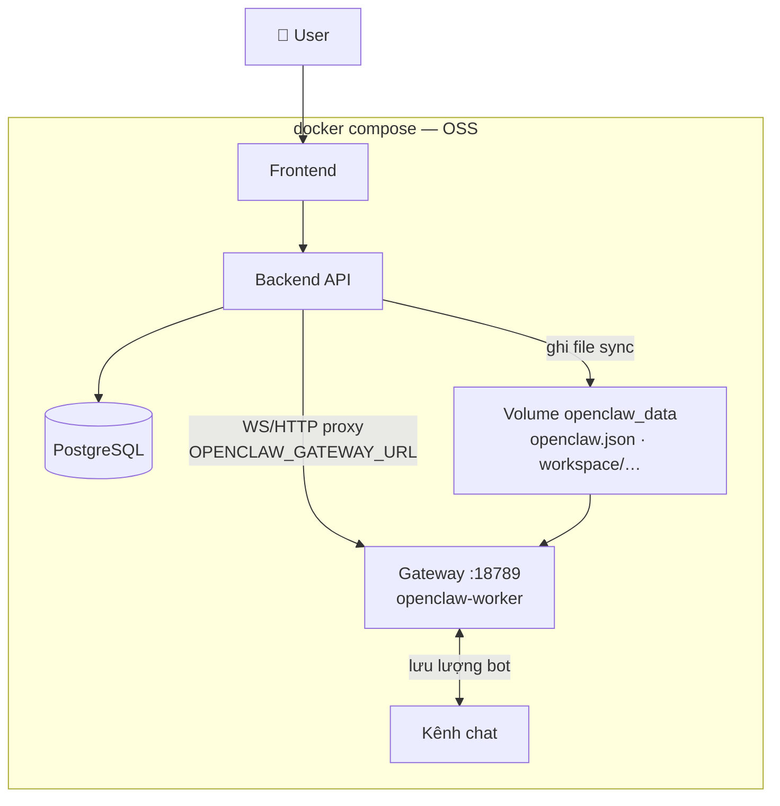
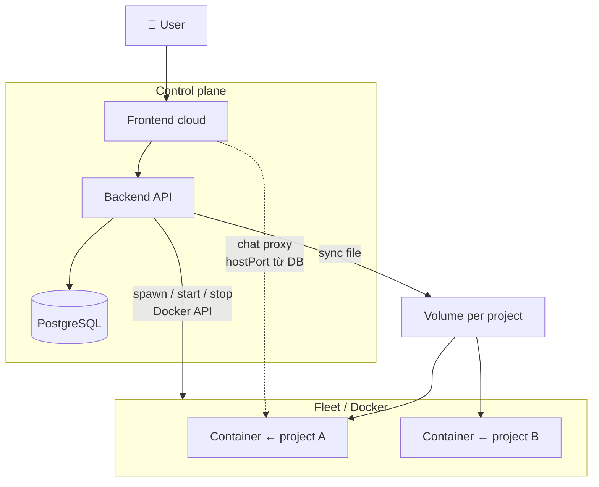
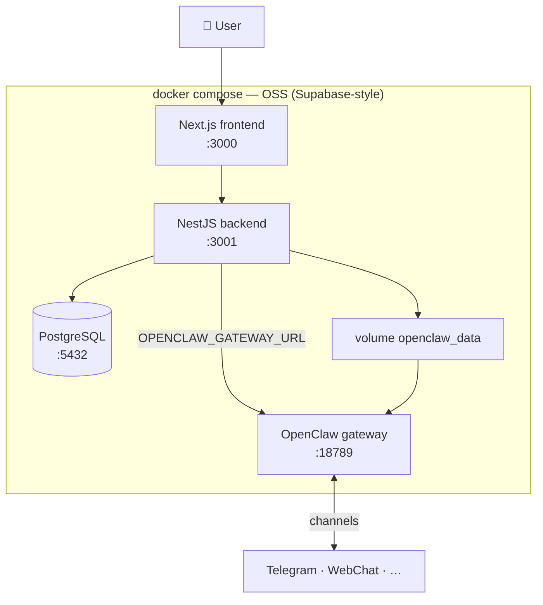
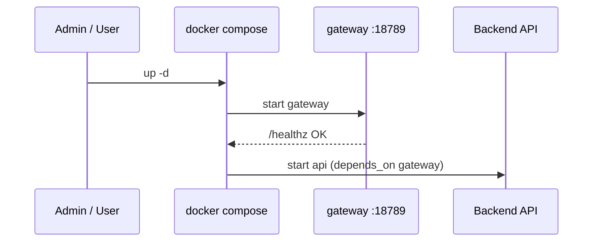
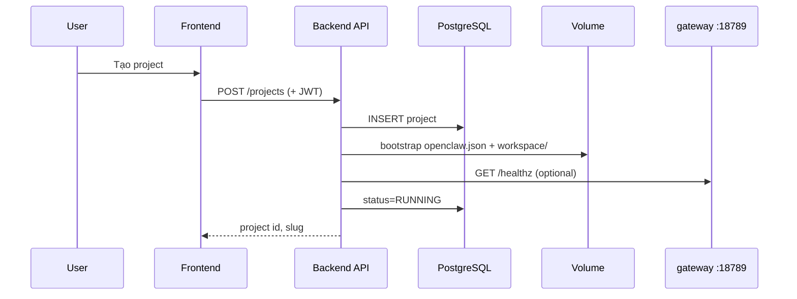
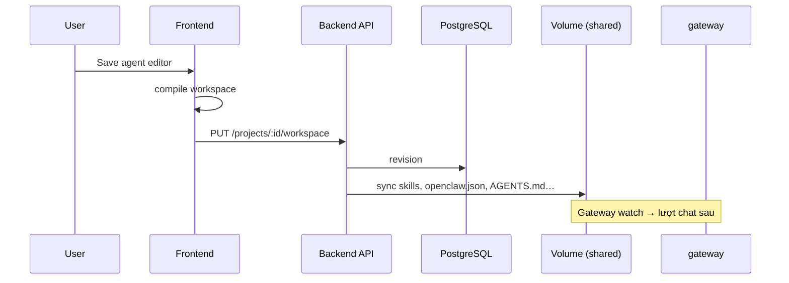
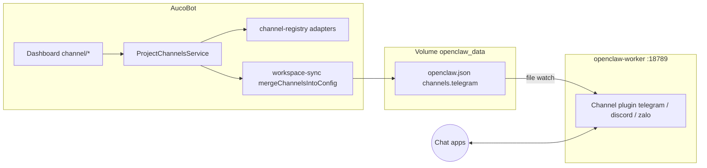
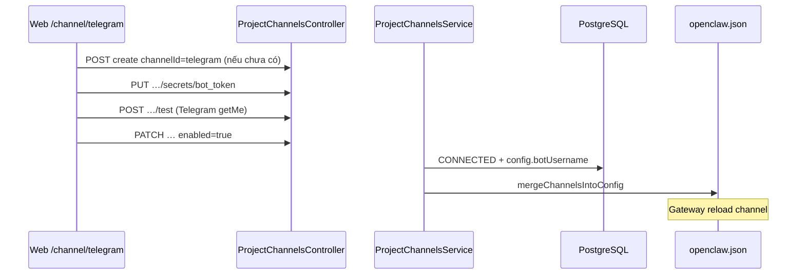
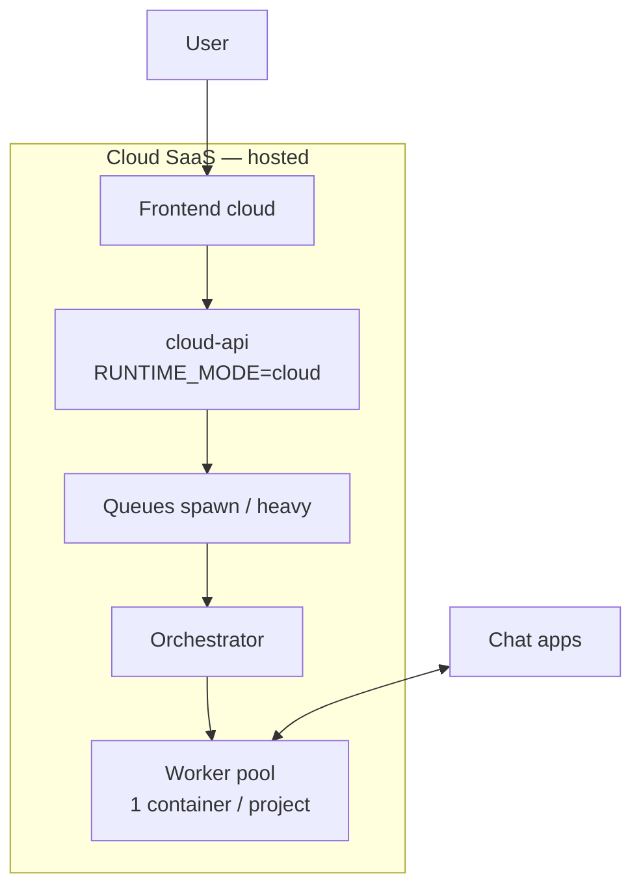
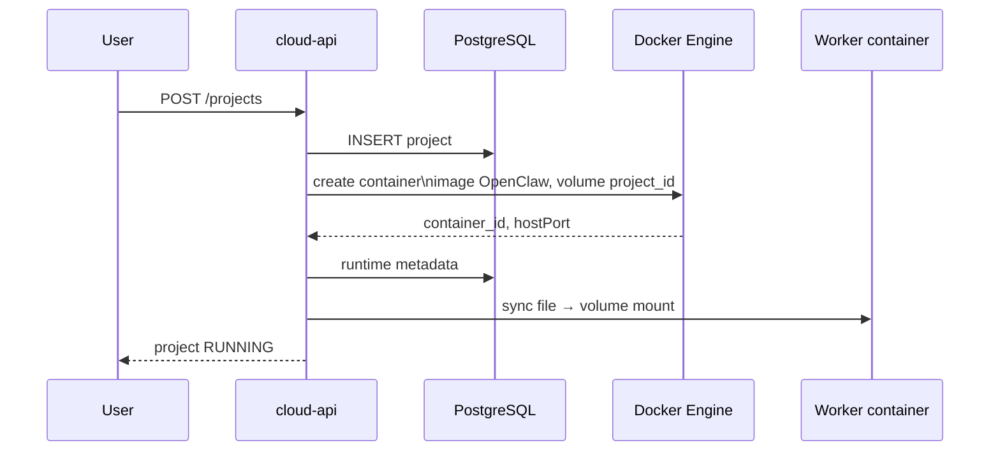

# AucoBot — Workflow & kiến trúc vận hành

> **Cập nhật:** 2026-05-24  
> **Tên sản phẩm / monorepo:** AucoBot (xem `monorepoplan.md`)  
> **Phân kỳ:**  
> - **OSS (mã nguồn mở):** một **`docker compose`** dựng **đủ stack** giống **[Supabase](https://supabase.com)** self-host: **frontend**, **backend**, **PostgreSQL**, và **một service gateway OpenClaw** (cổng **18789**). User chạy `docker compose up` — **không** spawn container qua Docker API khi tạo project. Backend **sync file** lên volume dùng chung và **proxy chat** tới `OPENCLAW_GATEWAY_URL` (ví dụ `http://gateway:18789`).  
> - **Cloud SaaS (hosted thương mại):** bạn **bán** bản cloud (đa tenant, vận hành thay khách). Runtime **mỗi project = một container** OpenClaw — backend **provision** qua Docker API / fleet (`vps-worker`, quota, billing). OSS **không** phải bản demo của Cloud — OSS là **sản phẩm gốc** cho community; Cloud **tái dùng** lõi OSS qua package/module, phần kinh doanh có thể **repo đóng**.  
> **Tham chiếu:** `openclaw-architecture.md`, `monorepoplan.md`, `billing-plan.md` (Cloud SaaS), `proxy-guide.md`.

---

## Vai trò tài liệu

| Thuộc | Không thuộc |
| ----- | ----------- |
| Luồng vận hành **OSS (self-host)** | Chi tiết giá/credit hosted (→ `billing-plan.md`) |
| Sketch **Cloud SaaS** (cloud bạn bán) | Schema Prisma từng bảng (→ `backend/prisma/schema.prisma`) |
| Ranh OSS vs Cloud / proprietary | Danh sách sprint (→ `roadmap-plan.md`) |
| Cấu trúc monorepo pnpm, **ranh giới 4 service OSS** | → `monorepoplan.md` §2 |

**Thuật ngữ**

- **Project:** đơn vị trong dashboard (cấu hình agent, workspace, bí mật, secrets). Metadata **lưu trong DB**; cấu hình runtime cho gateway qua **sync file** trên volume (`openclaw.json`, `AGENTS.md`, …).
- **Worker / Gateway:** tiến trình OpenClaw (image `openclaw-worker`).  
  - **OSS:** **một** gateway trong compose, cổng **18789** — dùng chung cho instance (MVP thường **1 user ≈ 1 project**).  
  - **Cloud:** **một container gateway / project** — spawn động, `hostPort` lưu DB.
- **Control plane:** App NestJS + Next.js + PostgreSQL — **không** đọc channel trực tiếp; điều phối DB, sync, proxy WS.

---

## 1. OSS và Cloud SaaS

Cộng đồng và team muốn **UI + persistence** cho project/bot đa kênh, **không** phụ thuộc black box — đồng thời muốn **engine mở** và **cloud trả phí** song song.

| Sản phẩm | Ai vận hành | Mô hình runtime gateway |
| -------- | ----------- | ------------------------ |
| **OSS** | Người dùng / tổ chức tự deploy | **Compose** bật sẵn `gateway:18789`; API **không** cần `docker.sock` |
| **Cloud SaaS** | Nhà cung cấp (bạn) | **Spawn 1 container / project** trên hạ tầng hosted + fleet, billing, quota |

| Sản phẩm | Ai vận hành control plane | Mô hình sản phẩm |
| -------- | -------------------------- | ---------------- |
| **OSS** | Người dùng tự host | Self-host, fork, PR, source công khai |
| **Cloud SaaS** | Bạn | Hosted trả phí — provisioning, SLA, scale |

- **OSS:** “**một nguồn thật trong DB**” + **sync file** volume (`openclaw-architecture.md` §4.5.1, §4.7 Phase 1). Auth API: **JWT**. Gateway: **`gateway.auth`** / `OPENCLAW_GATEWAY_TOKEN` — **không** dùng JWT dashboard cho chat.
- **Cloud:** Cùng sync file + thêm orchestration fleet, billing, multi-tenant — phần proprietary **repo đóng** import lõi OSS.

---

## 2. Ranh giới service OSS (4 container + volume)

OSS self-host **đủ** với **bốn container** trong `docker compose`. Chỉ **frontend** (`web`) và **backend** (`api`) là **code AucoBot**. **PostgreSQL** và **OpenClaw** (`gateway`) **pull image upstream** — fork để pin tag, **không sửa** runtime.

> **Tóm tắt:** `web` + `api` (bạn build) + `gateway` + `postgres` (pull) **+ volume** `openclaw_data`. Không Redis / BullMQ / fleet. Chi tiết: `monorepoplan.md` §2.

### 2.1 Bốn service

| Service | Image | Sở hữu | Port | Vai trò |
| ------- | ----- | ------- | ---- | ------- |
| `web` | Build `frontend/` | **AucoBot** | 3000 | Dashboard → API |
| `api` | Build `backend/` | **AucoBot** | 3001 | DB, sync file, proxy chat → gateway |
| `gateway` | Pull OpenClaw | **Upstream** | **18789** | Kênh chat, agent (đọc volume) |
| `postgres` | `postgres:16-alpine` | **Upstream** | 5432 | Metadata app |

- Chat: **web → api → gateway** — FE **không** gọi thẳng `:18789`.
- `api` **không** cần `docker.sock` (spawn = Cloud).

### 2.2 Volume & env (bắt buộc, không phải container thứ 5)

| Thành phần | Ghi chú |
| ---------- | ------- |
| Volume `openclaw_data` | `api` ghi sync; `gateway` đọc — cùng mount |
| `OPENCLAW_GATEWAY_URL` | `http://gateway:18789` (trong compose) |
| `OPENCLAW_GATEWAY_TOKEN` | Khớp token gateway; ≠ JWT dashboard |
| `OPENCLAW_DATA_ROOT` | Đường ghi file trên volume |
| `DATABASE_URL` | → `postgres` |

### 2.3 Không có trong compose OSS

Redis, BullMQ, `vps-worker`, Traefik (tuỳ chọn prod), `skill-hub` (catalog tĩnh), Docker socket trên `api`.

### 2.4 Ngoài stack (integration)

LLM API keys, Google OAuth (connectors), token kênh Telegram/Discord, reverse proxy TLS — **không** phải service container AucoBot.

### 2.5 Sở hữu code

```text
AucoBot:     frontend/ + backend/
Upstream:    postgres image + openclaw image (fork pin)
Compose:     docker-compose.yml + volume + .env
```

`openclaw-worker/` trong repo: pin upstream / docs — runtime OSS **pull image**.

---

## 3. Tư duy vận hành — Control plane vs OpenClaw

App = **control plane (DB + API + dashboard)** + **runtime OpenClaw (gateway)**.  
OpenClaw **không đọc PostgreSQL** — chỉ đọc **file + `openclaw.json`** trên volume.

### OSS (một gateway trong compose)



### Cloud (gateway per project — spawn động)



### Quy tắc một dòng

| OpenClaw gateway **phải thấy** để chạy? | Chỉ tính năng **app** (billing, UI, tenant…)? |
| -------------------------------------- | --------------------------------------------- |
| **Sync DB → volume / `openclaw.json`** | **Giữ trên DB** — API đọc trực tiếp |

### Ví dụ nhanh

| Sync sang OpenClaw (volume) | Chỉ DB (app) |
| --------------------------- | ------------ |
| API key provider → `env` trong `openclaw.json` | User, JWT, plan, invoice |
| Skill `enabled` → `workspace/skills/<slug>/SKILL.md` | Skill draft chưa publish |
| Agent workspace → `AGENTS.md`, `SOUL.md`, … | Danh sách project, slug hiển thị |
| Channel token (khi map workspace) | — |
| — | **OSS:** không lưu `container_id` / `host_port` |
| — | **Cloud:** `container_id`, `host_port`, Docker lifecycle |

**Khi user chat:** không inject config từng tin — file đã sync; gateway **watch** + build prompt (`openclaw-architecture.md` §11.5, §4.7).

**Sync khi nào:** khi user **lưu / bật / đổi** cấu hình — **không** sync mỗi tin nhắn.

---

## 4. OSS — Kiến trúc tổng quan

**Self-host một lần:** `docker compose up` khởi chạy **bốn service** (xem §2): **web** + **api** (build AucoBot), **postgres** + **gateway** (pull upstream). Repo `openclaw-worker/` chỉ để pin image — runtime OSS không build custom OpenClaw.



**Nguyên tắc OSS**

1. **Một stack compose = một gateway** trên **18789** (service name `gateway` trong mạng Docker). Backend truy cập `http://gateway:18789` (trong compose) hoặc `http://127.0.0.1:18789` (dev host).
2. **Không** spawn container per project qua Docker API; **không** mount `docker.sock` vào service `api`.
3. **PostgreSQL** = nguồn sự thật **app**. OpenClaw chỉ đọc **volume** — sync có chọn lọc (§3).
4. Tạo project trên OSS = **INSERT DB** + **bootstrap/sync file** + (tuỳ chọn) ping `GET /healthz` — **không** `docker create`.
5. **Không** bắt buộc BullMQ, `vps-worker`, billing trong OSS core (`NoopPlanGuard`).
6. **MVP:** thường **1 user ≈ 1 project**; volume `openclaw_data` mount chung cho api + gateway.

**Env OSS (api)**

```env
RUNTIME_MODE=oss
OPENCLAW_GATEWAY_URL=http://gateway:18789
OPENCLAW_GATEWAY_TOKEN=...
OPENCLAW_DATA_ROOT=/data/projects
```

---

## 5. OSS — Luồng vận hành (theo người dùng)

### 5.1 Đăng ký / đăng nhập

```mermaid
sequenceDiagram
    participant U as User
    participant FE as Frontend
    participant API as Backend API
    participant DB as PostgreSQL

    U->>FE: Đăng ký / đăng nhập
    FE->>API: POST /auth/* (credential)
    API->>DB: user record
    API-->>FE: JWT (access ± refresh)
    FE-->>U: Session; Bearer cho API
```

- **Auth OSS:** **JWT**. Gateway **không** dùng JWT dashboard — dùng `gateway.auth` / token compose.

### 5.2 Khởi động stack & tạo project

**Bước 0 — User (hoặc admin) bật stack:**

```bash
docker compose -f deploy/docker-compose.yml up -d
# postgres + gateway (healthz) + api + web
```



**Bước 1 — Tạo project (không spawn container):**



- Volume: `{OPENCLAW_DATA_ROOT}/{projectId}/` — api **ghi**, gateway **đọc** (cùng mount `openclaw_data`).
- Token gateway OSS: **`OPENCLAW_GATEWAY_TOKEN`** global từ compose (đồng bộ vào `openclaw.json` khi bootstrap).
- **Không** lưu `container_id` / `host_port` trên OSS (hoặc để null).
- Restart gateway: `docker compose restart gateway` — không có API “respawn project” trên OSS.

### 5.3 Soạn trên dashboard → lưu DB → sync file (OpenClaw)



- Agent compiler: `backend/src/plugins/projects/agents/agent-workspace-compile.ts` → sync runtime (provider keys, agents.list). Agent `main` implicit. Skill → `SKILL.md`.
- **Cloud:** cùng sync; có thể thêm `config.patch` RPC — §4.7 `openclaw-architecture.md`.

### 5.4 Kênh chat & lưu lượng thời gian thực

1. **OSS:** Một gateway trong compose — channel cấu hình trong workspace/volume project đó.
2. Lưu lượng bot **không** qua body HTTP sync; FE ↔ API **proxy WebSocket** → `OPENCLAW_GATEWAY_URL` (cổng **18789**).
3. API lo: auth JWT, CRUD, sync file — **không** lifecycle Docker trên OSS.

### 5.5 Channels — Control plane vs OpenClaw worker (Telegram, Discord, Zalo…)

**Channels** (Telegram, Discord, Zalo…) khác **connect to** (Google Drive, Calendar MCP). Cả hai đều lưu DB + sync file, nhưng **runtime chat** chỉ chạy trong **openclaw-worker** (gateway).

| Lớp | Nơi làm | Vai trò |
| --- | ------- | ------- |
| **Runtime channel** | `openclaw-worker` (image upstream / fork) | Nhận/gửi tin, webhook, pairing, RPC `channels.*` |
| **Control plane** | `apps/api` + `@aucobot/workspace-sync` | UI, DB, mã hóa secret, test token, ghi `openclaw.json` |

Backend **không inject code channel** vào worker — chỉ **inject cấu hình JSON** lên volume. Gateway **watch** file → load plugin → channel chạy.



#### Thêm kênh mới — quy trình

```
1. Upstream OpenClaw đã có channel id?
   ├─ Có (telegram, discord, zalo bundled) → adapter backend + merge config (+ plugins.entries nếu bundled)
   └─ Chưa → fork worker, viết plugin registerChannel, build image → rồi adapter backend + UI
```

| Kênh | Loại upstream | Fork worker? | Backend MVP |
| ---- | ------------- | ------------ | ----------- |
| **Telegram** | Built-in | Không (pin image) | `bot_token` → `channels.telegram.token` |
| **Discord** | Built-in | Không | `bot_token` → `channels.discord.token` |
| **Zalo** | Bundled plugin | Chỉ khi upstream thiếu / cần patch | secret + `plugins.entries.zalo.enabled` |

#### Luồng lưu Telegram (Phase 1)



**API (mirror connectors):**

- `GET /api/projects/channels/definitions` — catalog
- `GET|POST|PATCH|DELETE /api/projects/:id/channels`
- `PUT …/channels/:id/secrets/:key` · `POST …/test`

**Schema DB:** `project_channels`, `project_channel_secrets` (`ChannelConnectionStatus`).

**Quy ước:** `channelId` khớp OpenClaw (`telegram`, `discord`, `zalo`); mỗi kênh = một file adapter trong `channels/` — service chung không `if (channelId === …)`.

---

## 6. OSS — Phạm vi backend (“có” / “chưa”)

| Hạng mục | OSS |
| -------- | --- |
| Auth JWT, user, session | Có |
| CRUD project, metadata, revision workspace trong DB | Có |
| **Channels API** (Telegram MVP — DB + sync `openclaw.json`) | **Có** |
| Service **gateway** trong compose, proxy tới **:18789** | **Có** (mô hình đích) |
| Ghi workspace xuống volume gateway đọc | Có |
| **Spawn container per project** (Docker API) | **Không** |
| Mount **docker.sock** trên api | **Không** |
| API start/stop/respawn container project | **Không** (restart stack / gateway) |
| Mã hóa bí mật lưu trữ (SecretCrypto) | Khuyến nghị |
| Health DB + gateway `/healthz` | Có |
| Traefik wildcard, ingress fleet, autoscale | Chủ yếu **Cloud** |
| BullMQ / `vps-worker` / idle-shutdown | **Không** OSS core |
| Heavy jobs (FFmpeg, Playwright) + credits | **Không** (Cloud) |

> **Ghi chú triển khai:** Code `backend/` hiện tại vẫn có `DockerService.spawnWorker` — đó là **hành vi Cloud**; OSS đích dùng `RUNTIME_MODE=oss` + `StaticGatewayProvisioner` (xem `monorepoplan.md` §14 Phase 2).

---

## 7. Cấu trúc mã — OSS public vs Cloud (Supabase-style)

| Repo / package | License | Nội dung |
| -------------- | ------- | -------- |
| **AucoBot / `openclaw-saas` (public)** | Apache-2.0 / MIT | `frontend/`, `backend/`, `openclaw-worker/`, compose OSS |
| **`aucobot-cloud` (private)** hoặc `cloud/` | Proprietary | Billing, fleet, quota — **import** `@aucobot/control-plane-core` |

```text
aucobot/                            # PUBLIC — self-host
├── apps/web/                       # Dashboard
├── apps/api/                       # NestJS — RUNTIME_MODE=oss
├── deploy/docker-compose.yml       # postgres + api + web + gateway (pull)
└── packages/
    ├── control-plane-core/
    ├── runtime-oss/                # StaticGateway — URL cố định
    └── runtime-contracts/

aucobot/cloud/                      # PRIVATE (hoặc repo aucobot-cloud riêng)
├── api/                            # RUNTIME_MODE=cloud, docker.sock
├── web/
├── packages/                       # cloud-only (@aucobot-cloud/*)
│   ├── fleet/                      # DockerPerProjectProvisioner
│   └── billing/
└── deploy/                         # K8s, Traefik
```

**Tái dùng kỹ thuật:**

| Interface | OSS | Cloud |
| --------- | --- | ----- |
| `RuntimeProvisioner` | `StaticGatewayProvisioner` — health + sync only | `DockerPerProjectProvisioner` — spawn/stop |
| `PlanGuard` | `NoopPlanGuard` | Stripe / quota |
| Sync file → OpenClaw | **Chung** — không copy CRUD project |

Chi tiết monorepo: **`monorepoplan.md`**.

---

## 8. Cloud SaaS — Hosted (bạn bán)

**Mục tiêu:** khách đăng ký cloud, trả phí / free tier — **không** tự `docker compose` worker; bạn lo spawn, scale, backup.

| Thành phần | Gợi ý |
| ---------- | ----- |
| **Control plane** | API + DB managed; tenant isolation |
| **Runtime** | **1 container OpenClaw / project** — Docker API, `vps-worker` / K8s, ingress |
| **Backend → gateway** | `http://127.0.0.1:{hostPort}` — lưu DB per project |
| **Kinh doanh** | `billing-plan.md` |
| **Heavy / queue** | `vps-heavy`, BullMQ |
| **Mã nguồn** | Import lõi OSS; fleet + billing **proprietary** |



### Cloud — Tạo project (spawn container)



**OSS ↔ Cloud:** Cùng **project + sync file**; Cloud thêm **spawn per project**, billing, fleet, SLA. Khách cloud không chạy stack OSS tại nhà song song; migrate/import là luồng riêng.

---

## 9. Bảng so sánh nhanh

| Tiêu chí | OSS (community) | Cloud SaaS (hosted) |
| -------- | ----------------- | --------------------- |
| **Mô hình** | Self-host `docker compose up` | Đăng ký cloud, trả phí |
| **Tương tự thị trường** | Supabase self-host / n8n self-host | Supabase Cloud / n8n Cloud |
| **Gateway** | **1 service** stack, **:18789** cố định | **1 container / project**, port động |
| **Ai bật worker** | Compose (cùng lúc với api, db, web) | Orchestrator / Docker API |
| **docker.sock trên api** | **Không** | **Có** (hoặc remote Docker) |
| **Đồng bộ cấu hình** | DB + ghi file volume chung | DB + ghi file + spawn |
| **Auth API** | JWT | JWT + billing |
| `vps-worker` / `vps-heavy` | Không bắt buộc | Thường có |
| **Mã nguồn** | Repo public | OSS core + package đóng |

---

## 10. Liên kết tài liệu

| Chủ đề | File |
| ------ | ---- |
| Gateway HTTP, session API, config watch, skills | `openclaw-architecture.md` (§4.7, §11.5) |
| Monorepo AucoBot, **4 service OSS**, compose, Phase migrate | `monorepoplan.md` §2, §14 |
| Giá, credit, quota (Cloud) | `billing-plan.md` |
| Proxy / ingress an toàn | `proxy-guide.md` |

---

*OSS: **4 services** (`web`, `api`, `gateway`, `postgres`) + volume — chỉ web/api là code AucoBot; gateway/postgres pull upstream. Cloud: **1 project = 1 container**. Skills: sync `{OPENCLAW_DATA_ROOT}/<projectId>/workspace/skills/<slug>/SKILL.md`.*

### E2E checklist — Skills (OSS)

1. Stack đang chạy: `gateway` healthy tại `:18789`.
2. Tạo skill trên dashboard → `POST /api/projects/:id/skills`.
3. Soạn body → `PUT` debounced → bật **Bật & sync**.
4. Kiểm tra file: `{OPENCLAW_DATA_ROOT}/<projectId>/workspace/skills/<slug>/SKILL.md`.
5. Trong gateway container: `openclaw skills list --eligible` (hoặc chat sau `/new`).
6. Tắt skill → xóa thư mục skill khỏi volume; agent không thấy ở lượt sau.
