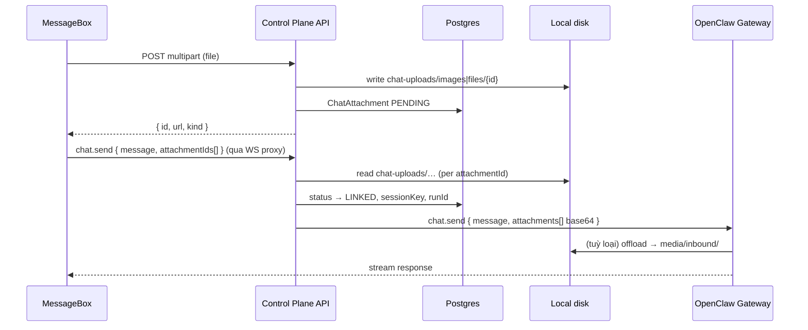

# Kế hoạch Backend — Chat Attachments (Local Storage)

> Tài liệu tham khảo cho thiết kế lưu file đính kèm chat: **bytes trên disk**, **metadata trong Postgres**, **tách ảnh và tài liệu**.
>
> Liên quan frontend: `MessageBox` (drag-drop, paste, max 10 file, 20MB ảnh/doc).

---

## 1. Đánh giá nhanh

**Tách file ra disk, DB chỉ giữ metadata** là hướng đúng cho chat attachment.

| Layer | Lưu gì | Không lưu gì |
|-------|--------|--------------|
| **Disk (local)** | Bytes thật của ảnh & tài liệu | — |
| **Postgres** | Metadata + đường dẫn + trạng thái | `Bytes`, base64 |
| **Gateway / OpenClaw** | Nhận `attachments[]` base64 qua `chat.send`; tự ghi `media/inbound/` | Upload trực tiếp từ browser; path-only attachment |

### Bối cảnh codebase hiện tại

- Project data: `data/projects/{projectId}/` (Docker mount `apps/api/data/projects:/data/projects`)
- Subdirs hiện có: `workspace/`, `devices/`, `agents/`, `logs/` (`packages/workspace-sync`)
- Chat: WebSocket proxy → `chat.send` (text only, chưa có attachment API)
- Avatar OSS: lưu bytes trong Postgres (512KB) — **không áp dụng pattern này** cho file 20MB
- Avatar Cloud: S3 + `avatarStorageKey` trong DB — **pattern tương tự** cho Cloud phase
- OpenClaw gateway: `GET /api/chat/media/outgoing/…` cho **ảnh agent trả về** (outgoing) — không dùng cho upload user
- OpenClaw inbound: `chat.send` → `parseMessageWithAttachments` → `media/inbound/` (`openclaw-fork/src/gateway/chat-attachments.ts`, `src/media/store.ts`)
- Gateway state dir = `OPENCLAW_STATE_DIR` = `data/projects/{projectId}/` (entrypoint `deploy/scripts/gateway-entrypoint.sh`)

### Vì sao tách `images/` và `files/` trên disk?

- Policy khác nhau (resize ảnh, thumbnail, virus scan doc)
- Agent / OpenClaw xử lý ảnh qua media pipeline riêng
- Quota & cleanup theo loại dễ hơn
- Migrate Cloud sau: ảnh → CDN/S3, doc → cold storage

---

## 2. Nguyên tắc thiết kế

1. **Không lưu blob trong database** — chỉ metadata + `storagePath` (hoặc `storageKey` trên Cloud).
2. **Tên file trên disk = UUID/cuid** — không tin tên gốc từ user (path traversal).
3. **Auth mọi download** — JWT + project ownership; không public URL.
4. **Validate server-side** — khớp giới hạn frontend (10 file, 20MB/loại, MIME whitelist).
5. **Shared volume với gateway** — project dir mount chung (`OPENCLAW_DATA_ROOT`); Phase 3 mặc định API đọc `chat-uploads/` rồi gửi base64 (gateway không cần đọc path upload trực tiếp).

---

## 3. Cấu trúc thư mục (local)

Gắn vào project dir hiện có:

```
data/projects/{projectId}/          ← OPENCLAW_STATE_DIR (shared volume api + gateway)
├── workspace/          # (đã có)
├── agents/             # (đã có)
├── devices/            # (đã có)
├── logs/               # (đã có)
├── chat-uploads/       # NEW — control plane (API)
│   ├── images/
│   │   └── {attachmentId}.webp   # hoặc .png / .jpg — ext từ MIME sau validate
│   └── files/
│       └── {attachmentId}.pdf    # ext từ MIME, không dùng tên gốc user
└── media/              # OpenClaw tự tạo khi chat.send có attachment
    ├── inbound/        # offload từ gateway: {name}---{uuid}.{ext}
    └── outgoing/       # ảnh agent trả về (managed-image-attachments)
        ├── originals/
        └── records/
```

**Hai layer disk (cố ý tách):**

| Thư mục | Owner | Mục đích |
|---------|-------|----------|
| `chat-uploads/` | Control plane API | Pre-upload, auth download, preview UI, orphan cleanup |
| `media/inbound/` | OpenClaw gateway | Runtime agent: `ctx.MediaPaths`, transcript `MediaPaths` |

Khi send, gateway có thể ghi thêm bản copy vào `media/inbound/` — **duplicate tạm** giữa hai layer; policy cleanup xem mục 10.

**Quy ước:**

- `attachmentId` = `cuid()` hoặc UUID v4
- `originalName` (vd. `demo1.docx`) **chỉ** lưu DB
- Ảnh lớn có thể normalize (resize → WebP) trước khi ghi — tham khảo `lib/avatar-upload.ts`
- Sau khi tạo dir: gọi `ensureGatewayWritableProjectDir()` (uid/gid gateway)

---

## 4. Database schema (Prisma)

Chỉ metadata — không cột `Bytes`.

```prisma
enum ChatAttachmentKind {
  IMAGE
  DOCUMENT
}

enum ChatAttachmentStatus {
  PENDING    // upload xong, chưa gửi chat
  LINKED     // đã gắn message / run
  DELETED
}

model ChatAttachment {
  id           String               @id @default(cuid())
  projectId    String               @map("project_id")
  userId       String               @map("user_id")
  sessionKey   String?              @map("session_key")
  kind         ChatAttachmentKind
  mimeType     String               @map("mime_type")
  originalName String               @map("original_name")
  sizeBytes    Int                  @map("size_bytes")
  storagePath  String?              @map("storage_path")  // OSS: chat-uploads/...
  storageKey   String?              @map("storage_key")   // Cloud R2 object key
  status       ChatAttachmentStatus @default(PENDING)
  linkedRunId  String?              @map("linked_run_id") // idempotencyKey chat.send
  expiresAt    DateTime?            @map("expires_at")    // orphan cleanup
  createdAt    DateTime             @default(now()) @map("created_at")

  project Project @relation(fields: [projectId], references: [id], onDelete: Cascade)
  user    User    @relation(fields: [userId], references: [id], onDelete: Cascade)

  @@index([projectId, status])
  @@index([projectId, userId])
  @@index([expiresAt])
  @@map("chat_attachments")
}
```

**Ownership (production):** Postgres là source of truth (`projectId`, `userId`, `id`); R2/disk chỉ blob. Cloud dùng `storageKey`; OSS dùng `storagePath`. Download luôn qua `GET /api/projects/:id/chat/attachments/:id` (JWT + lookup scoped `projectId`).

**Cloud phase:** `storageKey` bắt buộc khi `RUNTIME_MODE=cloud`; bucket R2 riêng (`CHAT_ATTACHMENT_S3_*` env).

---

## 5. Storage abstraction

Pattern giống `AvatarStorage` (`@claw-dashboard/runtime-contracts` + provider NestJS).

```typescript
interface ChatAttachmentStorage {
  save(input: {
    projectId: string;
    kind: 'image' | 'document';
    buffer: Buffer;
    mimeType: string;
    attachmentId: string;
  }): Promise<{ storagePath: string; sizeBytes: number }>;

  read(
    projectId: string,
    storagePath: string,
  ): Promise<{ buffer: Buffer; mimeType: string }>;

  delete(projectId: string, storagePath: string): Promise<void>;
}
```

| Runtime | Implementation |
|---------|----------------|
| OSS / local dev | `LocalChatAttachmentStorage` → `data/projects/...` |
| Cloud (sau) | `S3ChatAttachmentStorage` → `chat/{projectId}/images\|files/{id}` |

Inject qua `chat-attachment-storage.provider.ts` theo `RUNTIME_MODE` — tham khảo `avatar-storage.provider.ts`.

---

## 6. API endpoints

```
POST   /api/projects/:projectId/chat/attachments
       Content-Type: multipart/form-data, field "file"
       → validate → ghi disk → insert DB (PENDING)
       ← { id, kind, mimeType, originalName, sizeBytes, url, status }

GET    /api/projects/:projectId/chat/attachments/:id
       JWT + project owner → stream file (Content-Type, Content-Disposition)

DELETE /api/projects/:projectId/chat/attachments/:id
       Chỉ khi status = PENDING (user xóa trước khi gửi)
```

**Validation server** (khớp frontend):

| Rule | Giá trị |
|------|---------|
| Max file / message | 10 |
| Max size ảnh | 20 MB |
| Max size tài liệu | 20 MB |
| MIME | Whitelist + magic bytes |
| Project layout | `ensureProjectLayout(projectId)` trước khi ghi |

**Upload implementation:** `@fastify/multipart` (đã dùng cho avatar) + `fetch` từ web (`lib/api/multipart-upload.ts`).

---

## 7. Luồng end-to-end



### Thay đổi frontend (khi wire backend)

1. Upload từng file → `POST .../attachments` (progress thật qua `fetch` / `onUploadProgress`)
2. `onSend` gửi `attachmentIds[]` thay vì raw `File[]`
3. Preview dùng URL API (`GET .../attachments/:id`) thay vì `blob:` URL
4. Xóa file → `DELETE .../attachments/:id`

**Trạng thái hiện tại frontend:** simulate upload local, gửi kèm tên file trong text `[Đính kèm: ...]`.

---

## 8. Tích hợp `chat.send` với Gateway

> **Đã đối chiếu** `openclaw-fork` (2026-06-08). Schema RPC: `ChatSendParamsSchema` — `attachments?: Array<Unknown>`; mỗi item sau normalize phải có **`content` base64** + `mimeType` + `fileName` (`chat-attachments.ts`, `attachment-normalize.ts`). **Không hỗ trợ path-only.**

### Kết quả đối chiếu các hướng

| Hướng | Kết luận | Ghi chú |
|-------|----------|---------|
| **A. Path trong container** | ❌ Không khả thi trực tiếp | `content` bắt buộc base64; cần fork gateway nếu muốn path ref |
| **B. Copy vào `workspace/`** | ⚠️ Gateway đã làm (sandbox) | `prestageMediaPathOffloads` copy → `workspace/media/inbound/`; không thay API upload |
| **C. Gateway media API** | ❌ Chỉ outgoing | `/api/chat/media/outgoing/…` = ảnh **agent tạo**, không phải upload user |
| **D. API đọc disk → base64 → `chat.send`** | ✅ **Khuyến nghị Phase 3** | Không sửa `openclaw-fork`; proxy hiện tại forward transparent |

### Luồng gateway sau khi nhận base64

1. `parseMessageWithAttachments` — sniff MIME, cap 20MB (`resolveChatAttachmentMaxBytes`)
2. Ảnh ≤ 2MB + model vision → inline base64 trong prompt
3. Ảnh lớn / tài liệu / model text-only → `saveMediaBuffer` → `media/inbound/{name}---{uuid}.{ext}`
4. `prestageMediaPathOffloads` → inject `ctx.MediaPaths` cho agent
5. Transcript user message lưu `MediaPath` / `MediaPaths` (absolute path trong container)

### Rủi ro sandbox (quan trọng)

| Cap | Giá trị | Nguồn |
|-----|---------|-------|
| Upload / parse | **20 MB** | `resolveChatAttachmentMaxBytes` |
| Sandbox staging | **5 MB** | `MEDIA_MAX_BYTES` trong `prestageMediaPathOffloads` |

File **5–20 MB** có thể upload + parse OK nhưng **fail staging** nếu agent chạy sandbox → client thấy lỗi 4xx/5xx. Phase 0 spike phải xác nhận; Phase 3 có thể giảm cap doc khi sandbox bật hoặc document limitation.

### Khuyến nghị Phase 3 (mặc định: hướng D)

1. Proxy nhận `attachmentIds[]` từ client (hoặc API enrich trước khi forward).
2. Đọc file từ `chat-uploads/` → build `attachments: [{ mimeType, fileName, content: base64 }]`.
3. Forward `chat.send` qua WS proxy hiện có (`chat.gateway-proxy.service.ts`).
4. UI hiển thị attachment qua `GET .../attachments/:id` (control plane), **không** dùng `MediaPaths` gateway trong transcript.

**Tối ưu sau (optional):** ghi thẳng vào `media/inbound/` hoặc patch gateway nhận path ref — tránh duplicate disk.

**Spike còn lại:** gửi 1 ảnh + 1 PDF base64 qua `chat.send`; kiểm tra agent đọc doc; kiểm tra sandbox vs non-sandbox.

---

## 9. Bảo mật

- **Auth:** JWT + `projects.assertOwned(userId, projectId)` trên mọi endpoint
- **Download:** session cookie hoặc signed URL ngắn hạn — không CDN public
- **Filename:** UUID trên disk; `Content-Disposition: attachment` với `originalName` đã sanitize
- **Path traversal:** reject `..`, resolve path trong project dir only
- **Rate limit:** upload theo user / project (tránh abuse 20MB × 10)
- **(Sau)** ClamAV scan cho `files/` trước khi mark `READY`

---

## 10. Cleanup & quota

| Job | Rule |
|-----|------|
| Orphan cleanup | `PENDING` + `createdAt > 24h` → xóa disk + soft/hard delete DB |
| Gateway duplicate | `media/inbound/` do OpenClaw quản lý — `cleanOldMedia` TTL ~2 phút (transient); không xóa `chat-uploads/` |
| Linked retention | Policy theo project (30 / 90 ngày) hoặc theo session |
| Quota | `SUM(sizeBytes) WHERE projectId` — expose qua `storageUsedMb` (schema project đã có field optional) |

Cron NestJS hoặc script daily.

---

## 11. Lộ trình triển khai

### Phase 0 — Spike (0.5–1 ngày)

- [x] Đọc OpenClaw `chat.send` params — `attachments[]` với `content` base64 (`logs-chat.ts`, `chat-attachments.ts`)
- [x] Quyết định tích hợp: **hướng D** (API → base64 → proxy `chat.send`); A/C loại; B do gateway tự xử lý
- [ ] Spike: gửi 1 ảnh + 1 PDF qua `chat.send` (script kiểu `apps/api/scripts/test-chat-send.mjs`)
- [ ] Spike: xác nhận agent nhận doc qua `ctx.MediaPaths`
- [ ] Spike: sandbox vs non-sandbox — giới hạn staging 5 MB (mục 8)

### Phase 1 — Storage + Upload API (2–3 ngày)

- [ ] Prisma migration `ChatAttachment`
- [ ] `LocalChatAttachmentStorage` + provider
- [ ] `POST / GET / DELETE` attachments
- [ ] Unit test: validate, path safety, size limits

### Phase 2 — Frontend wire-up (1 ngày)

- [ ] `lib/api/chat.ts` — `uploadAttachment`, `deleteAttachment`
- [ ] MessageBox: upload thật thay `simulateAttachmentUpload`
- [ ] `ClientChatPage.handleSend` — gửi `attachmentIds[]`

### Phase 3 — chat.send integration (1–2 ngày)

- [ ] Enrich proxy / send handler: `attachmentIds[]` → đọc `chat-uploads/` → `attachments[]` base64
- [ ] Forward `chat.send` với `mimeType`, `fileName`, `content` (hướng D)
- [ ] `ChatMessageBubble` hiển thị ảnh qua URL API (`GET .../attachments/:id`)
- [ ] E2E: upload → send → agent nhận file; document limitation nếu sandbox + file > 5 MB

### Phase 4 — Ops (1 ngày)

- [ ] Orphan cleanup job
- [ ] Quota per project
- [ ] Logging + metrics upload fail

### Phase 5 — Cloud (khi cần)

- [ ] `S3ChatAttachmentStorage`
- [ ] `storageKey` trong DB
- [ ] Giữ nguyên API contract frontend

---

## 12. So sánh với Avatar hiện tại

| | Avatar OSS | Chat attachments (đề xuất) |
|--|------------|------------------------------|
| Blob | Postgres `Bytes` | Disk / S3 |
| DB | mime + data | metadata + path |
| Max size | 512 KB | 20 MB |
| Use case | Avatar nhỏ | File chat |

Chat attachment **không nên** đi theo pattern avatar OSS.

---

## 13. Quyết định cần nghiên cứu thêm

| # | Câu hỏi | Trạng thái | Ghi chú |
|---|---------|------------|---------|
| 1 | `chat.send` schema? | ✅ Đã rõ | `attachments[]`: `content` (base64), `mimeType`, `fileName` |
| 2 | Doc khi send? | ✅ Đã rõ | Gateway offload → `media/inbound/`; sandbox copy → `workspace/media/inbound/` |
| 3 | Normalize ảnh WebP? | ⏳ Mở | Tiết kiệm disk `chat-uploads/`; gateway có thể offload lại riêng |
| 4 | Message history? | ✅ Đã rõ | Gateway transcript: `MediaPaths` (absolute); UI dùng control plane DB + API URL |
| 5 | Multi-runtime S3? | ⏳ Mở | Defer Phase 5 trừ khi cần Cloud ngay |
| 6 | Cap 5 MB sandbox? | ⏳ Spike | Giảm validate API, doc limitation, hoặc tắt sandbox cho chat attachments |

---

## 14. File liên quan trong repo

| Path | Ghi chú |
|------|---------|
| `studio/apps/web/.../MessageBox/` | Composer UI, drag-drop, paste |
| `studio/apps/web/.../MessageBox/composer-attachments.ts` | Validate client-side |
| `studio/apps/web/lib/api/multipart-upload.ts` | Pattern upload HTTP |
| `studio/apps/api/src/core/users/avatar/` | Pattern storage provider |
| `studio/packages/workspace-sync/src/project-paths.ts` | Project dir layout |
| `studio/packages/database/prisma/schema.prisma` | Migration target |
| `studio/apps/api/src/features/projects/chat/` | Module mở rộng |
| `openclaw-architecture.md` §4.2 | Gateway media endpoint |
| `openclaw-fork/src/gateway/chat-attachments.ts` | Parse inbound attachments, offload `media/inbound/` |
| `openclaw-fork/src/gateway/server-methods/chat.ts` | `chat.send` handler, `prestageMediaPathOffloads` |
| `openclaw-fork/src/gateway/managed-image-attachments.ts` | Outgoing images, `/api/chat/media/outgoing/…` |
| `openclaw-fork/src/media/store.ts` | `saveMediaBuffer`, naming `{name}---{uuid}.ext` |
| `openclaw-fork/src/gateway/protocol/schema/logs-chat.ts` | `ChatSendParamsSchema` |
| `studio/deploy/scripts/gateway-entrypoint.sh` | `OPENCLAW_STATE_DIR` = project dir |

---

*Tạo: 2026-06-05 — cập nhật: 2026-06-08 (đối chiếu openclaw-fork, hướng D, rủi ro sandbox).*
