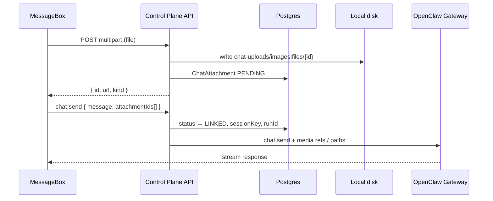

# Kế hoạch Backend — Chat Attachments (Local Storage)

> Tài liệu tham khảo cho thiết kế lưu file đính kèm chat: **bytes trên disk**, **metadata trong Postgres**, **tách ảnh và tài liệu**.
>
> Liên quan frontend: `MessageBox` (drag-drop, paste, max 10 file, 20MB ảnh/doc).

---

## 1. Đánh giá nhanh

**Tách file ra disk, DB chỉ giữ metadata** là hướng đúng cho chat attachment.

| Layer | Lưu gì | Không lưu gì |
|-------|--------|--------------|
| **Disk (local)** | Bytes thật của ảnh & tài liệu | — |
| **Postgres** | Metadata + đường dẫn + trạng thái | `Bytes`, base64 |
| **Gateway / OpenClaw** | Tham chiếu path hoặc media id khi `chat.send` | Upload trực tiếp từ browser |

### Bối cảnh codebase hiện tại

- Project data: `data/projects/{projectId}/` (Docker mount `apps/api/data/projects:/data/projects`)
- Subdirs hiện có: `workspace/`, `devices/`, `agents/`, `logs/` (`packages/workspace-sync`)
- Chat: WebSocket proxy → `chat.send` (text only, chưa có attachment API)
- Avatar OSS: lưu bytes trong Postgres (512KB) — **không áp dụng pattern này** cho file 20MB
- Avatar Cloud: S3 + `avatarStorageKey` trong DB — **pattern tương tự** cho Cloud phase
- OpenClaw gateway: `GET /api/chat/media/outgoing/…` cho ảnh trong pipeline chat

### Vì sao tách `images/` và `files/` trên disk?

- Policy khác nhau (resize ảnh, thumbnail, virus scan doc)
- Agent / OpenClaw xử lý ảnh qua media pipeline riêng
- Quota & cleanup theo loại dễ hơn
- Migrate Cloud sau: ảnh → CDN/S3, doc → cold storage

---

## 2. Nguyên tắc thiết kế

1. **Không lưu blob trong database** — chỉ metadata + `storagePath` (hoặc `storageKey` trên Cloud).
2. **Tên file trên disk = UUID/cuid** — không tin tên gốc từ user (path traversal).
3. **Auth mọi download** — JWT + project ownership; không public URL.
4. **Validate server-side** — khớp giới hạn frontend (10 file, 20MB/loại, MIME whitelist).
5. **Shared volume với gateway** — path phải readable bởi OpenClaw container khi agent cần đọc file.

---

## 3. Cấu trúc thư mục (local)

Gắn vào project dir hiện có:

```
data/projects/{projectId}/
├── workspace/          # (đã có)
├── agents/             # (đã có)
├── devices/            # (đã có)
├── logs/               # (đã có)
└── chat-uploads/       # NEW
    ├── images/
    │   └── {attachmentId}.webp   # hoặc .png / .jpg — ext từ MIME sau validate
    └── files/
        └── {attachmentId}.pdf    # ext từ MIME, không dùng tên gốc user
```

**Quy ước:**

- `attachmentId` = `cuid()` hoặc UUID v4
- `originalName` (vd. `demo1.docx`) **chỉ** lưu DB
- Ảnh lớn có thể normalize (resize → WebP) trước khi ghi — tham khảo `lib/avatar-upload.ts`
- Sau khi tạo dir: gọi `ensureGatewayWritableProjectDir()` (uid/gid gateway)

---

## 4. Database schema (Prisma)

Chỉ metadata — không cột `Bytes`.

```prisma
enum ChatAttachmentKind {
  IMAGE
  DOCUMENT
}

enum ChatAttachmentStatus {
  PENDING    // upload xong, chưa gửi chat
  LINKED     // đã gắn message / run
  DELETED
}

model ChatAttachment {
  id           String               @id @default(cuid())
  projectId    String               @map("project_id")
  userId       String               @map("user_id")
  sessionKey   String?              @map("session_key")
  kind         ChatAttachmentKind
  mimeType     String               @map("mime_type")
  originalName String               @map("original_name")
  sizeBytes    Int                  @map("size_bytes")
  storagePath  String               @map("storage_path")  // relative: chat-uploads/images/...
  status       ChatAttachmentStatus @default(PENDING)
  linkedRunId  String?              @map("linked_run_id") // idempotencyKey chat.send
  expiresAt    DateTime?            @map("expires_at")    // orphan cleanup
  createdAt    DateTime             @default(now()) @map("created_at")

  project Project @relation(fields: [projectId], references: [id], onDelete: Cascade)
  user    User    @relation(fields: [userId], references: [id], onDelete: Cascade)

  @@index([projectId, status])
  @@index([expiresAt])
  @@map("chat_attachments")
}
```

**Cloud phase (sau):** thêm `storageKey` (S3 object key), `storagePath` có thể null hoặc deprecated.

---

## 5. Storage abstraction

Pattern giống `AvatarStorage` (`@aucobot/runtime-contracts` + provider NestJS).

```typescript
interface ChatAttachmentStorage {
  save(input: {
    projectId: string;
    kind: 'image' | 'document';
    buffer: Buffer;
    mimeType: string;
    attachmentId: string;
  }): Promise<{ storagePath: string; sizeBytes: number }>;

  read(
    projectId: string,
    storagePath: string,
  ): Promise<{ buffer: Buffer; mimeType: string }>;

  delete(projectId: string, storagePath: string): Promise<void>;
}
```

| Runtime | Implementation |
|---------|----------------|
| OSS / local dev | `LocalChatAttachmentStorage` → `data/projects/...` |
| Cloud (sau) | `S3ChatAttachmentStorage` → `chat/{projectId}/images\|files/{id}` |

Inject qua `chat-attachment-storage.provider.ts` theo `RUNTIME_MODE` — tham khảo `avatar-storage.provider.ts`.

---

## 6. API endpoints

```
POST   /api/projects/:projectId/chat/attachments
       Content-Type: multipart/form-data, field "file"
       → validate → ghi disk → insert DB (PENDING)
       ← { id, kind, mimeType, originalName, sizeBytes, url, status }

GET    /api/projects/:projectId/chat/attachments/:id
       JWT + project owner → stream file (Content-Type, Content-Disposition)

DELETE /api/projects/:projectId/chat/attachments/:id
       Chỉ khi status = PENDING (user xóa trước khi gửi)
```

**Validation server** (khớp frontend):

| Rule | Giá trị |
|------|---------|
| Max file / message | 10 |
| Max size ảnh | 20 MB |
| Max size tài liệu | 20 MB |
| MIME | Whitelist + magic bytes |
| Project layout | `ensureProjectLayout(projectId)` trước khi ghi |

**Upload implementation:** `@fastify/multipart` (đã dùng cho avatar) + `fetch` từ web (`lib/api/multipart-upload.ts`).

---

## 7. Luồng end-to-end



### Thay đổi frontend (khi wire backend)

1. Upload từng file → `POST .../attachments` (progress thật qua `fetch` / `onUploadProgress`)
2. `onSend` gửi `attachmentIds[]` thay vì raw `File[]`
3. Preview dùng URL API (`GET .../attachments/:id`) thay vì `blob:` URL
4. Xóa file → `DELETE .../attachments/:id`

**Trạng thái hiện tại frontend:** simulate upload local, gửi kèm tên file trong text `[Đính kèm: ...]`.

---

## 8. Tích hợp `chat.send` với Gateway

> **Phase 0 spike bắt buộc** — xác nhận schema upstream OpenClaw trước khi implement Phase 3.

| Hướng | Ưu điểm | Nhược điểm |
|-------|---------|------------|
| **A. Path trong container** | Agent đọc được qua `group:fs` | Path phải visible cho gateway |
| **B. Copy vào `workspace/`** khi send | Agent thấy file như user upload | Duplicate disk |
| **C. Gateway media API** | Chuẩn pipeline ảnh OpenClaw | Cần map upload → gateway |

**Khuyến nghị:**

- **Ảnh:** tham chiếu path `/data/projects/{id}/chat-uploads/images/{id}` — gateway media có thể serve qua `/api/chat/media/outgoing/…`
- **Tài liệu:** copy hoặc symlink vào `workspace/uploads/` khi send để agent đọc qua fs tools

**Spike:** gửi message kèm path tuyệt đối trong container, kiểm tra agent có đọc được không.

---

## 9. Bảo mật

- **Auth:** JWT + `projects.assertOwned(userId, projectId)` trên mọi endpoint
- **Download:** session cookie hoặc signed URL ngắn hạn — không CDN public
- **Filename:** UUID trên disk; `Content-Disposition: attachment` với `originalName` đã sanitize
- **Path traversal:** reject `..`, resolve path trong project dir only
- **Rate limit:** upload theo user / project (tránh abuse 20MB × 10)
- **(Sau)** ClamAV scan cho `files/` trước khi mark `READY`

---

## 10. Cleanup & quota

| Job | Rule |
|-----|------|
| Orphan cleanup | `PENDING` + `createdAt > 24h` → xóa disk + soft/hard delete DB |
| Linked retention | Policy theo project (30 / 90 ngày) hoặc theo session |
| Quota | `SUM(sizeBytes) WHERE projectId` — expose qua `storageUsedMb` (schema project đã có field optional) |

Cron NestJS hoặc script daily.

---

## 11. Lộ trình triển khai

### Phase 0 — Spike (0.5–1 ngày)

- [ ] Đọc OpenClaw `chat.send` params cho media / attachments
- [ ] Thử gửi 1 ảnh từ path trong project dir
- [ ] Quyết định A / B / C (mục 8)

### Phase 1 — Storage + Upload API (2–3 ngày)

- [ ] Prisma migration `ChatAttachment`
- [ ] `LocalChatAttachmentStorage` + provider
- [ ] `POST / GET / DELETE` attachments
- [ ] Unit test: validate, path safety, size limits

### Phase 2 — Frontend wire-up (1 ngày)

- [ ] `lib/api/chat.ts` — `uploadAttachment`, `deleteAttachment`
- [ ] MessageBox: upload thật thay `simulateAttachmentUpload`
- [ ] `ClientChatPage.handleSend` — gửi `attachmentIds[]`

### Phase 3 — chat.send integration (1–2 ngày)

- [ ] Map attachment → gateway params trong proxy layer
- [ ] `ChatMessageBubble` hiển thị ảnh đính kèm
- [ ] E2E: upload → send → agent nhận file

### Phase 4 — Ops (1 ngày)

- [ ] Orphan cleanup job
- [ ] Quota per project
- [ ] Logging + metrics upload fail

### Phase 5 — Cloud (khi cần)

- [ ] `S3ChatAttachmentStorage`
- [ ] `storageKey` trong DB
- [ ] Giữ nguyên API contract frontend

---

## 12. So sánh với Avatar hiện tại

| | Avatar OSS | Chat attachments (đề xuất) |
|--|------------|------------------------------|
| Blob | Postgres `Bytes` | Disk / S3 |
| DB | mime + data | metadata + path |
| Max size | 512 KB | 20 MB |
| Use case | Avatar nhỏ | File chat |

Chat attachment **không nên** đi theo pattern avatar OSS.

---

## 13. Quyết định cần nghiên cứu thêm

1. **`chat.send` schema** — attachment truyền dạng gì cho OpenClaw? (path, URL, content blocks?)
2. **Doc khi send** — copy vào `workspace/` hay chỉ path absolute?
3. **Normalize ảnh** — resize WebP trước khi lưu? (tiết kiệm disk, đồng bộ avatar flow)
4. **Message history** — attachment metadata có lưu trong transcript gateway không, hay chỉ control plane DB?
5. **Multi-runtime** — Cloud dùng S3 ngay Phase 1 hay defer Phase 5?

---

## 14. File liên quan trong repo

| Path | Ghi chú |
|------|---------|
| `aucobot/apps/web/.../MessageBox/` | Composer UI, drag-drop, paste |
| `aucobot/apps/web/.../MessageBox/composer-attachments.ts` | Validate client-side |
| `aucobot/apps/web/lib/api/multipart-upload.ts` | Pattern upload HTTP |
| `aucobot/apps/api/src/core/users/avatar/` | Pattern storage provider |
| `aucobot/packages/workspace-sync/src/project-paths.ts` | Project dir layout |
| `aucobot/packages/database/prisma/schema.prisma` | Migration target |
| `aucobot/apps/api/src/features/projects/chat/` | Module mở rộng |
| `openclaw-architecture.md` §4.2 | Gateway media endpoint |

---

*Tạo: 2026-06-05 — tham chiếu cuộc thảo luận thiết kế chat attachments.*
