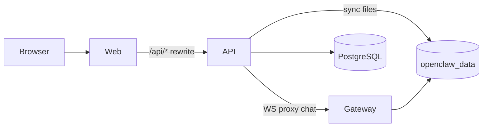
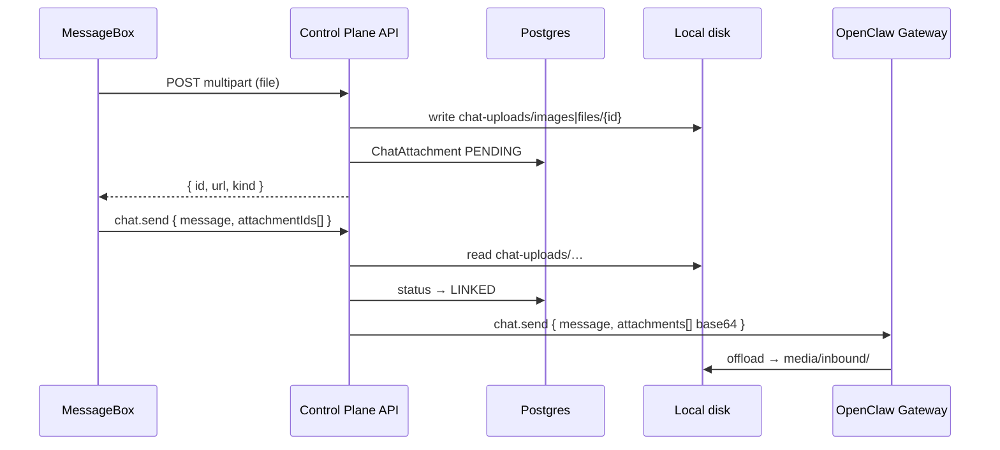

# Claw Dashboard — Architecture (OSS)

> **SSOT control plane:** this file + [`README.md`](README.md)  
> **SSOT OpenClaw gateway:** [`openclaw-architecture.md`](openclaw-architecture.md) (paths relative to [openclaw/openclaw](https://github.com/openclaw/openclaw))  
> **MCP connectors:** [`mcp.md`](mcp.md)

Single-repo **self-hosted OSS** control plane: **api**, **web**, **packages**, **deploy**.

---

## 1. Repository layout

```text
claw-dashboard/
├── apps/api          @claw-dashboard/api
├── apps/web          @claw-dashboard/web
├── packages/*        @claw-dashboard/*
├── deploy/           Docker Compose + Dockerfiles
├── claw-dashboard-architecture.md   Control plane (this file)
├── openclaw-architecture.md         OpenClaw gateway reference
└── mcp.md            MCP connectors (stdio npx)
```

| Path | Role |
|------|------|
| `apps/api` | Nest wiring, controllers, DTOs, guards — **thin** |
| `apps/web` | Next.js UI (Claw Dashboard) |
| `packages/*` | Shared libs (`@claw-dashboard/*`) |
| `deploy/` | OSS compose + Dockerfiles (api/web) |
| Gateway | **Upstream** [openclaw/openclaw](https://github.com/openclaw/openclaw) image `alpine/openclaw` |

Clone upstream gateway source locally when needed:

```bash
git clone https://github.com/openclaw/openclaw.git openclaw-upstream
```

---

## 2. OSS stack & constraints

**4 services:** `web` (:8386) + `api` (:8387) + `gateway` (:18789) + `postgres` (:5432)

```powershell
docker compose -f deploy/docker-compose.yml up -d
```

| Layer | Port | Role |
|-------|------|------|
| **Web** | 8386 | Dashboard — end users |
| **API** | 8387 | Settings, file sync, chat proxy |
| **Gateway** | 18789 | OpenClaw — agents, channels, MCP (`npx` stdio) |
| **PostgreSQL** | 5432 | Projects, users, metadata |

**OSS constraints:**

- API **does not** mount `docker.sock` (OSS only).
- Runtime gateway is **not** vendored — deploy pulls `alpine/openclaw` (see `deploy/docker-compose.yml`).
- Shared volume **`openclaw_data`**: API writes `/data/projects/default/…`, gateway reads the same data.
- **Distribution:** keep **api** and **web** as separate Docker images; bundle for end users via **one compose** or **desktop zip** (`deploy/desktop-bundle/`), not a single merged container.

Images: https://hub.docker.com/u/claw-dashboard

---

## 3. Operations & development

### Deploy (production / self-host)

```bash
docker compose -f deploy/docker-compose.yml pull
docker compose -f deploy/docker-compose.yml up -d
```

Build api/web from source:

```bash
docker compose -f deploy/docker-compose.yml up -d --build api web
```

### Dev (host)

```powershell
pnpm install
pnpm dev:db
pnpm dev
```

Default login: `admin` / `admin123`

### Verify (repo root)

```bash
pnpm --filter @claw-dashboard/runtime-contracts build
pnpm --filter @claw-dashboard/runtime-oss build
pnpm --filter @claw-dashboard/api build
pnpm --filter @claw-dashboard/web build
```

Compose E2E: `docker compose -f deploy/docker-compose.yml up -d --build`

### Runtime placement

- Interfaces → `packages/runtime-contracts`
- OSS gateway URL/health → `packages/runtime-oss`

---

## 4. Runtime flow

1. User opens Claw Dashboard → creates project (OSS: one project per user).
2. API syncs `openclaw.json`, workspace, connectors to shared volume.
3. Gateway reads volume and runs agents/channels.
4. Chat: browser → web → api → gateway WebSocket proxy.
5. Connectors: API writes stdio MCP entries; gateway spawns `npx` community packages.



---

## 5. Features

### 5.6 Agent collaboration

OpenClaw supports agent-to-agent tools via `tools.agentToAgent.allow` in `openclaw.json`. Claw Dashboard can merge collaboration member slugs from project settings into that config. UI: `/dashboard/agent/collaboration`. See [`openclaw-architecture.md`](openclaw-architecture.md) for gateway-side behavior.

### 5.7 Chat flow

**web → api (JWT) → gateway (gateway token)**

1. Browser opens Chat UI (`apps/web`).
2. Web proxies REST via `next.config.ts` rewrites `/api/*` → Nest API.
3. WebSocket chat uses API gateway proxy (`chat.gateway-proxy.service.ts`).
4. API authenticates user JWT, maps to project, forwards RPC to OpenClaw with gateway token.
5. Gateway runs agent; streaming events return through the same proxy path.

---

## 6. Chat attachments (local storage)

> Design reference: **bytes on disk**, **metadata in Postgres**, **images vs documents separated**.  
> Frontend: `MessageBox` (drag-drop, paste, max 10 files, 20MB image/doc).

### 6.1 Summary

| Layer | Stores | Does not store |
|-------|--------|----------------|
| **Disk (local)** | Raw image & document bytes | — |
| **Postgres** | Metadata + path + status | `Bytes`, base64 |
| **Gateway / OpenClaw** | Receives `attachments[]` base64 via `chat.send`; writes `media/inbound/` | Direct browser upload; path-only attachment |

**Codebase context:**

- Project data: `data/projects/{projectId}/` (Docker mount `openclaw_data`)
- Existing subdirs: `workspace/`, `devices/`, `agents/`, `logs/` (`packages/workspace-sync`)
- Chat: WebSocket proxy → `chat.send`
- Avatar OSS: bytes in Postgres (512KB) — **not** the pattern for 20MB chat files
- OpenClaw inbound: `chat.send` → `parseMessageWithAttachments` → `media/inbound/`
- Gateway state dir = `OPENCLAW_STATE_DIR` = `data/projects/{projectId}/` (`deploy/scripts/gateway-entrypoint.sh`)

**Why separate `images/` and `files/` on disk?**

- Different policies (resize, thumbnail, virus scan)
- OpenClaw image pipeline
- Easier quota & cleanup per type

### 6.2 Design principles

1. **No blob in database** — metadata + `storagePath` only.
2. **Disk filename = UUID/cuid** — never trust user-supplied names (path traversal).
3. **Auth every download** — JWT + project ownership; no public URL.
4. **Server-side validation** — match frontend limits (10 files, 20MB/type, MIME whitelist).
5. **Shared volume with gateway** — API reads `chat-uploads/`, sends base64 in Phase 3 (gateway does not need direct upload path).

### 6.3 Directory layout (local)

```
data/projects/{projectId}/          ← OPENCLAW_STATE_DIR (shared volume api + gateway)
├── workspace/          # (existing)
├── agents/             # (existing)
├── devices/            # (existing)
├── logs/               # (existing)
├── chat-uploads/       # NEW — control plane (API)
│   ├── images/
│   │   └── {attachmentId}.webp
│   └── files/
│       └── {attachmentId}.pdf
└── media/              # OpenClaw creates on chat.send with attachments
    ├── inbound/
    └── outgoing/
```

| Directory | Owner | Purpose |
|-----------|-------|---------|
| `chat-uploads/` | Control plane API | Pre-upload, auth download, preview, orphan cleanup |
| `media/inbound/` | OpenClaw gateway | Runtime agent: `ctx.MediaPaths`, transcript `MediaPaths` |

### 6.4 Database schema (Prisma)

```prisma
enum ChatAttachmentKind {
  IMAGE
  DOCUMENT
}

enum ChatAttachmentStatus {
  PENDING
  LINKED
  DELETED
}

model ChatAttachment {
  id           String               @id @default(cuid())
  projectId    String               @map("project_id")
  userId       String               @map("user_id")
  sessionKey   String?              @map("session_key")
  kind         ChatAttachmentKind
  mimeType     String               @map("mime_type")
  originalName String               @map("original_name")
  sizeBytes    Int                  @map("size_bytes")
  storagePath  String?              @map("storage_path")
  status       ChatAttachmentStatus @default(PENDING)
  linkedRunId  String?              @map("linked_run_id")
  expiresAt    DateTime?            @map("expires_at")
  createdAt    DateTime             @default(now()) @map("created_at")

  project Project @relation(fields: [projectId], references: [id], onDelete: Cascade)
  user    User    @relation(fields: [userId], references: [id], onDelete: Cascade)

  @@index([projectId, status])
  @@index([projectId, userId])
  @@index([expiresAt])
  @@map("chat_attachments")
}
```

### 6.5 Storage abstraction

Pattern like `AvatarStorage` (`@claw-dashboard/runtime-contracts` + Nest provider).

```typescript
interface ChatAttachmentStorage {
  save(input: {
    projectId: string;
    kind: 'image' | 'document';
    buffer: Buffer;
    mimeType: string;
    attachmentId: string;
  }): Promise<{ storagePath: string; sizeBytes: number }>;

  read(projectId: string, storagePath: string): Promise<{ buffer: Buffer; mimeType: string }>;
  delete(projectId: string, storagePath: string): Promise<void>;
}
```

OSS: `LocalChatAttachmentStorage` → `data/projects/...`

### 6.6 API endpoints

```
POST   /api/projects/:projectId/chat/attachments     multipart "file"
GET    /api/projects/:projectId/chat/attachments/:id   stream (JWT + owner)
DELETE /api/projects/:projectId/chat/attachments/:id   PENDING only
```

| Rule | Value |
|------|-------|
| Max files / message | 10 |
| Max size image | 20 MB |
| Max size document | 20 MB |
| MIME | Whitelist + magic bytes |

### 6.7 End-to-end flow



### 6.8 Gateway integration (`chat.send`)

> Cross-checked `openclaw/openclaw`. `ChatSendParamsSchema`: `attachments[]` must include **`content` base64** + `mimeType` + `fileName`. **No path-only support.**

| Approach | Verdict |
|----------|---------|
| Path in container | ❌ Not viable without gateway fork |
| Copy to `workspace/` | ⚠️ Gateway sandbox handles separately |
| Gateway media API | ❌ Outgoing agent images only |
| **API reads disk → base64 → `chat.send`** | ✅ **Recommended (Phase 3)** |

**Sandbox risk:** upload/parse cap **20 MB**; sandbox staging cap **5 MB** — files 5–20 MB may fail staging when sandbox is on.

**Phase 3 default:**

1. Proxy receives `attachmentIds[]`.
2. Read `chat-uploads/` → build `attachments: [{ mimeType, fileName, content: base64 }]`.
3. Forward via `chat.gateway-proxy.service.ts`.
4. UI displays via `GET .../attachments/:id`.

### 6.9 Security & cleanup

- JWT + `projects.assertOwned` on all endpoints
- Reject path traversal; UUID on disk
- Rate limit uploads per user/project
- Orphan cleanup: `PENDING` + `createdAt > 24h` → delete disk + DB
- `media/inbound/` managed by OpenClaw — do not delete `chat-uploads/` from gateway cleanup

### 6.10 Implementation roadmap

| Phase | Scope |
|-------|-------|
| 0 | Spike `chat.send` with image + PDF base64 |
| 1 | Prisma migration, `LocalChatAttachmentStorage`, POST/GET/DELETE |
| 2 | Frontend wire-up (`uploadAttachment`, `attachmentIds[]`) |
| 3 | Proxy enrich → base64 → `chat.send` |
| 4 | Orphan cleanup, quota, metrics |

### 6.11 Related files

| Path | Notes |
|------|-------|
| `apps/web/.../MessageBox/` | Composer UI |
| `apps/api/src/features/projects/chat/` | Chat module |
| `packages/runtime-contracts/src/chat-attachment-storage.ts` | Storage interface |
| `openclaw-architecture.md` §4.2 | Gateway media endpoint |

---

## 7. Development guidelines (agents & contributors)

Behavioral guidelines to reduce common LLM coding mistakes. Bias toward caution over speed; use judgment for trivial tasks.

### 7.1 Think before coding

- State assumptions explicitly; ask when uncertain.
- Present multiple interpretations — do not pick silently.
- Push back when a simpler approach exists.
- Stop and ask when something is unclear.

### 7.2 Simplicity first

- Minimum code that solves the problem; nothing speculative.
- No features, abstractions, or configurability beyond the request.
- No error handling for impossible scenarios.
- If 200 lines could be 50, rewrite.

### 7.3 Surgical changes

- Touch only what the task requires.
- Do not "improve" adjacent code, comments, or formatting.
- Match existing style.
- Remove orphans **your** changes created; do not delete pre-existing dead code unless asked.

### 7.4 Goal-driven execution

Transform tasks into verifiable goals:

- "Add validation" → tests for invalid inputs, then make them pass
- "Fix the bug" → repro test, then fix
- "Refactor X" → tests pass before and after

For multi-step work, state plan with verify checks per step.

---

**Last updated:** 2026-07-07
