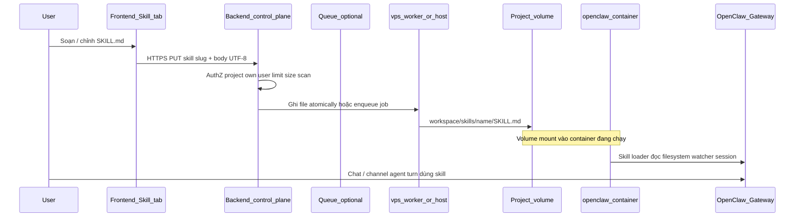

# Kế hoạch mở rộng: Skill — từ UI đến volume và sử dụng thực tế

Tài liệu dùng cho **toàn bộ monorepo / dự án openclaw-saas**, mô tả luồng mở rộng **Skill** từ tab frontend hiện có đến khi người dùng **tự lưu / cập nhật** vào **volume** của container và **tự dùng được** qua OpenClaw Gateway. Cuối file là **danh sách rủi ro** cần lưu ý khi thiết kế và triển khai.

---

## 1. Mục đích

- Thống nhất một **storyline kỹ thuật**: User soạn `SKILL.md` trên web → hệ thống ghi đúng chỗ trên disk của project → Gateway/agent nhận skill mới (hoặc sau một bước nhận biết có giới hạn).
- Làm cơ sở cho backend, vps-worker, và tùy chọn thay đổi nhỏ trên `openclaw-worker` (fork), **không** thay thế tài liệu OpenClaw gốc.

**Tham chiếu kiến trúc hiện tại** (rút gọn từ `openclaw-worker/README.md`):

- `1 project = 1 container` chạy image `openclaw-worker`.
- Control plane + queue + `vps-worker` quản lý vòng đời container; state/volume gắn với từng project.
- Traefik route subdomain tới container khi chạy.

---

## 2. Trạng thái hiện tại (baseline)

| Thành phần | Trạng thái |
|------------|------------|
| Frontend ` /project/[projectSlug]/skill` | Có form + tab Markdown, **Sao chép / Tải `SKILL.md`**, chưa gọi API lưu. |
| API project (ví dụ `PUT /api/projects/:id/env`) | Có; **chưa** có API skill/volume theo mô tả dưới. |
| Ghi trực tiếp vào volume từ browser | **Không** — bắt buộc qua backend (hoặc dịch vụ có quyền trên host/volume). |

---

## 3. Luồng mục tiêu (end-to-end)

**Ý nghĩa:** User không “tự mount” volume từ browser; họ chỉ bấm **Lưu**; **ủy quyền ghi** cho backend đã xác thực.

---

## 4. Các lớp triển khai (từ frontend đến volume)

### 4.1 Frontend

- Nút **「Lưu vào project」** / **「Cập nhật」** gọi API với:
  - `projectId` (hoặc infer từ session + slug URL),
  - `skillSlug` (chuẩn hóa giống `name` trong frontmatter — hyphen-case),
  - `content` (toàn bộ nội dung file UTF-8).
- Trạng thái: `idle` → `saving` → `saved` / `error`; hiển thị lỗi mạng/validation.
- (Tuỳ chọn sau) **Danh sách skill** đã lưu: `GET` trả về metadata + có thể không trả nội dung đầy đủ cho list.

### 4.2 Backend (control plane)

- **Xác thực** JWT/session; **phân quyền**: chỉ owner/collaborator của project.
- **Validation**: độ dài tối đa, charset, `skillSlug` khớp regex an toàn (tránh path traversal — xem mục Rủi ro).
- **Scan nhẹ** (tuỳ chọn): phát hiện pattern prompt-injection / shell pipe nguy hiểm trong nội dung — có thể mirror tinh thần OpenClaw Skill Workshop (chặn hoặc cảnh báo).
- **Ghi file** bằng một trong các mô hình:
  - **A.** Backend có quyền truy cập volume mount path trên host → `fs.writeFile` atomic (write temp + rename).
  - **B.** Gọi `vps-worker` / agent trên host thực hiện `docker exec` / script được tin cậy.
  - **C.** HTTP **nội bộ** tới endpoint tùy biến trên container (chỉ mạng nội bộ + token mạnh) — tránh expose ra internet.

### 4.3 Volume và đường dẫn OpenClaw

- OpenClaw load skill từ nhiều root (workspace `/skills`, `~/.openclaw/skills`, …). Trên SaaS cần **chốt một convention** cho mỗi project, ví dụ:
  - `<workspace>/skills/<skillSlug>/SKILL.md` trong volume đã được Gateway dùng làm workspace,
  - hoặc mirror vào `~/.openclaw/skills` trong **cùng** volume nếu cấu hình gateway trỏ về đó.
- **Đồng bộ với fork**: kiểm tra `OPENCLAW_*` / `openclaw.json` trong image để biết workspace root thực tế — không đoán mò đường dẫn trên production.

### 4.4 Khi nào user “dùng được” skill sau khi lưu?

OpenClaw thường:

- Snapshot skill khi **session** bắt đầu; có **watcher** file có thể cập nhật giữa các turn (tuỳ cấu hình).
- **Allowlist** agent (`agents.defaults.skills` / `agents.list[].skills`) có thể **ẩn** skill mới nếu không nằm trong danh sách.

**Kế hoạch sản phẩm cần làm rõ trong UI:**

- Thông báo: “Đã lưu. Skill có thể áp dụng từ **phiên chat mới** hoặc sau vài giây nếu watcher bật.”
- Nếu allowlist đang bật: cảnh báo “Thêm `skillSlug` vào allowlist trong cấu hình project” hoặc tự động append qua API config (phạm vi lớn hơn).

---

## 5. Cập nhật và xoá

| Thao tác | Hành vi mong muốn |
|----------|-------------------|
| **Cập nhật** | Ghi đè cùng `SKILL.md` (atomic); giữ version/history tuỳ chọn (DB) cho audit. |
| **Xoá** | API `DELETE .../skills/:slug` xoá thư mục skill hoặc file; Gateway có thể cache — document hành vi restart/session. |
| **Đổi tên** | Coi là xoá slug cũ + tạo slug mới hoặc cấm đổi tên trên UI v1 để tránh orphan config. |

---

## 6. Rủi ro — cần ghi nhận đầy đủ khi triển khai

### 6.1 Bảo mật & tin cậy nội dung

| ID | Rủi ro | Ghi chú |
|----|--------|---------|
| R-S1 | **Prompt injection trong SKILL.md** | Nội dung hướng dẫn agent có thể khuyến khích bỏ qua policy, lộ secret, hoặc gọi tool nguy hiểm. OpenClaw có khái niệm scanner đối với skill — SaaS nên có lớp kiểm tra hoặc nhãn “tin cậy”. |
| R-S2 | **Path traversal qua `skillSlug`** | Nếu không sanitize (`../`, null byte, Unicode), có thể ghi ra ngoài thư mục skill. **Bắt buộc** whitelist `[a-z0-9-]{1,64}` và normalize. |
| R-S3 | **Leo thang đặc quyền** | User A cố gắng ghi skill vào project của B — **authZ** phải kiểm tra `projectId` ↔ user ở mọi layer. |
| R-S4 | **Secret trong file** | User dán API key vào SKILL.md — lộ qua backup log; nên khuyến cáo env/secret reference trong UI và có thể quét pattern khóa. |
| R-S5 | **Endpoint ghi nội bộ container** | Nếu dùng HTTP trong container: token lộ / SSRF / bypass Traefik — chỉ bind localhost hoặc mạng overlay + HMAC. |

### 6.2 Vận hành & hạ tầng

| ID | Rủi ro | Ghi chú |
|----|--------|---------|
| R-O1 | **Container đang stop** | Ghi volume có thể vẫn OK nếu mount tồn tại; nếu chỉ `docker exec` khi running → lưu thất bại hoặc cần queue. |
| R-O2 | **Race condition** | Hai tab cùng lưu một skill — có thể mất bản cuối nếu không so sánh version / ETag. |
| R-O3 | **Disk đầy / I/O lỗi** | Ghi nửa chừng — cần atomic write + báo lỗi rõ. |
| R-O4 | **Encoding** | Thiếu UTF-8 có thể làm hỏng tiếng Việt trong SKILL.md — thống nhất UTF-8 end-to-end. |
| R-O5 | **Backup / DR** | Volume là single source of truth — mất volume = mất skill nếu không replicate metadata ra DB. |

### 6.3 Hành vi OpenClaw & sản phẩm

| ID | Rủi ro | Ghi chú |
|----|--------|---------|
| R-OC1 | **Skill không xuất hiện ngay** | User expect “lưu là chạy”; thực tế có thể cần session mới hoặc watcher tick — **kỳ vọng sai** nếu UI không giải thích. |
| R-OC2 | **Allowlist chặn skill** | Skill có trên disk nhưng agent không thấy — cần doc hoặc tự động hoá cấu hình allowlist. |
| R-OC3 | **YAML/frontmatter lỗi** | User sửa tay Markdown sai cú pháp → loader bỏ qua hoặc lỗi im lặng — có thể validate phía server trước khi ghi (tuỳ độ phức tạp). |
| R-OC4 | **Fork upstream** | Đường dẫn skill hoặc watcher đổi theo bản OpenClaw — cần kiểm thử sau mỗi lần pin upstream. |

### 6.4 Tuân thủ & vận hành SaaS

| ID | Rủi ro | Ghi chú |
|----|--------|---------|
| R-L1 | **Nội dung vi phạm / malware “xách tay”** Trong skill text | Trách nhiệm pháp lý và moderation — có thể cần điều khoản dịch vụ + báo cáo. |
| R-L2 | **Audit trail** | Doanh nghiệp cần biết ai sửa skill lúc nào — thiếu log API khiến khó điều tra. |

---

## 7. Giảm thiểu rủi ro (khuyến nghị ngắn)

1. **Slug**: chỉ cho phép regex đã dùng trên frontend (`skill-markdown.ts`) + kiểm tra lặp trên server.
2. **Ghi file**: `writeFile` tạm trong cùng partition → `rename` atomic.
3. **AuthZ**: một middleware duy nhất kiểm tra quyền project cho mọi route skill.
4. **Giới hạn**: kích thước body (ví dụ ≤ 128 KiB) đồng bộ với giới hạn OpenClaw Skill Workshop / docs.
5. **UI**: sau khi lưu thành công, copy ngắn về “khi nào skill có hiệu lực” + link docs OpenClaw “Skills”.
6. **Tuỳ chọn**: lưu bản shadow vào DB chỉ để history/rollback, không thay volume làm source of truth trừ khi có chiến lược đồng bộ rõ.

---

## 8. Thứ tự triển khai gợi ý

1. **Contract API** (OpenAPI hoặc markdown): `PUT/DELETE/GET` skill theo project (payload, error codes).
2. **Backend**: authZ + sanitize + ghi volume (hoặc queue tới vps-worker).
3. **Frontend**: nút Lưu + trạng thái + (sau) danh sách skill.
4. **Kiểm thử trên staging**: container chạy, chỉnh SKILL.md qua API, xác nhận agent thấy skill hoặc ít nhất file đúng path.
5. **Runbook**: container stop/start, backup volume, upgrade image worker.

---

## 9. Phiên bản tài liệu

| Ngày | Thay đổi |
|------|----------|
| 2026-05-02 | Khởi tạo tại root: luồng skill FE → volume → dùng thực tế + bảng rủi ro đầy đủ. |
