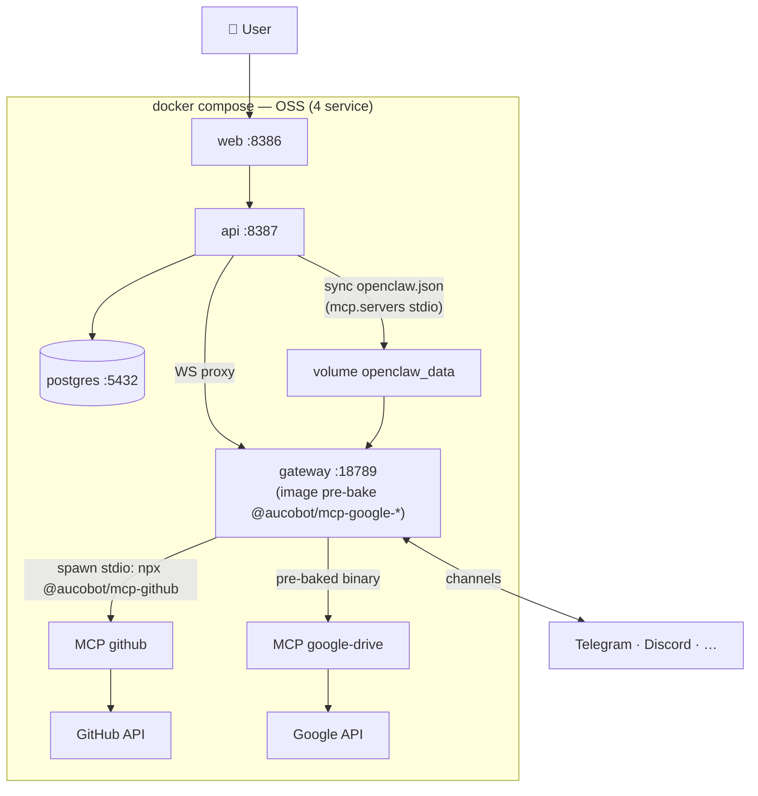
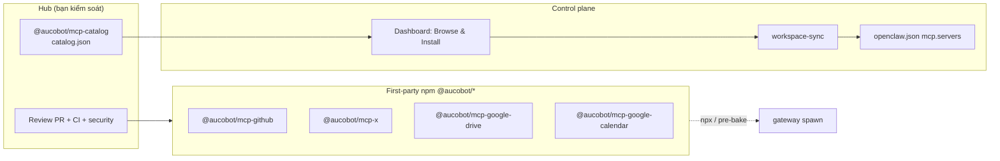

# AucoBot — MCP Hub & Connectors (OSS-first)

> **Cập nhật:** 2026-06-22
> **Phạm vi:** Tối ưu MCP cho **OSS self-host (1 user ≈ 1 máy)**. Cloud SaaS **tính sau** — chỉ ghi chú ranh giới, không thiết kế chi tiết ở đây.
> **Tham chiếu:** [`workflow.md`](workflow.md) §2, §5.5.1 · [`monorepoplan.md`](monorepoplan.md) §2 · `aucobot/packages/workspace-sync/src/connectors/connector-mcp.ts`
> **Quyết định lớn:** OSS bỏ service HTTP `mcp:8388` → **4 service**. Connector MCP chạy **stdio do gateway spawn** (`npx @aucobot/mcp-*`), Google pre-bake sẵn trong image gateway.

---

## 0. TL;DR

| | Trước (5 service) | Sau (4 service — OSS đích) |
| --- | --- | --- |
| Runtime MCP | Service HTTP `aucomcp :8388` (Express, multi-tenant, JWT) | **Gateway spawn stdio** `npx -y @aucobot/mcp-*` |
| Auth/secrets | JWT `mcp_project` + fetch secrets nội bộ | Secrets DB → `env` / credential file trong `openclaw.json` |
| Google Drive/Calendar | npm cộng đồng qua HTTP service | **`@aucobot/mcp-*` pre-bake trong image gateway** (offline, tức thì) |
| Connector khác | Embed trong Express monolith | `npx @aucobot/mcp-<name>` tải lần đầu, cache |
| Service compose | `web` + `api` + **`mcp`** + `gateway` + `postgres` | `web` + `api` + `gateway` + `postgres` |
| Env | `AUCOMCP_BASE_URL`, `MCP_SERVICE_SECRET` | **bỏ** (OSS) |

**Vì sao đổi:** OSS self-host = một máy, một user. Service HTTP đa tenant với JWT per-project là mô hình **Cloud** — over-engineering cho OSS. Mô hình stdio (giống Claude Desktop / Cursor) đơn giản hơn, ít service hơn, và **code `connector-mcp.ts` đã có sẵn nhánh `npx`** — chỉ cần bỏ `remoteMcp`.

---

## 1. Bối cảnh & vấn đề

### 1.1 Hiện trạng

- Repo sibling `mcp/` = service Express `aucomcp` (`POST /connectors/:slug/mcp`), transport **Streamable HTTP**, verify JWT `mcp_project`, fetch secrets từ API nội bộ, embed connector Google Drive/Calendar.
- `api` set `AUCOMCP_BASE_URL=http://mcp:8388` → `workspace-sync` ghi `mcp.servers[].url` (remote) vào `openclaw.json`.
- Nếu **không** set `AUCOMCP_BASE_URL` → `connector-mcp.ts` fallback ghi entry **stdio `npx`** (`@modelcontextprotocol/server-gdrive`, `@franciscpd/calendar-mcp-server`).

### 1.2 Vì sao sai hướng cho OSS

| Triệu chứng | Nguyên nhân |
| --- | --- |
| Thêm 1 service chỉ để chạy tool | HTTP multi-tenant cần cho **nhiều tenant** — OSS chỉ 1 user |
| JWT `mcp_project`, `MCP_SERVICE_SECRET` | Bảo vệ ranh giới tenant — thừa khi 1 máy |
| Phụ thuộc npm cộng đồng (`@modelcontextprotocol/server-gdrive`) | Rủi ro supply-chain: bị xóa/đổi maintainer/đổi license |
| Express embed mọi connector | Monolith khó mở rộng, mọi connector cùng deploy |

### 1.3 Mục tiêu OSS

1. **4 service** — bỏ `mcp` HTTP khỏi compose OSS.
2. **Gateway spawn MCP stdio** — giống cách Claude/Cursor dùng MCP.
3. **First-party packages** `@aucobot/mcp-*` — bạn kiểm soát, không phụ thuộc maintainer ngoài.
4. **Google pre-bake** trong image gateway → "như có sẵn trong app", chạy offline.
5. **Cộng đồng đóng góp** qua PR vào repo bạn; **bạn** review & publish.

---

## 2. Kiến trúc đích (OSS — 4 service)



**Luồng:**
1. User bật connector trên dashboard → nhập secret (PAT / OAuth) → `api` lưu DB (mã hóa).
2. `api` `mergeConnectorsIntoConfig` → ghi `mcp.servers.<id>` kiểu **stdio** vào `openclaw.json` trên volume.
3. Gateway **watch** file → khi agent cần tool, **spawn** `npx -y @aucobot/mcp-<name>` (hoặc binary pre-baked) với secrets trong `env`.
4. Google: package đã có trong image → spawn tức thì, không cần mạng.

---

## 3. MCP Hub — catalog + governance (không chạy tool)

Hub **không** là một service chạy tool. Hub = **catalog allowlist** + **quy trình review/publish**.



### 3.1 Nguyên tắc sở hữu

| Thành phần | Ai sở hữu | Cộng đồng |
| --- | --- | --- |
| Catalog (allowlist) | Bạn — chỉ entry `@aucobot/*` | Đề xuất qua issue/RFC |
| Code MCP `@aucobot/mcp-*` | Bạn — review & publish | PR vào repo bạn |
| Repo tham khảo (x-mcp, servers-archived) | Bên thứ ba | Chỉ port, **không** dùng trực tiếp production |

**Bất biến:** Dashboard chỉ hiện connector trong catalog. **Không** có field "npm ngoài" tùy ý → 1 ngày họ xóa package cũng không ảnh hưởng OSS.

### 3.2 Catalog entry (phác thảo)

```json
{
  "slug": "github",
  "displayName": "GitHub",
  "npm": "@aucobot/mcp-github",
  "version": "^1.0.0",
  "transport": "stdio",
  "kind": "API",
  "secretKeys": ["personal_access_token"],
  "env": { "personal_access_token": "GITHUB_PERSONAL_ACCESS_TOKEN" },
  "preBaked": false,
  "status": "stable",
  "maintainer": "aucobot"
}
```

Google entries đặt `"preBaked": true` → merge dùng binary global thay vì `npx -y`.

---

## 4. Packages `@aucobot/mcp-*` (monorepo, một npm scope)

**Khuyến nghị:** một repo `mcp/` (đã có sibling) chuyển thành pnpm monorepo nhiều package, **không** tách repo/org mỗi connector.

```text
mcp/                              # repo sibling (đã clone)
├── pnpm-workspace.yaml
├── packages/
│   ├── catalog/                  # @aucobot/mcp-catalog — catalog.json + types
│   ├── core/                     # @aucobot/mcp-core — registerTool, error, auth helper
│   ├── mcp-google-drive/         # @aucobot/mcp-google-drive  (pre-bake)
│   ├── mcp-google-calendar/      # @aucobot/mcp-google-calendar (pre-bake)
│   ├── mcp-github/               # @aucobot/mcp-github
│   └── mcp-x/                     # @aucobot/mcp-x
└── reference/                    # clone tham khảo (gitignore) — KHÔNG publish
    ├── servers-archived/         # github (TS) — port sang mcp-github
    └── x-mcp/                     # x (TS) — port sang mcp-x
```

Mỗi package = thin: tools + API client + `bin` để `npx` chạy:

```json
{
  "name": "@aucobot/mcp-github",
  "type": "module",
  "bin": { "aucobot-mcp-github": "./dist/index.js" },
  "dependencies": { "@modelcontextprotocol/sdk": "^1.12.1", "@aucobot/mcp-core": "workspace:*" }
}
```

**Khi nào tách repo riêng:** chỉ khi team/release cycle độc lập. Giai đoạn đầu monorepo đủ — CI một chỗ, shared `core`, catalog auto-generate từ `packages/*/package.json`.

---

## 5. Pre-bake Google MCP trong image gateway

Gateway hiện **pull upstream** (`alpine/openclaw:latest`). Để Google connector "tức thì + offline", thêm **một lớp mỏng** trên upstream — **không** patch runtime OpenClaw.

`aucobot/deploy/Dockerfile.gateway` (mới):

```dockerfile
FROM alpine/openclaw:latest
# Lớp mỏng: cài sẵn MCP first-party Google (offline, tức thì)
RUN npm i -g @aucobot/mcp-google-drive @aucobot/mcp-google-calendar
# entrypoint giữ nguyên gateway-entrypoint.sh
```

| Connector | Cài đặt | UX lần đầu |
| --- | --- | --- |
| Google Drive / Calendar | **Pre-baked** trong image | Tức thì, không cần mạng |
| GitHub, X, … | `npx -y @aucobot/mcp-<name>` | ~1–5s lần đầu (tải npm), sau đó cache |

**Tối ưu thêm (tùy chọn):** mount volume npm cache (`~/.npm`) để giữ cache giữa restart; pin version trong catalog.

> Pre-bake = thêm global npm package, **không** sửa OpenClaw → vẫn tuân nguyên tắc "không patch runtime gateway" (chỉ là image base mới có sẵn tool first-party).

---

## 6. Merge vào `openclaw.json` (stdio)

`mergeConnectorsIntoConfig` ghi entry stdio (đã có nhánh này trong `connector-mcp.ts`):

```json
{
  "mcp": {
    "servers": {
      "github": {
        "command": "npx",
        "args": ["-y", "@aucobot/mcp-github"],
        "env": { "GITHUB_PERSONAL_ACCESS_TOKEN": "<decrypt từ DB>" }
      },
      "google-drive": {
        "command": "aucobot-mcp-google-drive",
        "env": { "GDRIVE_CREDENTIALS_PATH": "/data/projects/<id>/connectors/google-drive/credentials.json" }
      }
    }
  }
}
```

| Loại secret | Cách truyền |
| --- | --- |
| Token tĩnh (PAT, bearer) | `env` trực tiếp trong `openclaw.json` |
| OAuth file (Google) | Ghi credential file trên volume (`writeGoogleDriveCredentialFiles` đã có), trỏ `env` path |

**Pre-baked vs npx:** catalog `preBaked: true` → `command: "aucobot-mcp-google-drive"` (binary global); `false` → `command: "npx", args: ["-y", "@aucobot/mcp-<name>"]`.

---

## 7. Thay đổi code (checklist OSS)

### 7.1 `aucobot/` (control plane)

| File | Thay đổi |
| --- | --- |
| `deploy/docker-compose.yml` | **Xóa** service `mcp`; bỏ env `AUCOMCP_BASE_URL`, `MCP_SERVICE_SECRET` (OSS); thêm build `gateway` từ `Dockerfile.gateway` |
| `deploy/Dockerfile.gateway` | **Mới** — `FROM alpine/openclaw` + `npm i -g @aucobot/mcp-google-*` |
| `workspace.service.ts` | Bỏ nhánh `remoteMcp` khi `RUNTIME_MODE=oss` (luôn stdio) |
| `packages/workspace-sync/src/connectors/connector-mcp.ts` | Đọc catalog: `command`/`args`/`env`/`preBaked` thay switch slug cứng; trỏ package `@aucobot/*` thay npm cộng đồng |
| `connector-registry.ts` / adapters | Mỗi connector tham chiếu `catalogId`; thêm `mcp` runtime spec (stdio) |
| `.env.example` | Bỏ `AUCOMCP_BASE_URL`, `MCP_SERVICE_SECRET` khỏi khối OSS (giữ cho Cloud sau) |

### 7.2 `mcp/` (repo sibling → monorepo packages)

| Việc | Ghi chú |
| --- | --- |
| Chuyển sang pnpm workspace `packages/*` | `catalog`, `core`, `mcp-google-drive`, `mcp-google-calendar`, `mcp-github`, `mcp-x` |
| Port Google từ Express `aucomcp` hiện tại | Tool đã viết sẵn — bọc lại thành stdio package |
| Port GitHub từ `reference/servers-archived/src/github` | Đổi `setRequestHandler` → `registerTool` |
| Port X từ `reference/x-mcp/index.js` | Read tools trước (Bearer), write sau (OAuth 1.0a) |
| Publish npm `@aucobot/mcp-*` | Bạn publish; contributor không có quyền |

> Express `aucomcp` HTTP cũ: **giữ lại cho Cloud** (multi-tenant) hoặc tách `mcp-cloud` sau — không xóa, chỉ bỏ khỏi OSS compose.

---

## 8. Lộ trình (OSS-first)

| Phase | Việc | Kết quả |
| --- | --- | --- |
| **1. Catalog** | `packages/catalog` + types; adapter tham chiếu `catalogId`; UI list từ catalog | Hub allowlist, chưa đụng runtime |
| **2. Manifest merge** | Refactor `connector-mcp.ts` đọc catalog (stdio); bỏ `remoteMcp` ở OSS | `openclaw.json` ghi stdio entries |
| **3. Pre-bake Google** | `Dockerfile.gateway` + publish `@aucobot/mcp-google-*` | Google offline/tức thì; compose 4 service |
| **4. GitHub + X** | Port từ `reference/` → publish `@aucobot/mcp-github`, `@aucobot/mcp-x` | Catalog entry mới |
| **5. Cloud (sau)** | Đưa `aucomcp` HTTP về cho hosted multi-tenant | Ngoài phạm vi file này |

---

## 9. Ranh giới Cloud (tính sau)

| | OSS (file này) | Cloud (sau) |
| --- | --- | --- |
| Runtime MCP | Gateway spawn stdio | `aucomcp` HTTP multi-tenant (giữ Express cũ) |
| Secrets | DB → `openclaw.json` env/file | JWT `mcp_project` + fetch nội bộ |
| Service | 4 (không `mcp`) | + `mcp` (hoặc managed) |
| Packages | `@aucobot/mcp-*` (chung) | Cùng package, wrap HTTP / pre-install image |

Cùng catalog + cùng packages `@aucobot/mcp-*`; chỉ khác **transport resolver** theo `RUNTIME_MODE`. Không thiết kế chi tiết Cloud ở đây.

---

## 10. Bảo vệ supply-chain

| Rủi ro | Cách tránh |
| --- | --- |
| npm ngoài bị unpublish | Catalog chỉ allowlist `@aucobot/*` |
| Upstream GitHub repo biến mất | Code đã port vào repo bạn |
| `npx` không tải được (offline) | Pre-bake Google trong image; pin version; tùy chọn Docker bundle cho connector khác |
| Contributor độc hại | PR review + CI + không quyền publish npm |

---

## 11. Liên kết

| Chủ đề | File |
| --- | --- |
| Service OSS (4 service), compose | [`workflow.md`](workflow.md) §2, §5.5.1 |
| Monorepo, ranh giới package | [`monorepoplan.md`](monorepoplan.md) §2, §7 |
| Merge `openclaw.json` connectors | `aucobot/packages/workspace-sync/src/connectors/connector-mcp.ts` |
| Connector adapter (kind API/OAuth) | `aucobot/apps/api/src/features/projects/connectors/adapters/note.md` |
| Repo tham khảo (port) | `mcp/reference/servers-archived`, `mcp/reference/x-mcp` |

---

*OSS: MCP = gateway spawn stdio `@aucobot/mcp-*`; Google pre-bake trong image gateway; hub = catalog allowlist first-party. 4 service (`web`, `api`, `gateway`, `postgres`). Cloud (HTTP `aucomcp` multi-tenant) tính sau.*
