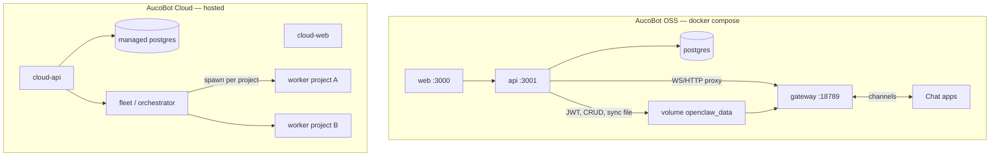
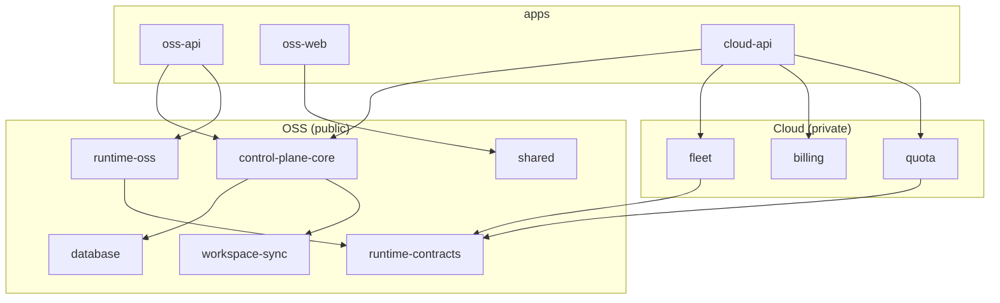
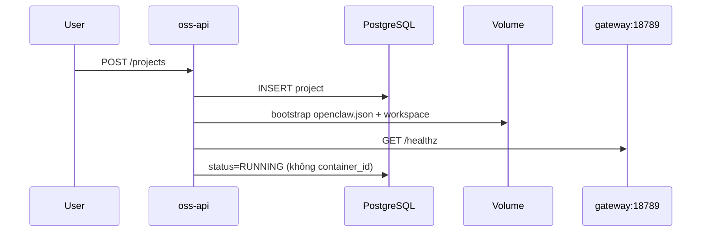
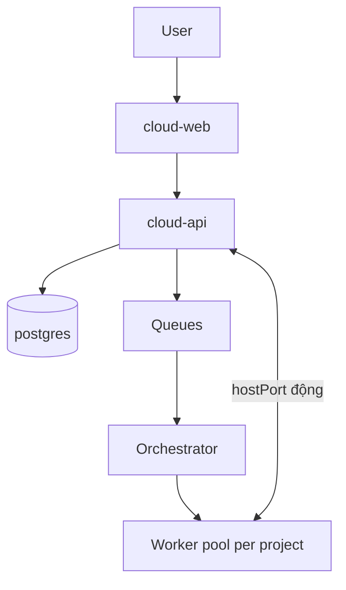

# AucoBot — Kế hoạch Monorepo (pnpm)

> **Tên dự án:** AucoBot  
> **Cập nhật:** 2026-05-23  
> **Tham chiếu:** `openclaw-architecture.md`, `workflow.md`, `billing-plan.md`  
> **Mô hình thị trường:** Engine mở (OSS self-host) + Cloud trả phí (Supabase / n8n style)

---

## 1. Tóm tắt

AucoBot là monorepo **pnpm** gồm:

| Sản phẩm | Ai vận hành | Runtime gateway |
| -------- | ----------- | ----------------- |
| **OSS** | Người dùng tự host (`docker compose up`) | **Một** service `gateway` cố định cổng **18789** — cùng stack với API, DB, UI |
| **Cloud** | Nhà cung cấp (hosted) | **Một container OpenClaw / project** — spawn qua Docker API / fleet |

**Điểm quan trọng (đã chỉnh so với sketch cũ trong `workflow.md`):**

- **Spawn container per project = chỉ Cloud.** Code hiện tại (`DockerService.spawnWorker`, `hostPort` động) là mô hình Cloud.
- **OSS = Supabase-style:** `docker compose` dựng **hết** service (`postgres`, `api`, `web`, `gateway`); backend **không** cần `docker.sock`, truy cập gateway qua `OPENCLAW_GATEWAY_URL` (ví dụ `http://gateway:18789`).
- **Sync file DB → volume** giữ nguyên cho cả OSS và Cloud (Phase 1 — `openclaw-architecture.md` §4.7).

---

## 2. Mental model



### Quy tắc một dòng

| Gateway cần thấy để chạy? | Chỉ tính năng app (billing, tenant…)? |
| ------------------------- | ------------------------------------- |
| **Sync DB → volume / `openclaw.json`** | **Giữ trên DB** — API đọc trực tiếp |

- **Control plane** = PostgreSQL + Nest API + Dashboard (JWT).
- **OpenClaw worker** không đọc PostgreSQL — chỉ đọc file + `openclaw.json` trên volume.
- **Auth:** JWT (dashboard) ≠ `gateway.auth` (operator worker).

---

## 3. OSS vs Cloud — bảng so sánh

| Tiêu chí | OSS (community, public) | Cloud (hosted, proprietary) |
| -------- | ------------------------ | ---------------------------- |
| **Triển khai** | `docker compose up` một lần | Đăng ký cloud, không tự cài worker |
| **Gateway** | Service `gateway` trong compose, **18789** cố định | Container riêng / project, port động |
| **Backend → gateway** | `OPENCLAW_GATEWAY_URL=http://gateway:18789` | `http://127.0.0.1:{hostPort}` từ DB |
| **Docker socket trên API** | **Không** | **Có** (hoặc remote Docker) |
| **DB `container_id` / `host_port`** | Không dùng (nullable) | Bắt buộc |
| **API start/stop/respawn project** | Không (restart stack / `compose restart gateway`) | Có |
| **`vps-worker` / BullMQ / billing** | Không trong OSS core | Có |
| **Mã nguồn** | Monorepo public | Package/repo đóng import lõi OSS |

---

## 4. Cấu trúc monorepo AucoBot

```text
aucobot/                              # root monorepo (repo public OSS)
├── pnpm-workspace.yaml
├── package.json                        # scripts: dev, build, lint, docker:*
├── pnpm-lock.yaml
├── turbo.json                          # (khuyến nghị) pipeline build
├── .npmrc
│
├── apps/
│   ├── oss-api/                        # ← migrate từ backend/ (NestJS)
│   ├── oss-web/                        # ← migrate từ frontend/ (Next.js)
│   ├── cloud-api/                      # PRIVATE — Nest, import @aucobot/*
│   └── cloud-web/                      # PRIVATE — shell branded / extend oss-web
│
├── packages/
│   ├── shared/                         # types, constants, API client FE ↔ BE
│   ├── database/                       # Prisma schema + client
│   ├── control-plane-core/             # auth, crypto, projects, sync, chat proxy
│   ├── runtime-contracts/              # RuntimeProvisioner, GatewayEndpoint, PlanGuard
│   ├── runtime-oss/                    # StaticGateway — URL cố định :18789, không dockerode
│   ├── workspace-sync/               # agent compile, openclaw.json, skills sync
│   ├── ui-kit/                         # (tuỳ chọn) components dùng chung
│   │
│   └── cloud/                          # PRIVATE — không publish npm
│       ├── billing/                    # Stripe, plans, credits (billing-plan.md)
│       ├── fleet/                      # DockerPerProjectProvisioner, vps-worker
│       ├── quota/                      # PlanGuard impl
│       └── ingress/                    # Traefik, worker callbacks
│
├── workers/
│   └── openclaw/                       # ← openclaw-worker/ (nested pnpm workspace)
│       ├── pnpm-workspace.yaml
│       ├── ui/
│       ├── packages/*
│       └── extensions/*
│
├── deploy/
│   ├── oss/
│   │   ├── docker-compose.yml          # postgres + api + web + gateway
│   │   ├── docker-compose.deps.yml       # chỉ postgres (dev local)
│   │   ├── Dockerfile.api
│   │   ├── Dockerfile.web
│   │   └── Dockerfile.gateway          # build từ workers/openclaw
│   └── cloud/                          # PRIVATE — K8s, fleet templates
│
├── catalogs/
│   └── skill-hub/                      # ← skill-hub/ (skill mẫu OSS)
│
└── docs/
    ├── openclaw-architecture.md
    ├── workflow.md
    ├── billing-plan.md
    └── monorepoplan.md                 # file này
```

### Mapping từ repo hiện tại (`openclaw-saas`)

| Hiện tại | Sau migrate (AucoBot) |
| -------- | ------------------------ |
| `backend/` | `apps/oss-api` + tách `packages/*` |
| `frontend/` | `apps/oss-web` |
| `openclaw-worker/` | `workers/openclaw/` |
| `skill-hub/` | `catalogs/skill-hub/` |
| Docs root | `docs/` |
| Cloud (chưa có) | `apps/cloud-*` + `packages/cloud/*` hoặc repo `aucobot-cloud` riêng |

---

## 5. `pnpm-workspace.yaml` (root)

```yaml
packages:
  - "apps/*"
  - "packages/*"
  - "packages/cloud/*"          # chỉ clone nội bộ / submodule private
  - "workers/openclaw"
  - "workers/openclaw/ui"
  - "workers/openclaw/packages/*"
  - "workers/openclaw/extensions/*"
```

**Lưu ý:**

- Giữ **nested workspace** của OpenClaw — không flatten `extensions/*` lên root.
- Scope package gợi ý: `@aucobot/shared`, `@aucobot/database`, `@aucobot/control-plane-core`, …
- Cloud private: `@aucobot-cloud/billing`, `@aucobot-cloud/fleet`.

---

## 6. Package graph & quy tắc dependency



| Quy tắc | Mô tả |
| ------- | ----- |
| `packages/cloud/*` | **Không** được import bởi package OSS public |
| `control-plane-core` | Không biết Docker vs static gateway — chỉ gọi `RuntimeProvisioner` |
| `oss-api` | Wire `StaticGatewayProvisioner` + `NoopPlanGuard`; **không** `dockerode` |
| `cloud-api` | Wire `DockerPerProjectProvisioner` + `StripePlanGuard` |
| `workspace-sync` | Một implementation — OSS và Cloud chỉ khác volume path / orchestration |

---

## 7. Runtime contracts

### 7.1 `RuntimeProvisioner`

```typescript
// packages/runtime-contracts

export interface RuntimeProvisioner {
  /** OSS: sync disk + đợi gateway compose healthy. Cloud: tạo container. */
  provision(projectId: string, opts: ProvisionOpts): Promise<RuntimeHandle>;
  start(handle: RuntimeHandle): Promise<void>;
  stop(handle: RuntimeHandle): Promise<void>;
  destroy(handle: RuntimeHandle): Promise<void>;
  getStatus(handle: RuntimeHandle): Promise<RuntimeStatus>;
}

export interface GatewayEndpoint {
  /** http://gateway:18789 hoặc http://127.0.0.1:54321 */
  baseUrl: string;
  token: string;
}
```

| Implementation | Package | Dùng bởi |
| -------------- | ------- | -------- |
| `StaticGatewayProvisioner` | `@aucobot/runtime-oss` | `oss-api` — ping `OPENCLAW_GATEWAY_URL`, không Docker API |
| `DockerPerProjectProvisioner` | `@aucobot-cloud/fleet` | `cloud-api` — logic `DockerService.spawnWorker` hiện tại |
| `NoopPlanGuard` | `runtime-contracts` hoặc `oss-api` | OSS — không quota |
| `StripePlanGuard` | `@aucobot-cloud/quota` | Cloud — `billing-plan.md` |

### 7.2 `GatewayEndpointResolver`

Chat proxy và health check dùng resolver thay vì `project.hostPort` trực tiếp:

| Mode | Nguồn endpoint |
| ---- | -------------- |
| `RUNTIME_MODE=oss` | `process.env.OPENCLAW_GATEWAY_URL` + `OPENCLAW_GATEWAY_TOKEN` |
| `RUNTIME_MODE=cloud` | `project.hostPort` + `project.gatewayToken` từ DB |

---

## 8. OSS — Docker Compose (Supabase-style)

### 8.1 Services

| Service | Port | Vai trò |
| ------- | ---- | ------- |
| `postgres` | 5432 | Nguồn sự thật app |
| `api` | 3001 | NestJS control plane |
| `web` | 3000 | Next.js dashboard |
| `gateway` | **18789** | OpenClaw worker (image từ `workers/openclaw`) |

### 8.2 `deploy/oss/docker-compose.yml` (sketch)

```yaml
services:
  postgres:
    image: postgres:16-alpine
    healthcheck: ...

  gateway:
    image: ${OPENCLAW_IMAGE:-aucobot-gateway:local}
    container_name: aucobot-gateway
    command: ["node", "openclaw.mjs", "gateway", "--bind", "lan"]
    environment:
      OPENCLAW_GATEWAY_TOKEN: ${OPENCLAW_GATEWAY_TOKEN}
      OPENCLAW_STATE_DIR: /home/node/.openclaw
      OPENCLAW_CONFIG_PATH: /home/node/.openclaw/openclaw.json
    volumes:
      - openclaw_data:/home/node/.openclaw
    ports:
      - "18789:18789"
    healthcheck:
      test: ["CMD-SHELL", "wget -q -O- http://127.0.0.1:18789/healthz || exit 1"]

  api:
    build: ...
    depends_on:
      postgres: { condition: service_healthy }
      gateway: { condition: service_healthy }
    environment:
      RUNTIME_MODE: oss
      DATABASE_URL: ...
      OPENCLAW_DATA_ROOT: /data/projects
      OPENCLAW_GATEWAY_URL: http://gateway:18789
      OPENCLAW_GATEWAY_TOKEN: ${OPENCLAW_GATEWAY_TOKEN}
    volumes:
      - openclaw_data:/data/projects
    # KHÔNG mount /var/run/docker.sock

  web:
    depends_on: [api]

volumes:
  openclaw_data:
```

### 8.3 Volume & sync

- Backend ghi: `{OPENCLAW_DATA_ROOT}/{projectId}/` → `openclaw.json`, `workspace/skills/…`, `AGENTS.md`, …
- Gateway đọc cùng volume (mount vào `/home/node/.openclaw`).
- **MVP OSS:** 1 user ≈ 1 project — volume có thể map 1:1 project subfolder hoặc root volume cho instance đơn giản.
- **Sync khi:** user lưu / bật skill / đổi config — **không** sync mỗi tin nhắn chat.

### 8.4 Luồng tạo project (OSS)



- Token gateway OSS: dùng `OPENCLAW_GATEWAY_TOKEN` **global** từ compose (không random per project trừ khi sau này multi-gateway).
- Không endpoint `respawn` / start-stop container trên OSS (hoặc trả 501 + hướng dẫn `docker compose restart gateway`).

### 8.5 Env OSS (`apps/oss-api`)

```env
RUNTIME_MODE=oss
DATABASE_URL=postgresql://...
OPENCLAW_GATEWAY_URL=http://gateway:18789
OPENCLAW_GATEWAY_TOKEN=...
OPENCLAW_DATA_ROOT=/data/projects
JWT_SECRET=...
FRONTEND_URL=http://localhost:3000

# Dev trên host (không compose): OPENCLAW_GATEWAY_URL=http://127.0.0.1:18789
# KHÔNG dùng trên OSS: OPENCLAW_IMAGE spawn, docker.sock
```

---

## 9. Cloud — Hosted

| Thành phần | Gợi ý |
| ---------- | ----- |
| Control plane | API + DB managed; tenant isolation |
| Runtime | `DockerPerProjectProvisioner` — 1 container / project |
| Kinh doanh | `packages/cloud/billing` — `billing-plan.md` |
| Queue / heavy | `vps-heavy`, BullMQ (tuỳ sản phẩm) |
| Mã nguồn | Import `@aucobot/control-plane-core`; fleet/billing **proprietary** |



### Env Cloud (sketch)

```env
RUNTIME_MODE=cloud
OPENCLAW_IMAGE=...
# Docker socket hoặc DOCKER_HOST remote
OPENCLAW_SPAWN_TIMEOUT_MS=60000
```

---

## 10. Apps

### 10.1 `apps/oss-api` (public)

- Nest `AppModule` + `@aucobot/control-plane-core`.
- Providers: `StaticGatewayProvisioner`, `NoopPlanGuard`.
- Không dependency `dockerode` trong production OSS build.

### 10.2 `apps/oss-web` (public)

- Dashboard self-host đầy đủ.
- Chat WS proxy tới API → gateway cố định.

### 10.3 `apps/cloud-api` / `apps/cloud-web` (private)

- Composition root mỏng: import OSS core + override provisioner/plan guard.
- UI: branding + billing + quota; có thể extend `oss-web` qua feature flags / route groups.

---

## 11. Repo & license

| Artifact | Repo | License |
| -------- | ---- | ------- |
| Monorepo OSS AucoBot | `aucobot` (public, rename từ `openclaw-saas`) | Apache-2.0 / MIT |
| `packages/cloud/*`, `apps/cloud-*` | Cùng monorepo (git submodule) **hoặc** `aucobot-cloud` riêng | Proprietary |

**Khuyến nghị:**

- **Giai đoạn 1:** OSS monorepo sạch; Cloud repo riêng `pnpm link` / GitHub Packages `@aucobot/*`.
- **Giai đoạn 2:** Submodule `packages/cloud` nếu team nhỏ muốn một clone.

---

## 12. Dev workflow (root scripts)

```json
{
  "scripts": {
    "dev": "turbo run dev --parallel --filter=@aucobot/oss-api --filter=@aucobot/oss-web",
    "dev:deps": "docker compose -f deploy/oss/docker-compose.deps.yml up -d",
    "dev:stack": "docker compose -f deploy/oss/docker-compose.yml up",
    "build": "turbo run build",
    "build:gateway-image": "docker build -f deploy/oss/Dockerfile.gateway -t aucobot-gateway:local .",
    "db:migrate": "pnpm --filter @aucobot/database exec prisma migrate dev"
  }
}
```

**Dev local (không full compose):**

1. `pnpm dev:deps` — Postgres.
2. Chạy gateway riêng hoặc `docker compose up gateway` — port **18789**.
3. `pnpm dev` — api + web; `OPENCLAW_GATEWAY_URL=http://127.0.0.1:18789`.

---

## 13. Lộ trình migrate

### Phase 0 — Chuẩn bị (1–2 ngày)

- [ ] Root `package.json`, `pnpm-workspace.yaml`, `.npmrc`, `turbo.json`
- [ ] Chuyển frontend/backend sang **pnpm**; bỏ `package-lock.json`
- [ ] CI: `pnpm install --frozen-lockfile`

### Phase 1 — Di chuyển cơ học (3–5 ngày)

- [ ] `backend/` → `apps/oss-api`
- [ ] `frontend/` → `apps/oss-web`
- [ ] `openclaw-worker/` → `workers/openclaw`
- [ ] `skill-hub/` → `catalogs/skill-hub`
- [ ] Docs → `docs/`
- [ ] Compose → `deploy/oss/`

### Phase 2 — Runtime OSS vs Cloud (1 tuần) — **ưu tiên**

- [ ] `RUNTIME_MODE` + `GatewayEndpointResolver`
- [ ] `packages/runtime-contracts` + `packages/runtime-oss`
- [ ] OSS: bỏ spawn trong `ProjectsService.create`; healthcheck gateway URL
- [ ] Chat proxy: `OPENCLAW_GATEWAY_URL` thay `hostPort` khi `oss`
- [ ] Compose OSS: service `gateway` :18789; api **không** mount docker.sock
- [ ] Cập nhật `.env.example` (khối OSS / Cloud)
- [ ] Cập nhật `workflow.md` §3–§6 (OSS ≠ 1 container/project)

### Phase 3 — Tách packages OSS (1–2 tuần)

- [ ] `packages/database` (Prisma)
- [ ] `packages/workspace-sync`
- [ ] `packages/control-plane-core`
- [ ] `packages/shared`
- [ ] `oss-api` chỉ còn bootstrap + wiring

### Phase 4 — Cloud skeleton (private)

- [ ] `packages/cloud/fleet` — port `DockerService` hiện tại
- [ ] `packages/cloud/billing` — theo `billing-plan.md`
- [ ] `apps/cloud-api` import `@aucobot/control-plane-core`

### Phase 5 — Polish

- [ ] Publish `@aucobot/control-plane-core` (optional)
- [ ] E2E checklist skills (`workflow.md`)
- [ ] Rename repo / branding AucoBot trên UI và README

---

## 14. Refactor code hiện tại (ghi chú)

**Trước migrate monorepo**, có thể làm ngay trên `backend/`:

| File / vùng | Thay đổi OSS |
| ----------- | ------------ |
| `projects.service.ts` | `create`: bootstrap disk only; không `docker.spawnWorker` khi `RUNTIME_MODE=oss` |
| `docker.service.ts` | Chỉ load module Cloud; hoặc guard `RUNTIME_MODE !== 'oss'` |
| `chat.gateway-proxy.service.ts` | Resolver URL từ env |
| `gateway-upstream.ts` | Hỗ trợ `baseUrl` thay chỉ `hostPort: number` |
| Prisma `Project` | `containerId`, `hostPort` optional — OSS không ghi |
| `.env.example` | Tách block OSS / Cloud |

---

## 15. Rủi ro & quyết định

| Chủ đề | Quyết định |
| ------ | ---------- |
| Nested `workers/openclaw` | Giữ workspace con; không merge extensions lên root |
| Prisma schema | Một schema OSS; Cloud thêm bảng billing hoặc schema riêng |
| Multi-project OSS | Một gateway + multi-agent / workspace path — không spawn N container |
| `workflow.md` “1 project = 1 container” | Chỉ áp dụng **Cloud** |
| FE Cloud | Bắt đầu extend `oss-web`; tách `ui-kit` khi >3 màn hình khác biệt |

---

## 16. Kết quả mong đợi

Sau khi hoàn tất Phase 2+:

```bash
git clone https://github.com/<org>/aucobot
cd aucobot
pnpm install
cp deploy/oss/.env.example .env
docker compose -f deploy/oss/docker-compose.yml up
```

→ **Postgres + API + Dashboard + Gateway :18789** chạy cùng nhau; user không cần Docker socket trên máy để spawn worker.

Team Cloud thêm repo/package riêng, **import lõi AucoBot OSS**, không fork logic sync file.

---

## 17. Liên kết tài liệu

| Chủ đề | File |
| ------ | ---- |
| Gateway, channels, skills sync | `openclaw-architecture.md` |
| Luồng vận hành (cần cập nhật OSS gateway) | `workflow.md` |
| Billing Cloud | `billing-plan.md` |
| Kế hoạch monorepo (file này) | `monorepoplan.md` |

---

*AucoBot — OSS: compose + gateway :18789. Cloud: spawn per project. Monorepo pnpm tách package public và `packages/cloud` proprietary.*
