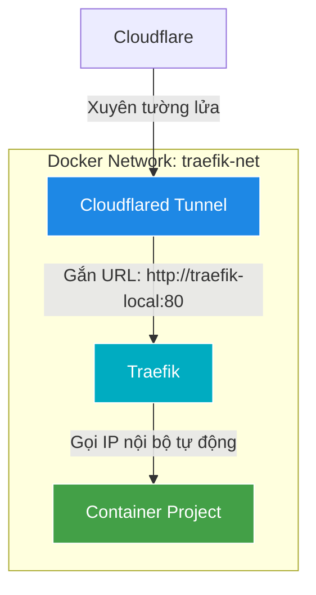
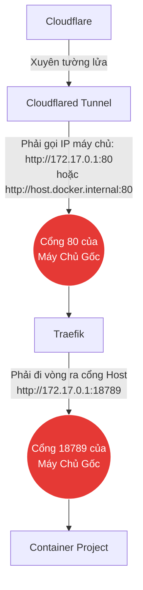
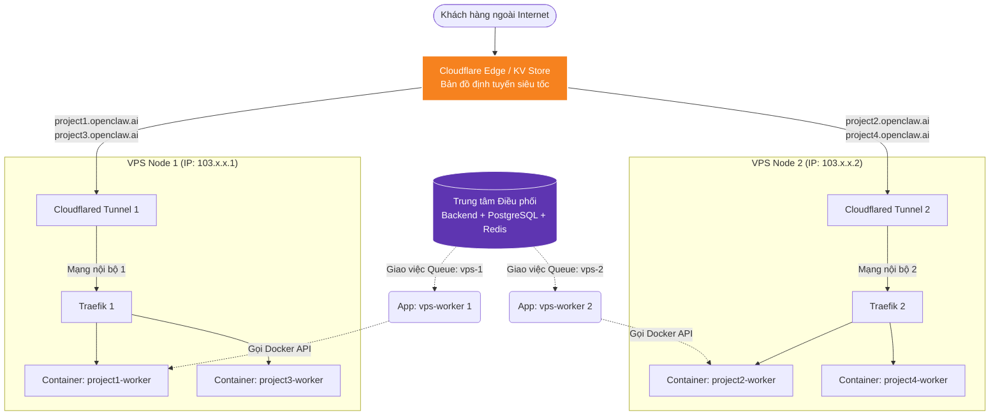

# Hướng Dẫn Toàn Tập: Kiến Trúc Cloudflare Tunnel & Traefik Cho OpenClaw SaaS

Tài liệu này ghi lại toàn bộ quá trình thiết lập, nguyên lý hoạt động và cách tự động hóa hệ thống định tuyến (Routing) cho nhiều VPS sử dụng Cloudflare Tunnel và Traefik.

## 1. Sơ đồ kiến trúc (Architecture Diagram)

Sơ đồ dưới đây mô tả cách một luồng truy cập đi từ người dùng ngoài Internet vào đến đúng container của từng Project bên trong VPS.

```mermaid
flowchart TD
    User([Khách hàng ngoài Internet\nTruy cập: project1.clawsandbox.cloud]) --> CF[Cloudflare Edge / DNS]
    
    subgraph "Bên ngoài Internet"
        CF
    end

    CF -- "Kết nối mã hoá xuyên Tường Lửa" --> Tunnel[Cloudflare Tunnel Container\n(cloudflared)]
    
    subgraph "Bên trong Máy Chủ (VPS / Local)"
        Tunnel -- "Forward request tới\nhttp://traefik-local:80" --> Traefik[Traefik Reverse Proxy\n(Port 80)]
        
        DockerSock[(Docker Socket\n/var/run/docker.sock)] -. "Báo cáo trạng thái container" .-> Traefik
        
        Traefik -- "Rule: Host(`project1...`)\nPort: 18789" --> Worker1[Container: project1-worker]
        Traefik -- "Rule: Host(`project2...`)\nPort: 18789" --> Worker2[Container: project2-worker]
    end
```

---

## 2. Nguyên lý hoạt động: Ai tìm thấy ai?

### A. Cách Cloudflare và Traefik tìm thấy nhau
- **Cloudflare Tunnel (`cloudflared`):** Hoạt động như một "đường ống" nối thẳng từ mạng lưới toàn cầu của Cloudflare vào bên trong mạng nội bộ (Docker Network) của VPS. Nó giúp VPS không cần mở bất kỳ port Public nào (không sợ bị hacker quét port).
- Nhờ việc chạy chung một mạng Docker (`openclaw-worker_traefik-net`), container `cloudflared` có thể nhìn thấy và gọi trực tiếp tên của container `traefik-local` thông qua tính năng DNS nội bộ của Docker.
- Trên Cloudflare Dashboard, chúng ta đã cấu hình: `HTTP -> traefik-local:80`. Do đó, mọi request đi qua đường hầm đều được thả chính xác vào cổng 80 của anh bảo vệ Traefik.

### B. Cách Traefik tìm thấy ĐÚNG container của người dùng
Đây là sức mạnh tuyệt đối của tính năng **Auto-Discovery (Tự động nhận diện)** của Traefik:
1. Traefik được cấp quyền đọc file `/var/run/docker.sock` của máy chủ. Đây là bộ não của Docker, chứa thông tin mọi container đang chạy.
2. Khi hệ thống sinh ra một container mới (`project1-worker`), chúng ta dán cho nó các "Nhãn" (Labels). Ví dụ:
   ```yaml
   labels:
     - "traefik.enable=true"
     - "traefik.http.routers.worker1.rule=Host(`project1.clawsandbox.cloud`)"
     - "traefik.http.services.worker1.loadbalancer.server.port=18789"
   ```
3. Ngay lập tức, Traefik đọc được nhãn này và tự động thêm một quy tắc (Rule) vào bộ nhớ: *"Nếu có thằng nào truy cập với tên miền `project1.clawsandbox.cloud`, hãy ném nó vào cổng 18789 của container này"*. Quá trình này diễn ra hoàn toàn tự động mà không cần khởi động lại Traefik.

---

## 3. Quá trình thiết lập (Setup Process)

### Bước 1: Khởi tạo Traefik trên VPS
Tạo file `docker-compose.yml` để khởi chạy Traefik và cấp quyền đọc Docker Socket.
```yaml
services:
  traefik:
    image: traefik:v3
    container_name: traefik-local
    command:
      - --providers.docker=true
      - --entrypoints.web.address=:80
    ports:
      - "80:80"
    volumes:
      - /var/run/docker.sock:/var/run/docker.sock:ro
    networks:
      - traefik-net
```

### Bước 2: Thiết lập Cloudflare Tunnel
1. Trỏ tên miền về Cloudflare Nameservers.
2. Vào **Zero Trust** -> **Networks** -> **Connectors** -> Tạo Tunnel mới.
3. Chạy lệnh cài đặt Docker Tunnel trên VPS, nhớ thêm tham số `--network traefik-net` để Tunnel nằm chung mạng với Traefik.
4. Ở phần **Public Hostnames**, cấu hình:
   - Subdomain: `*` (hoặc tên miền cụ thể)
   - URL: `http://traefik-local:80`

### Bước 3: Tạo Container Project
Chạy các container cho từng Project và gắn labels tương ứng để Traefik tự nhận dạng.

---

## 4. Tự động hoá cấp Subdomain (Không cần tạo bằng tay)

Làm sao để khi có hàng ngàn User đăng ký, hệ thống tự động sinh ra tên miền `user1.clawsandbox.cloud`, `user2.clawsandbox.cloud` mà bạn không cần phải lên Cloudflare bấm bằng tay?

**Giải pháp: Kết hợp Wildcard Tunnel và Docker API**

1. **Cấu hình Wildcard trên Cloudflare (Làm 1 lần duy nhất):**
   - Trong phần Public Hostnames của Cloudflare Tunnel, ở ô `Subdomain` bạn điền dấu `*` (Ví dụ: `*.clawsandbox.cloud`).
   - Ô URL vẫn trỏ về `traefik-local:80`.
   - Lợi ích: Bất kể user gõ tên miền gì (abc, xyz, project999), Cloudflare đều lùa hết vào đường hầm gửi tới Traefik.

2. **Backend Tự động hoá sinh Container (Làm bằng Code):**
   - Khi User bấm "Tạo Project" trên web, Backend (NestJS) của bạn sẽ gửi lệnh tới VPS.
   - VPS gọi Docker API để tự động chạy lệnh sinh ra một container mới. Lệnh này sẽ tự động sinh mã ngẫu nhiên cho nhãn của Traefik.
   - Ví dụ một lệnh mà Backend sẽ sinh ra để chạy ngầm:
     ```bash
     docker run -d \
       --name project_999_worker \
       --network traefik-net \
       -l "traefik.enable=true" \
       -l "traefik.http.routers.proj999.rule=Host(\`project999.clawsandbox.cloud\`)" \
       -l "traefik.http.services.proj999.loadbalancer.server.port=18789" \
       clawsaas-worker:1.0.2
     ```
   - **Kết quả:** Vừa tạo lệnh xong chưa tới 1 giây, User đã có thể truy cập `project999.clawsandbox.cloud` mà bạn không cần đụng tay vào cấu hình bất cứ gì trên Cloudflare hay Traefik nữa. Mọi thứ tự động 100%!

---

## 5. Tầm quan trọng của Mạng nội bộ (Docker Network)

Tại sao chúng ta phải ép tất cả vào chung một mạng (`--network traefik-net`)? Dưới đây là sự khác biệt giữa việc dùng chung mạng và không dùng chung mạng.

### Sơ đồ 1: Có dùng chung mạng (Cách làm chuẩn - Best Practice)
Tất cả các container (Cloudflared, Traefik, Worker) đều kết nối vào một Switch ảo của Docker. Chúng gọi tên nhau bằng Tên Container (Hostname) và không cần mở cổng ra ngoài máy chủ. An toàn tuyệt đối.



### Sơ đồ 2: KHÔNG dùng chung mạng (Cách làm tồi - Bad Practice)
Nếu không dùng chung mạng, các container bị nhốt ở các khu cách ly khác nhau. Chúng bắt buộc phải đi vòng ra "Mặt tiền máy chủ" (Host Machine) để tìm nhau bằng địa chỉ IP của máy chủ.
Bạn sẽ phải vất vả cấu hình IP thủ công và phải mở hở sườn các cổng của Project ra ngoài mạng Internet, cực kì rủi ro.



---

## 6. Sơ đồ mở rộng với nhiều VPS (Multi-VPS Architecture)

Khi hệ thống của bạn phát triển và 1 VPS không còn đủ sức chứa, bạn thuê thêm VPS thứ 2, thứ 3. Mỗi VPS sẽ chạy độc lập một cụm `Cloudflare Tunnel + Traefik` riêng biệt. 

Lúc này, bộ não điều phối chính là **Backend API & Redis Queue** của bạn kết hợp với hệ thống điều hướng thông minh của **Cloudflare**.



### Luồng xử lý khi mở rộng:
1. **Khách tạo Project mới:** Backend nhận lệnh, kiểm tra thấy VPS 1 đang đầy RAM, quyết định phân Project sang VPS 2.
2. **Backend tạo bản đồ:** Backend lập tức ghi đè lên Cloudflare KV Store (hoặc gọi API đổi DNS): `project2.openclaw.ai -> Trỏ vào Tunnel của VPS 2`.
3. **VPS 2 tự đẻ Container:** App `vps-worker` số 2 nhận được lệnh từ Redis, gọi lệnh Docker khởi tạo container `project2-worker` với dán nhãn đầy đủ cho Traefik.
4. **Trải nghiệm khách hàng:** Khách hàng gõ `project2.openclaw.ai`, Cloudflare dẫn nó chạy thẳng vào VPS 2. VPS 1 hoàn toàn không liên quan và không bị tốn một tí tài nguyên nào. Hệ thống có thể nhân bản lên hàng trăm VPS vẫn theo nguyên lý này!
