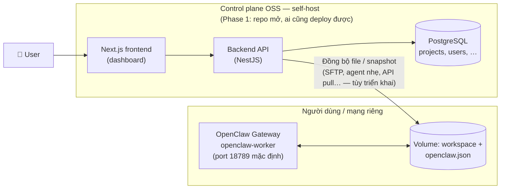
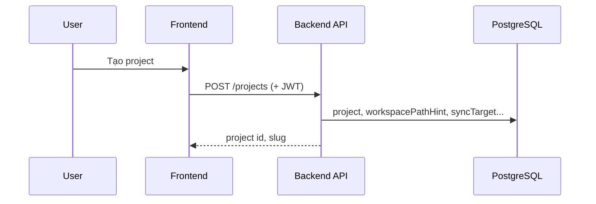
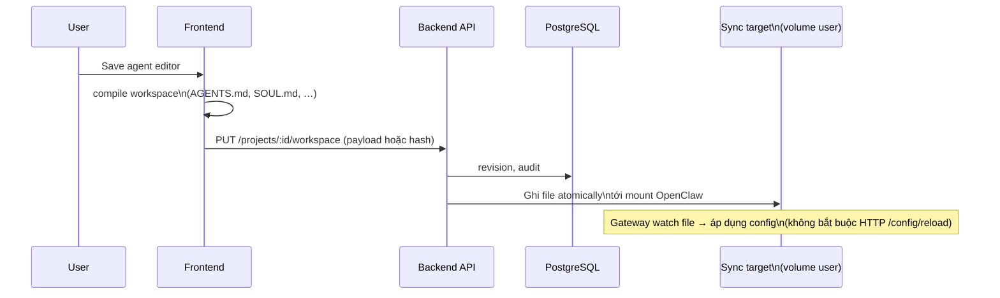

# OpenClaw SaaS — Workflow & kiến trúc vận hành

> **Cập nhật:** 2026-05-20  
> **Phân kỳ:**  
> - **Phase 1 — Mã nguồn mở (OSS):** toàn bộ stack “control plane + cách nối OpenClaw” **công khai**, cộng đồng **tự clone, tự host**, tự gắn gateway trên máy/VPS của họ.  
> - **Phase 2 — Dịch vụ SaaS thương mại:** bạn **bán** bản **hosted** (đa tenant, vận hành thay khách), mô hình kinh doanh giống kiểu **[Supabase](https://supabase.com)** (sản phẩm mở + cloud trả phí) hay **[n8n](https://n8n.io)** (tự host mở + **n8n Cloud** do nhà phát hành vận hành) — không đồng nghĩa Phase 1 là “bản demo” của Phase 2; Phase 1 là **sản phẩm gốc** cho community.  
> **Tham chiếu:** `openclaw-architecture.md`, `billing-plan.md` (Phase 2), `proxy-guide.md`.

---

## Vai trò tài liệu

| Thuộc | Không thuộc |
| ----- | ----------- |
| Luồng vận hành **Phase 1 (OSS, self-host)** | Chi tiết giá/credit hosted (→ `billing-plan.md`) |
| Sketch **Phase 2** (cloud bạn bán) | Schema Prisma từng bảng (→ `backend-architecture.md`) |
| Ranh OSS vs hosted commercial | Danh sách sprint (→ `roadmap-plan.md`) |

**Thuật ngữ**

- **Project:** đơn vị trong dashboard (cấu hình agent, workspace, bí mật tham chiếu).
- **Worker / Gateway:** tiến trình OpenClaw xử lý kênh + agent. **Phase 1:** gateway **luôn** chạy trên hạ tầng người deploy OSS (không phải VM bạn thuê cho họ). **Phase 2:** gateway (hoặc tầng tương đương) có thể chạy trên **hạ tầng hosted** bạn vận hành.

---

## 1. Vấn đề & cách chia phase

Cộng đồng và team muốn **UI + persistence** cho project/bot đa kênh, **không** phụ thuộc black box — đồng thời bạn muốn một lộ trình **vừa mở cho community vừa có chỗ bán dịch vụ**.

| Phase | Ai vận hành control plane & gateway | Mô hình |
| ----- | ------------------------------------- | ------- |
| **1 — OSS** | Người dùng / tổ chức tự deploy repo mở | **Self-host**; source công khai; mọi người có thể fork, đóng góp, chạy trên infra riêng. |
| **2 — SaaS** | Bạn (nhà cung cấp) | **Hosted product** trả phí: provisioning, backup, SLA, billing, scale — tương tự cloud của Supabase / n8n (khách không bắt buộc tự cài worker). |

- **Phase 1** giải “**một nguồn thật cho metadata + file workspace**” + **đồng bộ xuống đĩa** mà OpenClaw Gateway đọc (`openclaw.json`, `AGENTS.md`, …). Auth API self-host dùng **JWT** (hoặc tương đương bạn chọn cho bản OSS).
- **Phase 2** là **sản phẩm đám mây** bạn bán: multi-tenant, orchestration, quota, có thể kèm phần **không publish** (infra, abuse, cost controls) — **không thay thế** cam kết Phase 1 vẫn là nền mở cho community.

---

## 2. Phase 1 — Kiến trúc tổng quan



**Nguyên tắc Phase 1**

1. Sau khi user lưu cấu hình agent/project trên dashboard, hệ thống **ghi persistence** (DB + object storage tùy chọn) và **xuất cùng một bộ file** mà OpenClaw đã hỗ trợ (xem `openclaw-architecture.md` §4.5.1 — gateway **watch** `openclaw.json`).
2. **Không** spawn Docker container per user, **không** BullMQ `vps-worker` cho lifecycle container trong scope Phase 1.
3. **Không** billing/credit/heavy-job queue trong **OSS Phase 1** (có thể để hook hoặc stub cho người self-host mở rộng; **SaaS Phase 2** mới bắt buộc đầy đủ thương mại).

---

## 3. Phase 1 — Luồng vận hành (theo người dùng)

### 3.1 Đăng ký / đăng nhập

```mermaid
sequenceDiagram
    participant U as User
    participant FE as Frontend
    participant API as Backend API
    participant DB as PostgreSQL

    U->>FE: Đăng ký / đăng nhập
    FE->>API: POST /auth/* (credential)
    API->>DB: user record
    API-->>FE: JWT (access ± refresh)
    FE-->>U: Session; Bearer cho API
```

- **Auth chốt Phase 1:** **JWT** (access token + refresh theo policy bạn chọn). Gateway OpenClaw **không** dùng JWT này trực tiếp — nó dùng `gateway.auth` (token/password/…) riêng trên máy user.

### 3.2 Tạo project & metadata



- Project lưu **đường dẫn / mô hình đồng bộ** (ví dụ: “thư mục trên VPS user”, hoặc “chỉ lưu cloud, user tự tải zip”) tùy sản phẩm MVP của bạn.

### 3.3 Soạn agent / skill trên dashboard → biên dịch → sync file



**Ghi chú kỹ thuật**

- Compiler phía frontend/backend nên khớp quy ước file OpenClaw (đã có hướng `frontend/lib/agent-workspace-compile.ts`).
- **Phase 1:** ưu tiên **ghi file** lên path mà `OPENCLAW_CONFIG_PATH` / workspace trỏ tới. **Phase 2+** có thể bổ sung `config.patch` qua RPC hoặc `POST /tools/invoke` với operator token — xem `openclaw-architecture.md` §4.2, §4.5.1.

### 3.4 Người dùng chạy gateway locally / VPS riêng

1. User cài `openclaw` từ image/build của bạn hoặc từ upstream pin (`openclaw-worker` trong monorepo).
2. Trỏ config + workspace vào thư mục đã sync.
3. Kết nối kênh (Telegram, …) theo doc OpenClaw — **không** đi qua control plane cho lưu lượng chat thời gian thực.

---

## 4. Phase 1 — Phạm vi backend (“có” / “chưa”)

| Hạng mục | Phase 1 |
| -------- | ------- |
| Auth JWT, user, session | Có |
| CRUD project, metadata, (tuỳ chọn) revision workspace | Có |
| Đồng bộ file xuống nơi gateway đọc được | Có (cơ chế triển khai tùy bạn: SSH, sidecar, download) |
| Mã hóa bí mật lưu trữ (SecretCrypto) | Khuyến nghị |
| Health DB + logging | Có |
| Spawn/stop container per user, Traefik wildcard multi-tenant | **Không** |
| BullMQ / `vps-worker` / idle-shutdown fleet | **Không** |
| Heavy jobs (FFmpeg, Playwright) + credits | **Không** (Phase 2) |
| Worker callback nội bộ (PUT /api/internal/status…) cho fleet | **Không** (Phase 2) |

---

## 5. Phase 1 — Cấu trúc monorepo (tham chiếu)

```text
openclaw-saas/                    # Phase 1: công khai — community self-host
├── frontend/                     # Dashboard Next.js (OSS)
├── backend/                      # API NestJS (OSS)
├── openclaw-worker/              # Pin/fork OpenClaw gateway — người dùng tự chạy
├── vps-worker/                   # Chủ yếu cho Phase 2 hosted orchestrator (tuỳ policy công bố)
└── vps-heavy/                    # Phase 2 hosted heavy compute
```

*Gợi ý sản phẩm: **Phase 1** = những gì bạn **cam kết mở** và hướng dẫn deploy; **Phase 2** = pipeline + config + mã điều khiển cloud **của riêng bạn** (có thể không full OSS), tương tự cloud Supabase/n8n không phải 100% trùng repo self-host.*

---

## 6. Phase 2 — Dịch vụ SaaS trên cloud (bạn bán — kiểu Supabase / n8n)

**Mục tiêu:** khách **đăng ký tài khoản trên cloud của bạn**, trả phí (hoặc free tier), **không** bắt buộc tự cài Docker/gateway; bạn lo vận hành, patch, scale, backup.

**Đặc điểm (sketch — giống mô hình thị trường):**

| Thành phần | Gợi ý |
| ---------- | ----- |
| **Control plane** | Managed API + DB của bạn; tenant isolation; auth session/JWT do dịch vụ phát hành. |
| **Runtime bot/agent** | Worker/gateway (hoặc stack tương đương) chạy trên **hạ tầng bạn**; provisioning qua orchestrator (`vps-worker` hoặc K8s), ingress (Traefik / cloud LB). |
| **Kinh doanh** | Plans, metered usage, support — xem `billing-plan.md`. |
| **Heavy / queue** | Lane riêng (`vps-heavy`, BullMQ, …) nếu bạn bán tính năng nặng. |
| **Mã nguồn** | **Phase 1 OSS** vẫn là “engine + dashboard self-host”; **Phase 2** có thể gồm **repo riêng** hoặc phần **proprietary** (automation nội bộ, chi phí, chống abuse) — tương tự không phải mọi thứ trên Supabase Cloud / n8n Cloud đều là một-one public repo. |
| **Bảo mật** | JWT app vs `gateway.auth`; không public `POST /tools/invoke` — xem `openclaw-architecture.md`. |

```mermaid
flowchart TB
    subgraph P2["Phase 2 — Hosted SaaS\n(sản phẩm cloud bạn bán)"]
        FE2[Frontend\n(branded cloud)]
        API2[Backend API + billing]
        Q[Queues\nspawn / heavy]
        Orc[Orchestrator\n(proprietary ops có thể)]
        Pool[Worker pool\ncontainers / VMs]
        FE2 --> API2
        API2 --> Q
        Q --> Orc
        Orc --> Pool
    end
    User2[User] --> FE2
    Chat[Chat apps] <--> Pool
```

**Từ Phase 1 → Phase 2:** giữ **cùng mental model** “project + workspace files”; Phase 2 thêm **đẩy config xuống runtime hosted**, observability, SLA, **kinh tế hóa** chi phí vận hành — **song song** với việc Phase 1 OSS vẫn được maintain cho community (mô hình tương tự bản self-host vẫn chạy độc lập khi nhà phát hành bán cloud).

---

## 7. Bảng so sánh nhanh

| Tiêu chí | Phase 1 (OSS / community) | Phase 2 (SaaS hosted — bạn bán) |
| -------- | ------------------------- | ------------------------------- |
| **Mô hình** | Self-host, fork, PR | Đăng ký cloud, trả phí / free tier |
| **Tương tự thị trường** | Postgres self-host / n8n self-host | Supabase Cloud / n8n Cloud |
| Gateway chạy ở đâu | Máy / VPS **người deploy OSS** | Hạ tầng **bạn** |
| Đồng bộ cấu hình | **Ghi file** (+ DB local/self-host) | Orchestrator + volume hosted + (tuỳ) RPC nội bộ |
| Auth | **JWT** (API do người self-host chạy) | Auth do **dịch vụ cloud** bạn cung cấp + billing |
| `vps-worker` / `vps-heavy` | Không bắt buộc OSS core | Thường **có** cho fleet |
| **Cam kết mở** | Core dashboard + API + hướng dẫn deploy **công khai** | Phần vận hành cloud **tuỳ bạn** công bố hay giữ riêng |

---

## 8. Liên kết tài liệu

| Chủ đề | File |
| ------ | ---- |
| Gateway HTTP, session API, config watch, RPC `config.*` | `openclaw-architecture.md` |
| Giá, credit, quota (Phase 2+) | `billing-plan.md` |
| Proxy / ingress an toàn | `proxy-guide.md` |

---

*Ghi chú phiên bản: tài liệu **phân tách đúng** “**OSS cho cộng đồng**” vs “**SaaS bạn kinh doanh**”. Lược đồ MVP cũ (một phase gộp control plane + fleet + heavy) có thể **tái sử dụng** trong tài liệu nội bộ “Phase 2 runbook” hoặc `billing-plan.md`.*
