# AucoBot — Workflow & kiến trúc vận hành

> **Cập nhật:** 2026-06-24  
> **SSOT tính năng AucoBot** (control plane, API, sync, chat proxy, channels) — file này.  
> **SSOT OpenClaw worker** (gateway, kênh upstream, RPC, skills load) — [`openclaw-architecture.md`](openclaw-architecture.md).  
> **Tên sản phẩm / monorepo:** AucoBot (`aucobot/`, xem `aucobot/docs/monorepoplan.md`)  
> **Phân kỳ:**  
> - **OSS (mã nguồn mở):** một **`docker compose`** dựng **đủ stack** giống **[Supabase](https://supabase.com)** self-host: **frontend**, **backend**, **PostgreSQL**, và **một service gateway OpenClaw** (cổng **18789**) — **4 service**. User chạy `docker compose up` — **không** spawn container qua Docker API khi tạo project. Backend **sync file** lên volume dùng chung, **proxy chat** tới `OPENCLAW_GATEWAY_URL` (ví dụ `http://gateway:18789`); **MCP connectors chạy stdio do gateway spawn** (`npx @aucobot/mcp-*`, Google pre-bake trong image gateway) — **không** còn service HTTP `mcp` riêng (xem [`mcp.md`](mcp.md)).  
> - **Cloud SaaS (hosted thương mại):** bạn **bán** bản cloud (đa tenant, vận hành thay khách). Runtime **mỗi project = một container** OpenClaw — backend **provision** qua Docker API / fleet (`vps-worker`, quota, billing). OSS **không** phải bản demo của Cloud — OSS là **sản phẩm gốc** cho community; Cloud **tái dùng** lõi OSS qua package/module, phần kinh doanh có thể **repo đóng**.  
> **Tham chiếu:** `openclaw-architecture.md` (worker), `aucobot/docs/monorepoplan.md`, `billing-plan.md` (Cloud SaaS), `proxy-guide.md`.

---

## Vai trò tài liệu

| Thuộc (`workflow.md`) | Không thuộc (→ file khác) |
| ----- | ----------- |
| Luồng vận hành **OSS / Cloud**, sync DB → volume, **merge openclaw.json**, chat WS proxy, channels API, **runtime plane `data/projects`** | Chi tiết gateway RPC, channel plugin upstream (→ `openclaw-architecture.md`) |
| Phase 1 / 2 tích hợp control plane ↔ worker | Schema Prisma từng bảng (→ `packages/database/`) |
| Sketch **Cloud SaaS** (cloud bạn bán) | Giá/credit hosted (→ `billing-plan.md`) |
| Ranh OSS vs Cloud / proprietary | Danh sách sprint (→ `roadmap-plan.md`) |
| Cấu trúc monorepo, **4 service OSS** | → `aucobot/docs/monorepoplan.md` §2 |
| MCP Hub, connector stdio, pre-bake Google | → [`mcp.md`](mcp.md) |

**Thuật ngữ**

- **Project:** đơn vị trong dashboard (cấu hình agent, workspace, bí mật, secrets). Metadata **lưu trong DB**; cấu hình runtime cho gateway qua **sync file** trên volume (`openclaw.json`, `AGENTS.md`, …).
- **Worker / Gateway:** tiến trình OpenClaw (image `openclaw-worker`).  
  - **OSS:** **một** gateway trong compose, cổng **18789** — dùng chung cho instance (MVP thường **1 user ≈ 1 project**).  
  - **Cloud:** **một container gateway / project** — spawn động, `hostPort` lưu DB.
- **MCP / Connectors:** Google Drive, Calendar (và MCP khác) — chạy **stdio do gateway spawn** (`npx -y @aucobot/mcp-*`); API merge `mcp.servers` (kiểu stdio: `command`/`args`/`env`) vào `openclaw.json`. Google pre-bake sẵn trong image gateway (offline/tức thì); connector khác tải qua `npx` lần đầu. **Không** còn service HTTP `mcp` trên OSS (đó là mô hình Cloud — xem [`mcp.md`](mcp.md)).
- **Control plane:** App NestJS + Next.js + PostgreSQL — **không** đọc channel trực tiếp; điều phối DB, sync, proxy WS.

---

## 1. OSS và Cloud SaaS

Cộng đồng và team muốn **UI + persistence** cho project/bot đa kênh, **không** phụ thuộc black box — đồng thời muốn **engine mở** và **cloud trả phí** song song.

| Sản phẩm | Ai vận hành | Mô hình runtime gateway |
| -------- | ----------- | ------------------------ |
| **OSS** | Người dùng / tổ chức tự deploy | **Compose** bật sẵn `gateway:18789`; API **không** cần `docker.sock` |
| **Cloud SaaS** | Nhà cung cấp (bạn) | **Spawn 1 container / project** trên hạ tầng hosted + fleet, billing, quota |

| Sản phẩm | Ai vận hành control plane | Mô hình sản phẩm |
| -------- | -------------------------- | ---------------- |
| **OSS** | Người dùng tự host | Self-host, fork, PR, source công khai |
| **Cloud SaaS** | Bạn | Hosted trả phí — provisioning, SLA, scale |

- **OSS:** “**một nguồn thật trong DB**” + **sync file** volume (§5.6, Phase 1; gateway watch file — `openclaw-architecture.md` §4.5.1). Auth API: **JWT**. Gateway: **`gateway.auth`** / `OPENCLAW_GATEWAY_TOKEN` — chat dashboard qua **proxy WS** (§5.7), không JWT thẳng vào `:18789`.
- **Cloud:** Cùng sync file + thêm orchestration fleet, billing, multi-tenant — phần proprietary **repo đóng** import lõi OSS.

---

## 2. Ranh giới service OSS (4 container + volume)

OSS self-host **đủ** với **bốn container** trong `docker compose`. **`web`** và **`api`** build từ repo **AucoBot** (`aucobot/`). **`postgres`** và **`gateway`** (OpenClaw) **pull image upstream** — fork để pin tag, **không sửa** runtime gateway (image gateway thêm **một lớp mỏng** pre-bake `@aucobot/mcp-google-*`, xem [`mcp.md`](mcp.md) §5).

> **Tóm tắt:** `web` + `api` (build AucoBot) + `gateway` + `postgres` (pull upstream) **+ volume** `openclaw_data`. Không Redis / BullMQ / fleet / service `mcp`. **MCP connectors = stdio do gateway spawn** (`npx @aucobot/mcp-*`, Google pre-bake). Chi tiết: `monorepoplan.md` §2, [`mcp.md`](mcp.md).

### 2.1 Bốn service

| Service | Image | Sở hữu | Port | Vai trò |
| ------- | ----- | ------- | ---- | ------- |
| `web` | Build `apps/web` | **AucoBot** | 8386 | Dashboard → API |
| `api` | Build `apps/api` | **AucoBot** | 8387 | DB, sync file, proxy chat → gateway; OAuth connector; merge `mcp.servers` (stdio) |
| `gateway` | Pull OpenClaw (+ pre-bake `@aucobot/mcp-google-*`) | **Upstream** | **18789** | Agent, kênh chat; đọc volume; **spawn MCP stdio** từ `mcp.servers` |
| `postgres` | `postgres:16-alpine` | **Upstream** | 5432 | Metadata app |

- **Chat:** **web → api → gateway** — FE **không** gọi thẳng `:18789`.
- **Connectors:** **gateway spawn stdio** (`npx -y @aucobot/mcp-*` hoặc binary pre-baked) — secrets nằm trong `env` của `mcp.servers` (api sync từ DB). User chỉ thao tác dashboard.
- `api` **không** cần `docker.sock` (spawn container = Cloud).

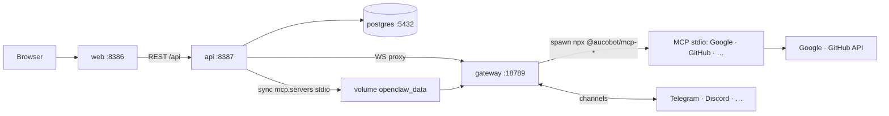

### 2.2 Volume & env (bắt buộc, không phải container thứ 5)

| Thành phần | Ghi chú |
| ---------- | ------- |
| Volume `openclaw_data` | `api` ghi sync; `gateway` đọc — cùng mount |
| `OPENCLAW_GATEWAY_URL` | `http://gateway:18789` (trong compose) |
| `OPENCLAW_GATEWAY_TOKEN` | Khớp token gateway; ≠ JWT dashboard |
| `OPENCLAW_DATA_ROOT` | Đường ghi file trên volume (compose: `/data/projects`; dev: `apps/api/data/projects`) |
| `OSS_PROJECT_ID` | (tuỳ chọn) Chọn **một** thư mục `{ROOT}/{OSS_PROJECT_ID}/` khi >1 project trên cùng gateway — xem §5.8.3 |
| `DATABASE_URL` | → `postgres` |

> **Bỏ trên OSS:** `MCP_SERVICE_SECRET`, `AUCOMCP_BASE_URL` — chỉ cần cho service HTTP `mcp` (mô hình Cloud). OSS truyền secrets connector trực tiếp vào `mcp.servers.env` / credential file trên volume (xem [`mcp.md`](mcp.md) §6).

### 2.3 Không có trong compose OSS

Redis, BullMQ, `vps-worker`, Traefik (tuỳ chọn prod), `skill-hub` (catalog tĩnh), Docker socket trên `api`.

### 2.4 Ngoài stack (integration)

LLM API keys, Google Cloud Console (OAuth connectors), token kênh Telegram/Discord, reverse proxy TLS — **không** phải service container AucoBot (OAuth callback vẫn vào `api`).

### 2.5 Sở hữu code

```text
AucoBot (build image):     aucobot/apps/web + aucobot/apps/api
MCP packages (npm):        sibling ../mcp/  →  @aucobot/mcp-* (publish npm; gateway npx / pre-bake)
Upstream (pull + lớp mỏng): postgres:16-alpine + openclaw/openclaw (gateway) + Dockerfile.gateway pre-bake @aucobot/mcp-google-*
Compose / hạ tầng:         aucobot/deploy/docker-compose.yml + volume + .env
```

`openclaw-worker/` trong meta-repo: pin upstream / docs — runtime OSS **pull image** gateway; image gateway chỉ thêm lớp mỏng cài `@aucobot/mcp-google-*` (không patch runtime OpenClaw). Repo `mcp/` không còn build image service HTTP cho OSS — chuyển thành **monorepo publish packages** `@aucobot/mcp-*` ([`mcp.md`](mcp.md) §4).

---

## 3. Tư duy vận hành — Control plane vs OpenClaw

App = **control plane (DB + API + dashboard)** + **runtime OpenClaw (gateway)**.  
OpenClaw **không đọc PostgreSQL** — chỉ đọc **file + `openclaw.json`** trên volume.

### OSS (một gateway trong compose)

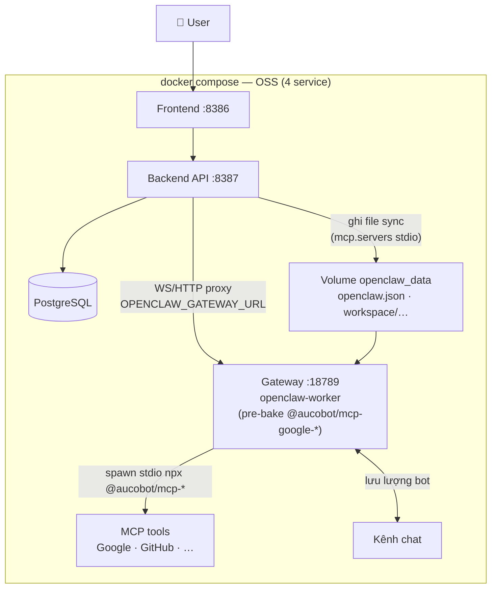

### Cloud (gateway per project — spawn động)

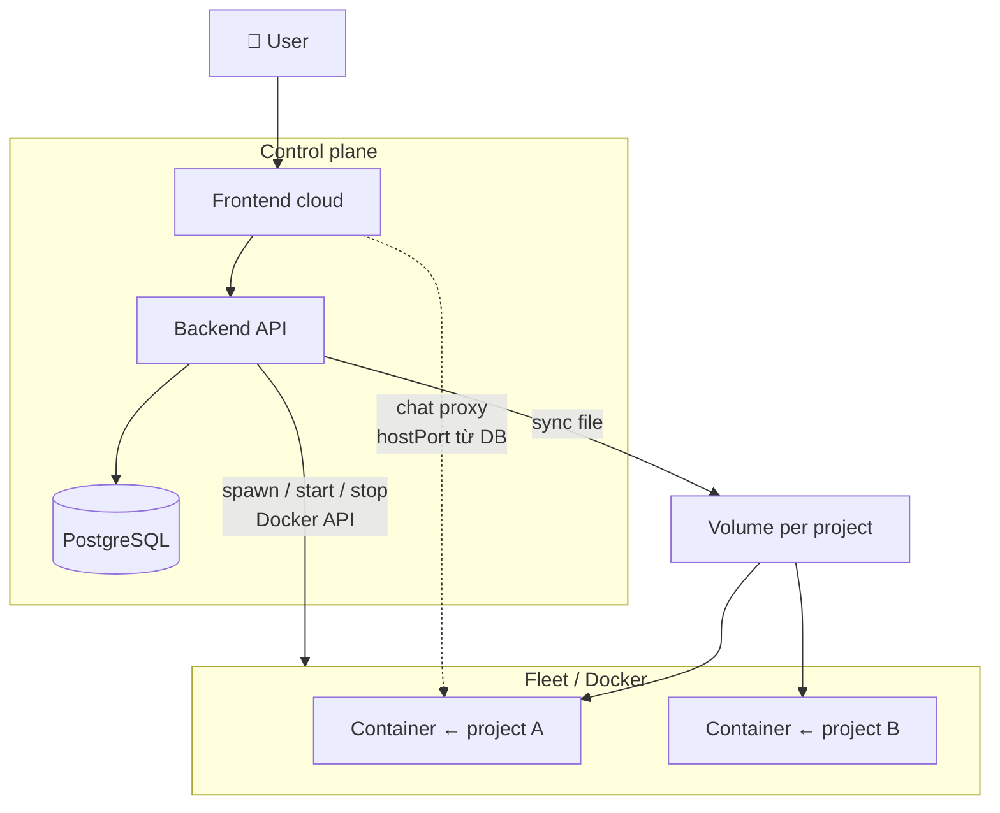

### Quy tắc một dòng

| OpenClaw gateway **phải thấy** để chạy? | Chỉ tính năng **app** (billing, UI, tenant…)? |
| -------------------------------------- | --------------------------------------------- |
| **Sync DB → volume / `openclaw.json`** | **Giữ trên DB** — API đọc trực tiếp |

### Ví dụ nhanh

| Sync sang OpenClaw (volume) | Chỉ DB (app) |
| --------------------------- | ------------ |
| API key provider → `env` trong `openclaw.json` | User, JWT, plan, invoice |
| Skill `enabled` → `workspace/skills/<slug>/SKILL.md` | Skill draft chưa publish |
| Agent workspace → `AGENTS.md`, `SOUL.md`, … | Danh sách project, slug hiển thị |
| Channel token (khi map workspace) | — |
| — | **OSS:** không lưu `container_id` / `host_port` |
| — | **Cloud:** `container_id`, `host_port`, Docker lifecycle |

**Khi user chat:** không inject config từng tin — file đã sync; gateway **watch** + build prompt (`openclaw-architecture.md` §11.5; skills AucoBot §5.3).

**Sync khi nào:** khi user **lưu / bật / đổi** cấu hình — **không** sync mỗi tin nhắn.

---

## 4. OSS — Kiến trúc tổng quan

**Self-host một lần:** `docker compose up` khởi chạy **bốn service** (xem §2): **web** + **api** (build AucoBot), **postgres** + **gateway** (pull upstream; gateway pre-bake `@aucobot/mcp-google-*`). Repo `openclaw-worker/` chỉ để pin image gateway — runtime OSS không build custom OpenClaw trong `aucobot/`.

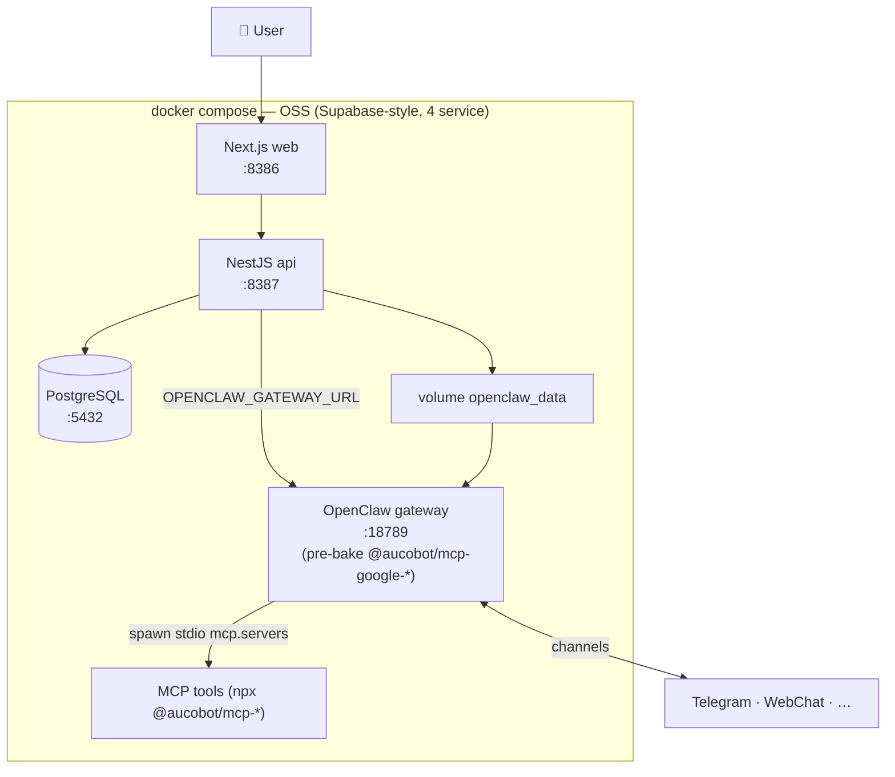

**Nguyên tắc OSS**

1. **Một stack compose = một gateway** trên **18789** (service name `gateway` trong mạng Docker). Backend truy cập `http://gateway:18789` (trong compose) hoặc `http://127.0.0.1:18789` (dev host).
2. **Không** spawn container per project qua Docker API; **không** mount `docker.sock` vào service `api`.
3. **PostgreSQL** = nguồn sự thật **app**. OpenClaw chỉ đọc **volume** — sync có chọn lọc (§3).
4. Tạo project trên OSS = **INSERT DB** + **bootstrap/sync file** + (tuỳ chọn) ping `GET /healthz` — **không** `docker create`.
5. **Không** bắt buộc BullMQ, `vps-worker`, billing trong OSS core (`NoopPlanGuard`).
6. **MVP:** thường **1 user ≈ 1 project**; volume `openclaw_data` mount chung cho api + gateway.

**Env OSS (api)**

```env
RUNTIME_MODE=oss
OPENCLAW_GATEWAY_URL=http://gateway:18789
OPENCLAW_GATEWAY_TOKEN=...
OPENCLAW_DATA_ROOT=/data/projects
# MCP connectors = stdio do gateway spawn; secrets vào mcp.servers.env khi sync.
# Không cần MCP_SERVICE_SECRET / AUCOMCP_BASE_URL trên OSS (đó là service HTTP — mô hình Cloud).
```

---

## 5. OSS — Luồng vận hành (theo người dùng)

### 5.1 Đăng ký / đăng nhập

```mermaid
sequenceDiagram
    participant U as User
    participant FE as Frontend
    participant API as Backend API
    participant DB as PostgreSQL

    U->>FE: Đăng ký / đăng nhập
    FE->>API: POST /auth/* (credential)
    API->>DB: user record
    API-->>FE: JWT (access ± refresh)
    FE-->>U: Session; Bearer cho API
```

- **Auth OSS:** **JWT**. Gateway **không** dùng JWT dashboard — dùng `gateway.auth` / token compose.

### 5.2 Khởi động stack & tạo project

**Bước 0 — User (hoặc admin) bật stack:**

```bash
docker compose -f deploy/docker-compose.yml up -d
# postgres + gateway (healthz) + api + web  (4 service)
```

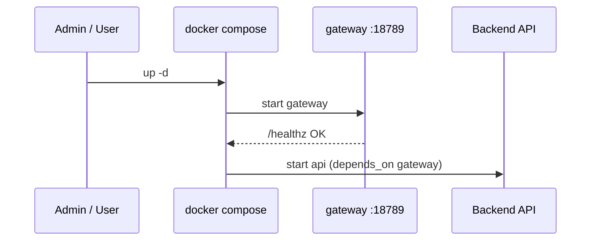

**Bước 1 — Tạo project (không spawn container):**

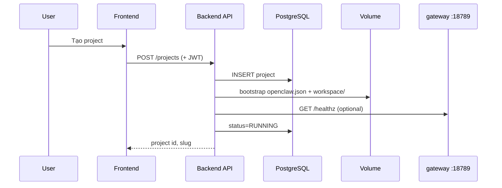

- Volume: `{OPENCLAW_DATA_ROOT}/{projectId}/` — api **ghi**, gateway **đọc** (cùng mount `openclaw_data`).
- Token gateway OSS: **`OPENCLAW_GATEWAY_TOKEN`** global từ compose (đồng bộ vào `openclaw.json` khi bootstrap).
- **Không** lưu `container_id` / `host_port` trên OSS (hoặc để null).
- Restart gateway: `docker compose restart gateway` — không có API “respawn project” trên OSS.

### 5.3 Soạn trên dashboard → lưu DB → sync file (OpenClaw)

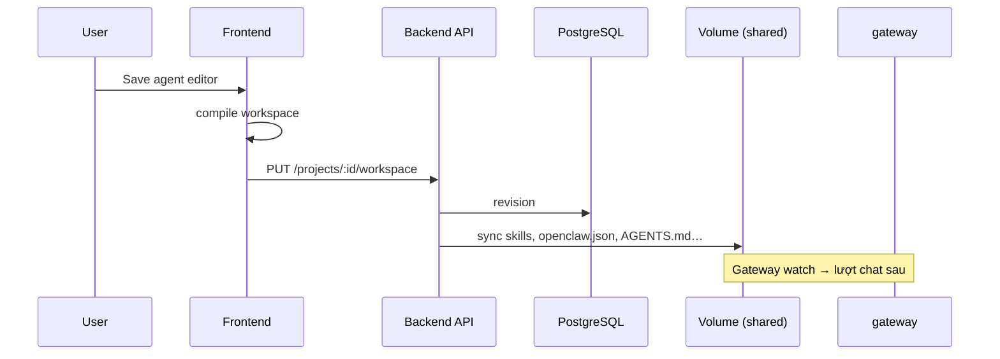

- Agent compiler: `packages/workspace-sync/src/agent-workspace-compile.ts` — bootstrap markdown (`AGENTS.md`, `SOUL.md`, …) per agent; runtime merge qua `syncProjectRuntime` (§5.6). Agent `main` implicit trong `agents.list`. Skill → `SKILL.md`.
- **Cloud:** cùng sync; có thể thêm `config.patch` RPC (Phase 2 — §5.6).

### 5.4 Tóm tắt lưu lượng realtime

1. **OSS:** Một gateway trong compose — channel cấu hình trong volume project (`openclaw.json`); connectors chạy **stdio do gateway spawn** (`npx @aucobot/mcp-*`, Google pre-bake).
2. Tin nhắn **không** đi qua body HTTP sync; xem §5.7 (dashboard WS vs kênh bot).
3. API lo: auth JWT, CRUD, sync file — **không** lifecycle Docker trên OSS.

### 5.5 Channels — Control plane vs OpenClaw worker (Telegram, Discord, …)

**Channels** (Telegram, Discord, Zalo…) khác **connectors** (Google Drive, Calendar MCP). Cả hai lưu DB + sync file; **runtime chat** chỉ trong **openclaw-worker** (gateway — `openclaw-architecture.md` §3.3).

| Lớp | Nơi làm | Vai trò |
| --- | ------- | ------- |
| **Runtime channel** | `openclaw-worker` | Nhận/gửi tin, pairing, RPC `channels.*` |
| **Control plane** | `apps/api` + `@aucobot/workspace-sync` | UI, DB, mã hóa secret, test token, ghi `openclaw.json` |

Backend **không inject code channel** vào worker — chỉ **cấu hình JSON** trên volume. Gateway **watch** file → plugin chạy.

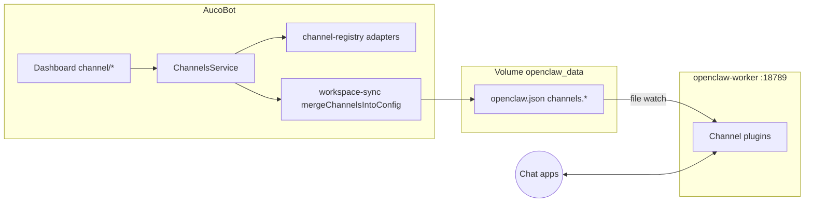

| Kênh | Backend MVP |
| ---- | ------------- |
| **Telegram** | `bot_token` → `channels.telegram.botToken` |
| **Discord** | `bot_token` → `channels.discord.token` |

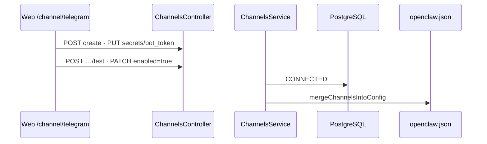

**REST:** `GET /api/projects/channels/definitions` · `GET|POST|PATCH|DELETE /api/projects/:id/channels` · `PUT|DELETE …/secrets/:key` · `POST …/test`

### 5.5.1 Connectors — MCP stdio do gateway spawn

**Connectors** (Google Drive, Calendar, GitHub, …) khác **channels** (§5.5): runtime tool MCP chạy **stdio do gateway spawn** (`npx -y @aucobot/mcp-*` hoặc binary pre-baked), **không** phải plugin chat trong gateway và **không** còn service HTTP `mcp` riêng. Chi tiết hub/packages/pre-bake: [`mcp.md`](mcp.md).

| Lớp | Nơi làm | Vai trò |
| --- | ------- | ------- |
| **Dashboard** | `apps/web` | UI Connect — user bấm **Connect**, không cấu hình MCP thủ công |
| **Control plane** | `apps/api` | CRUD `ProjectConnector`, OAuth callback, mã hóa secret, `mergeConnectorsIntoConfig` → `mcp.servers` (stdio) |
| **MCP packages** | sibling [`mcp`](../mcp/) → `@aucobot/mcp-*` (npm) | Tool stdio (Drive, Calendar, GitHub, X); first-party, bạn publish & kiểm soát |
| **Gateway** | `openclaw-worker :18789` | Đọc `mcp.servers` từ volume; **spawn** MCP subprocess khi agent dùng tool (Google pre-bake → tức thì/offline) |

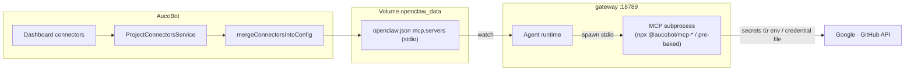

- **Merge stdio:** `mergeConnectorsIntoConfig` ghi `mcp.servers.<id>` kiểu `command`/`args`/`env`; secrets DB (mã hóa) → `env` hoặc credential file trên volume (`writeGoogleDriveCredentialFiles` cho OAuth Google). Code đã có nhánh stdio `npx` trong `connector-mcp.ts` — bỏ nhánh `remoteMcp` ở OSS.
- **Google pre-bake:** image gateway (`Dockerfile.gateway`) cài sẵn `@aucobot/mcp-google-drive`, `@aucobot/mcp-google-calendar` → chạy offline/tức thì; connector khác `npx -y @aucobot/mcp-<name>` tải lần đầu (cache lại).
- **Hub first-party:** dashboard chỉ hiện connector trong catalog `@aucobot/*` — không phụ thuộc npm cộng đồng (chống supply-chain). Repo `mcp/` chuyển thành monorepo publish `@aucobot/mcp-*` (`git@github.com:aucobot/mcp.git`, sibling `../mcp/`).

### 5.6 Sync DB ↔ disk (`syncProjectRuntime`)

| Giai đoạn | Đồng bộ với worker | Auth |
| --------- | ------------------- | ---- |
| **Phase 1** | Ghi file volume (`openclaw.json`, workspace, skills) — gateway **watch** (§4.5.1 upstream) | **JWT** cho API SaaS; worker dùng **`gateway.auth.token`** |
| **Phase 2** | Tuỳ chọn RPC `config.patch` / `POST /tools/invoke` | Map JWT → operator credential nội bộ |

**Hai lớp dữ liệu (hybrid SSOT):**

| Lớp | Vai trò | Công nghệ |
| --- | ------- | --------- |
| **Control plane** | Cấu hình dashboard, secrets (mã hóa), user, usage analytics | PostgreSQL qua `apps/api` |
| **Runtime plane** | Những gì OpenClaw gateway thực sự chạy | `{OPENCLAW_DATA_ROOT}/{projectId}/` trên volume dùng chung |

Postgres (SSOT UI) → `WorkspaceService.syncProjectRuntime()` → disk → gateway đọc/ghi cùng volume. OpenClaw **không đọc PostgreSQL**.

**Entry path:** `packages/workspace-sync/src/paths/project-paths.ts` — `resolveProjectDataDir(projectId)` → `{dataRoot}/{projectId}`.

```
{OPENCLAW_DATA_ROOT}/{projectId}/
  openclaw.json              # API merge → gateway watch/reload
  proxy-device.json          # API: Ed25519 identity cho WS proxy connect
  workspace/                 # skills, HEARTBEAT.md (project)
  workspace-{slug}/          # AGENTS.md, SOUL.md, IDENTITY.md, TOOLS.md (per agent)
  connectors/                # file OAuth (vd. google-drive) — API khi sync connector
  chat-uploads/              # đính kèm chat (API)
  devices/
    paired.json              # Gateway (+ API auto-approve proxy)
    pending.json
  agents/{slug}/             # Gateway-owned runtime state
    agent/                   # models.json, tooling artifacts
    sessions/
      sessions.json          # index session + token totals
      {sessionId}.jsonl      # transcript chat
      {sessionId}.trajectory.jsonl
  logs/
    config-health.json       # gateway diagnostics
```

`ensureProjectLayout()` bootstrap: `workspace`, `devices`, `agents`, `logs`, `chat-uploads` (`project-paths.ts`). Thư mục `connectors/` được tạo khi `mergeConnectorsIntoConfig` chạy.

**Package merge:** `@aucobot/workspace-sync` (`packages/workspace-sync/`). Orchestrator: `apps/api/.../workspace/workspace.service.ts`. Dev: `pnpm dev:runtime` (`aucobot/package.json`).

#### Khi nào gọi sync

| Sự kiện | Service | Ghi disk |
| ------- | ------- | -------- |
| Lưu / bật / tắt / xóa agent | `AgentService` | `syncAgentToDisk` (bootstrap markdown) + `syncProjectRuntime` |
| Đổi provider key / default model | `ProviderKeysService` | `syncProjectRuntime` |
| Bật / sửa channel | `ChannelsService` | `syncProjectRuntime` |
| Bật / sửa connector | `ProjectConnectorsService` | `syncProjectRuntime` |
| Sandbox default / per-agent | `SandboxService` | `syncProjectRuntime` |
| Exec policy (ask, safeBins, timeout) | `ExecPolicyService` | `syncProjectRuntime` |
| Heartbeat project / agent | `HeartbeatService` | `syncProjectRuntime` + `writeHeartbeatFiles` |
| Collaboration (`tools.agentToAgent`) | `CollaborationService` | `syncProjectRuntime` |
| Bật/tắt skill, sync-all | `ProjectSkillsService` | `syncProjectRuntime` |
| Tạo project (bootstrap) | `ProjectsService` → `WorkspaceService.bootstrapProjectWorkspace` | layout + `openclaw.json` ban đầu |
| `GET /api/projects/:id/health` (OSS) | `ProjectsService.syncOssProjectFromGateway` | `syncGatewayAuthToDisk` (token reconcile) |
| CLI / ops | `sync-project-runtime.mjs`, `sync-project-openclaw.mjs`, `sync-gateway-token-disk.mjs` | `syncProjectRuntime` / token |
| `POST …/agents/sync-all`, `…/skills/sync-all` | controller tương ứng | `syncProjectRuntime` |

Tin nhắn chat **không** trigger sync — chỉ thay đổi cấu hình (§3, §5.4).

#### Pipeline merge `openclaw.json`

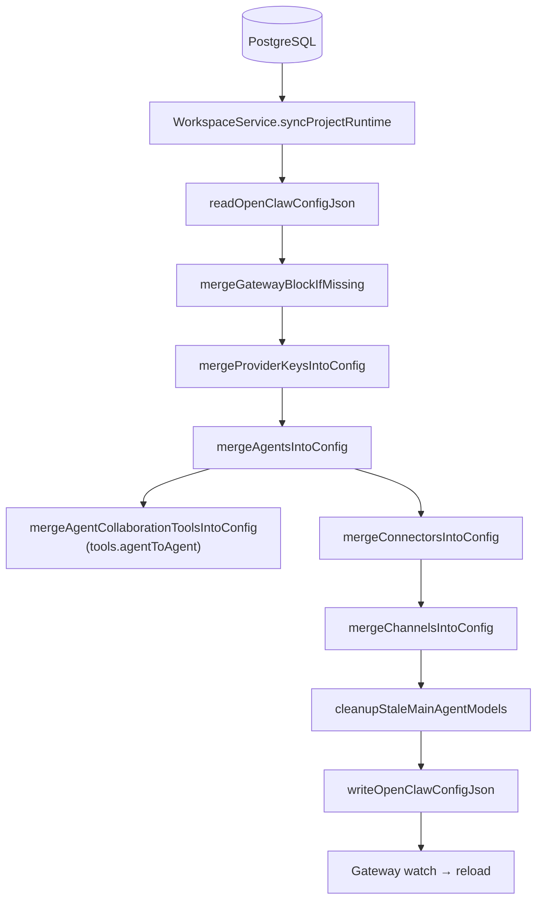

**Thứ tự thực thi** (trong `workspace.service.ts`):

1. `mergeGatewayBlockIfMissing` — đảm bảo `gateway.auth` (OSS token).
2. `mergeProviderKeysIntoConfig` — `env.*`, `agents.defaults.model.primary`, `models.providers.<id>` (custom/foundation provider: `models[]` + `baseUrl` + `api` + **`apiKey`**), `plugins.entries` (chỉ bật plugin **bundle sẵn** trong image gateway). Xem [§5.6.1](#561-provider-auth--custom-provider-apikey-fix-2026-06-24).
3. `mergeAgentsIntoConfig` — `agents.list`, `agents.defaults.workspace`; cuối hàm gọi `mergeAgentCollaborationToolsIntoConfig` (từ `Project.collaboration*`).
4. `mergeConnectorsIntoConfig` — `mcp.servers` (+ file credential Google trên disk nếu cần).
5. `mergeChannelsIntoConfig` — `channels.*`, `plugins.entries` (telegram/discord).
6. `cleanupStaleMainAgentModels` — dọn model legacy trên volume.
7. `writeOpenClawConfigJson` + `removeLegacyDotEnv`.

| Hàm merge | Nhánh `openclaw.json` | Nguồn DB | File |
| --------- | ---------------------- | -------- | ---- |
| `mergeProviderKeysIntoConfig` | `env.*`, `agents.defaults.model`, `models.providers.<id>` (+ `apiKey`), `plugins.entries` (provider — chỉ bundle sẵn) | `ProjectProviderKey` | `config/merge-openclaw/merge-openclaw.ts` |
| `mergeAgentsIntoConfig` | `agents.list[]`, `agents.defaults.workspace` | `ProjectAgent` (enabled) | `openclaw-config-merge.ts` |
| `mergeAgentCollaborationToolsIntoConfig` | `tools.agentToAgent` | `Project.collaborationEnabled`, `collaborationMemberSlugs` | `agent-collaboration.ts` |
| `mergeConnectorsIntoConfig` | `mcp.servers` | `ProjectConnector` + secrets | `merge-connectors-into-config.ts` |
| `mergeChannelsIntoConfig` | `channels.*`, `plugins.entries` (channel) | `ProjectChannel` + secrets | `merge-channels-into-config.ts` |

**Nguyên tắc merge:** đọc config hiện có → ghi đè **nhánh do AucoBot quản lý**; giữ key ngoài phạm vi (managed ids) nếu user/host đã có sẵn trên volume.

#### 5.6.1 Provider auth — custom provider `apiKey` (fix 2026-06-24)

> **Triệu chứng:** Chat với model custom provider (vd `deepseek/deepseek-v4-flash`) báo `Unknown model` rồi `No API key found for provider "deepseek"`, dù provider đã bật + lưu key trên dashboard. Bản commit cũ chạy được, bản mới (gateway `2026.6.9`) thì lỗi.

**Root cause (đọc source `openclaw-worker`):** Với **custom / foundation provider không có plugin bundle** trong image gateway (DeepSeek, Kilocode, …), runtime resolve auth theo thứ tự **auth store SQLite (`openclaw-agent.sqlite`) → biến môi trường → `models.providers.<id>.apiKey`**. Gateway **KHÔNG** đọc `auth-profiles.json` cho agent-scoped profile, và env var của provider không-bundle thường **không** có mapping trong `candidateMap`. Trước đây AucoBot chỉ ghi key vào `env.*` + dựa `auth-profiles.json` → với agent `main` (sqlite rỗng) gateway không tìm ra key → báo lỗi.

**Fix (3 lớp):**

| Lớp | File | Thay đổi |
| --- | ---- | -------- |
| Sync merge | `packages/workspace-sync/src/config/merge-openclaw/merge-openclaw.ts` | `mergeProviderKeysIntoConfig` ghi `models.providers.<id>` gồm `models[]`, `baseUrl`, `api` (`openai-completions`) và **literal `apiKey`** (strip whitespace). `plugins.entries` chỉ `enabled` khi plugin nằm trong `STOCK_BUNDLED_PLUGIN_IDS` (`openai, anthropic, google, xai, mistral, openrouter, together, vercel-ai-gateway`) — tránh bật plugin không cài → khỏi lỗi nhiễu "plugin not installed". |
| Provider registry | `apps/api/.../ai-providers/lib/provider-registry.ts` | `collectFoundationProviderModelsSync(enabledProviderIds, apiKeyByProviderId)` nhận map key đã giải mã, gắn vào `ProviderModelsSyncEntry.apiKey`. |
| Orchestrator | `apps/api/.../workspace/workspace.service.ts` | `syncProjectRuntime` build `apiKeyByProviderId` từ `decryptSecret(row.ciphertext)` (bỏ qua row không giải mã được) rồi truyền vào `collectFoundationProviderModelsSync`. |

**Kết quả `openclaw.json`** sau sync (provider custom):

```json5
{
  models: {
    mode: "merge",
    providers: {
      deepseek: {
        models: [{ id: "deepseek-v4-flash", name: "DeepSeek V4 Flash" }],
        baseUrl: "https://api.deepseek.com",
        api: "openai-completions",
        apiKey: "sk-…"               // ← key giải mã nhúng trực tiếp
      }
    }
  },
  plugins: { entries: { deepseek: { enabled: false } } }  // không bundle → tắt
}
```

**Lưu ý vận hành:**

- `apiKey` là **secret nằm trên volume** (`{OPENCLAW_DATA_ROOT}/{projectId}/openclaw.json`) — bảo vệ volume như bí mật; không commit file project ra repo.
- Đổi key trên dashboard → `ProviderKeysService` gọi `syncProjectRuntime` ghi lại `models.providers.<id>.apiKey` → gateway watch/reload (hoặc `docker compose restart gateway` nếu cần nạp lại chắc chắn).
- Test: `aucobot/packages/workspace-sync/src/config/merge-openclaw/merge-openclaw.spec.ts` — case "writes literal apiKey into models.providers" + case deepseek plugin giữ `enabled: false`.

#### Bootstrap agent (ngoài `openclaw.json`)

Khi agent create/update/delete, `AgentService.syncAgentToDisk` ghi markdown bootstrap:

| File | Compiler |
| ---- | -------- |
| `workspace-{slug}/AGENTS.md` | `compileAgentsMd` |
| `workspace-{slug}/SOUL.md` | `compileSoulMd` |
| `workspace-{slug}/IDENTITY.md` | `compileIdentityMd` |
| `workspace-{slug}/TOOLS.md` | `compileToolsMd` |

Patch runtime per agent trong `agents.list`: `compileOpenClawAgentConfig` (model, sandbox) — **không** ghi collaboration policy vào từng entry; allow list nằm ở `tools.agentToAgent` (global).

#### Agent collaboration (`tools.agentToAgent`)

**UI:** `/dashboard/agent/collaboration` — project-level `collaborationEnabled`, `collaborationMemberSlugs` (cột `Project`). Tab Instructions trên agent editor: link + danh sách peer read-only. Tạo agent: checkbox “Add to collaboration”. Danh sách agents: badge + filter “Collaboration”.

**API:** `GET/PUT /api/projects/:id/collaboration` (`CollaborationService`). `GET` tự persist nếu còn derive từ legacy `formData`. Save agent luôn omit `teamEnabled` / `allowedAgentSlugs`; `syncProjectRuntime` strip các key legacy còn trong DB.

**Validation:** `validateCollaborationSettings` (`agent-collaboration.ts`) — bật collaboration phải có ≥1 member enabled; không `main`; slug hợp lệ. Xóa / disable agent → `CollaborationService.removeMember`; duplicate agent trong pool → `addMember`.

**Legacy migration:** `legacyTeamFormSlice` + `resolveProjectCollaborationSettings` (đọc một lần); module `agent-team.ts` đã gỡ — logic nằm trong `agent-collaboration.ts`.

**Merge runtime:** `buildAgentToAgentAllowListFromCollaboration` → ghi `openclaw.json`:

```json5
{
  tools: {
    agentToAgent: {
      enabled: true,
      allow: ["agent-a", "agent-b", "main"]  // main + enabled members
    }
  }
}
```

| Điều kiện | Kết quả |
| --------- | ------- |
| `collaborationEnabled: false` hoặc không member | `{ enabled: false, allow: [] }` |
| Bật + có member | `enabled: true`; `allow` = `main` ∪ member slug **đang enabled** trong project |

**OpenClaw:** `tools.agentToAgent.allow` là **một list chung** (mesh trong pool) — không team cách ly trên cùng gateway. Chi tiết: `openclaw-architecture.md` §25.8.

**Khác `subagents.allowAgents`:** per-agent spawn scope; khác `tools.agentToAgent.allow` (global messaging). Xem `openclaw-architecture.md` §25.6 vs §25.8.

### 5.7 Hai luồng chat — Dashboard WS proxy vs kênh bot

Cùng một gateway; **ingress** khác nhau.

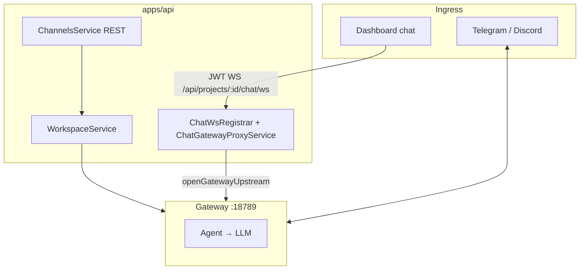

| Luồng | Vào gateway | Nest tham gia? |
| ----- | ----------- | -------------- |
| **Dashboard chat** | WS proxy → `chat.send`, `chat.history`, … | Có (JWT + RPC whitelist) |
| **Kênh bot** | Plugin + `bot_token` trên disk | Chỉ **setup** REST; tin nhắn không qua Nest |

`bot_token` **không** gọi LLM — chỉ đăng nhập bot; model từ `env.*` + `agents.*`.

**Dashboard — WS 2 tầng** (`web → api → gateway`, không nối thẳng `:18789`):

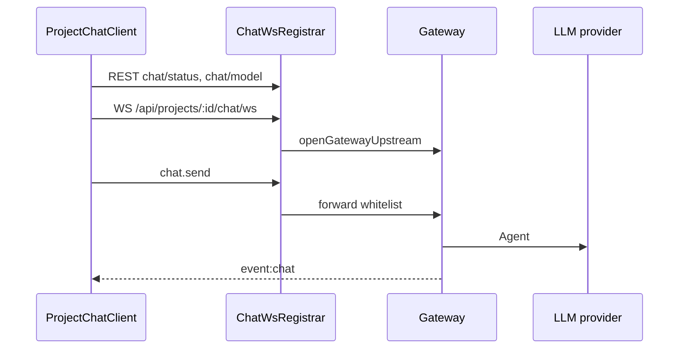

**RPC whitelist** (`packages/control-plane-core/chat/chat-rpc-whitelist.ts`): `chat.history`, `chat.send`, `chat.abort`, `agents.list`, `sessions.patch`, … `connect` do proxy xử lý; `config.patch` **không** từ browser (Phase 1 REST + sync).

**Model policy vs session override (Dashboard Chat):**

| Lớp | Cơ chế | Ảnh hưởng kênh |
| ----- | ------ | -------------- |
| Agent primary | `formData.model` → `agents.list[].model.primary` (Capabilities Save) | Telegram, Discord, cron dùng primary |
| Session override | `sessions.patch({ key, model })` — `model: null` xóa override | Chỉ phiên Dashboard Chat |

OpenClaw gateway field: `model` trên `sessions.patch` (`openclaw-worker/src/gateway/sessions-patch.ts`). Chat UI **không** gọi `PUT /chat/model` (deprecated) khi đổi model trong composer.

| Thành phần | Path |
| ---------- | ---- |
| WS client | `apps/web/lib/chat/project-chat-client.ts` |
| Registrar / proxy | `apps/api/.../chat/chat-ws.registrar.ts`, `chat.gateway-proxy.service.ts` |
| Upstream | `packages/control-plane-core/chat/gateway-upstream.ts` |
| Channels | `apps/api/.../channels/channels.service.ts` |

Sơ đồ compose: `aucobot/docs/monorepo-diagram.md` §1.5.

### 5.8 Runtime data plane — `data/projects/{projectId}` (SSOT & khoảng trống)

Mục tiêu vận hành: **mọi dữ liệu runtime OpenClaw nằm trên cùng volume `{OPENCLAW_DATA_ROOT}/{projectId}/`** khi deploy đúng. Đây **không** đồng nghĩa mọi thứ được mirror vào PostgreSQL — chat transcript, cron, node runtime **cố ý** chỉ trên disk (gateway) hoặc trong bộ nhớ gateway.

#### 5.8.1 Sơ đồ luồng dữ liệu

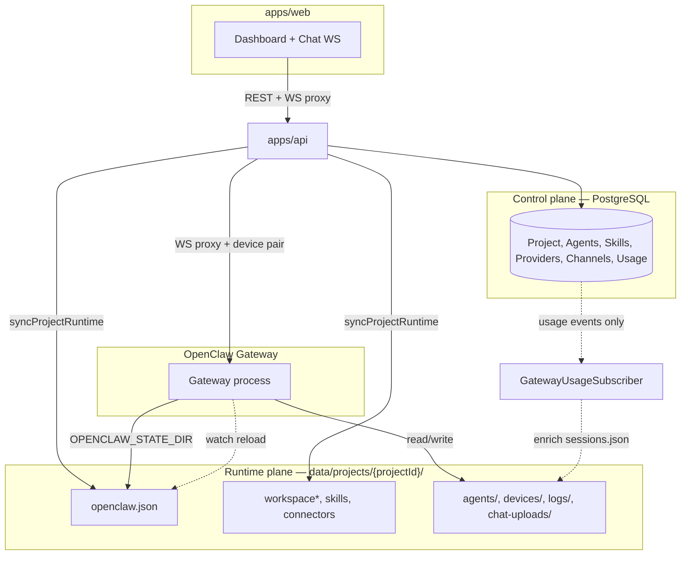

#### 5.8.2 Bảng entity — ai là SSOT?

| Entity | SSOT chính | Trong `data/projects` | Trong DB | Ghi bởi |
| ------ | ---------- | --------------------- | -------- | ------- |
| Project metadata (tên, status) | DB | — | `Project` | API |
| Gateway token | DB + env | `openclaw.json` → `gateway.auth.token` | `Project.gatewayToken` | API (`syncGatewayAuthToDisk`, `syncProjectRuntime`) |
| LLM provider keys | DB (mã hóa) | `openclaw.json` → `env` **và** `models.providers.<id>.apiKey` (custom provider — xem §5.6.1) | `ProjectProviderKey`, `ProjectProviderModel` | API merge |
| Agents (config) | DB | `openclaw.json` + `workspace-{slug}/*.md` | `ProjectAgent` | API |
| Skills | DB | `workspace/skills/{slug}/SKILL.md` | `ProjectSkill` | API |
| Connectors / MCP | DB | `openclaw.json` + `connectors/*` | `ProjectConnector` + secrets | API |
| Channels (Telegram, …) | DB | `openclaw.json` → `channels.*` | `ProjectChannel` + secrets | API |
| Sandbox / exec policy | DB | `openclaw.json` → `tools.exec`, `tools.sandbox` | cột `Project` / agent | API; exec disk→DB **một lần** (`maybeMigrateExecPolicyFromLegacy`) |
| Collaboration / heartbeat | DB | `openclaw.json` + `HEARTBEAT.md` | `Project` + agent heartbeat | API |
| Chat attachments | DB metadata | `chat-uploads/` | `ChatAttachment` | API |
| Proxy device identity | Disk | `proxy-device.json` | — | API (`loadOrCreateGatewayDeviceIdentity`) |
| Device pairing | Disk (gateway) | `devices/paired.json`, `pending.json` | — | Gateway; API patch auto-approve proxy |
| Node pairing / nodes | Gateway runtime | (RPC nội bộ gateway) | `NodeInvite` (mã mời) | Gateway |
| Chat sessions / transcript | Gateway | `agents/*/sessions/sessions.json`, `*.jsonl` | — | Gateway |
| Session thinking level | Gateway | `sessions.json` | — | Gateway (`sessions.patch`) |
| Cron jobs | Gateway | trong STATE_DIR gateway | — | Gateway RPC (`cron.*`) — API proxy, **không** mirror DB |
| Model usage / Overview | DB | đọc `sessions.json` khi enrich event | `ModelUsageEvent` | API tap WS (`GatewayUsageSubscriberService`) |
| Exec approvals (host) | Gateway | `exec-approvals.json` (OpenClaw) | — | Gateway — **không** sync ngược AucoBot |

**Quy tắc một dòng:** Cấu hình từ dashboard **phải** đi qua `syncProjectRuntime` trước khi kỳ vọng gateway khớp DB. Runtime chat/cron **không** cần API copy thêm nếu api + gateway **cùng mount** volume.

#### 5.8.3 Ba hướng sync

**A. DB → disk (control plane → runtime)** — trung tâm `WorkspaceService.syncProjectRuntime(projectId)` (`apps/api/.../workspace/workspace.service.ts`). Package merge: `@aucobot/workspace-sync`.

**B. Disk ↔ Gateway (runtime consumption)** — **không có API pull.** Gateway mount cùng volume; `deploy/scripts/gateway-entrypoint.sh` set:

- `OPENCLAW_STATE_DIR` = `{ROOT}/{OSS_PROJECT_ID}` hoặc thư mục **đầu tiên** có `openclaw.json`
- `OPENCLAW_CONFIG_PATH` = `{STATE}/openclaw.json`

| Deploy | Mount |
| ------ | ----- |
| `deploy/docker-compose.yml` | `openclaw_data:/data/projects` (api + gateway) |
| `deploy/docker-compose.runtime.yml` | `../apps/api/data/projects:/data/projects` |
| `deploy/docker-compose.gateway.dev.yml` | **một** project → `/home/node/.openclaw` (khác full compose) |
| Cloud fleet | `{hostDataPath}` → `/home/node/.openclaw` per project |

Gateway **ghi trực tiếp** sessions, devices, logs vào volume. API **đọc** một phần (usage enrich, exec migrate) — **không** sync định kỳ toàn bộ sessions vào DB.

**C. Live runtime (API ↔ Gateway qua WS)** — **không có webhook gateway → API.**

| Cơ chế | Path | Vai trò |
| ------ | ---- | ------- |
| Chat WS proxy | `ChatGatewayProxyService`, `ChatWsRegistrar` | Browser → gateway RPC whitelist |
| Upstream connect | `openGatewayUpstream` (`control-plane-core`) | Signed connect + `proxy-device.json` |
| Device auto-pair | `approveProxyDeviceIfPending` | Ghi `devices/paired.json` trên volume |
| One-shot RPC | `GatewayRpcService` → `callGatewayRpc` | Cron, nodes |
| Usage tap | `GatewayUsageSubscriberService` | WS events → `ModelUsageEvent`; enrich từ `sessions.json` khi thiếu `usage` |
| Health reconcile | `ProjectsService.health` (OSS) | `syncGatewayAuthToDisk` + ping `/healthz` |

Contract usage: `apps/api/.../usage/lib/gateway-usage.contract.md`.

#### 5.8.4 Web app đọc từ đâu?

| Concern | Nguồn |
| ------- | ----- |
| CRUD dashboard | REST `projectApi.*` → `/api/projects/...` |
| Chat, sessions, history | `ProjectChatClient` → WS `/api/projects/{id}/chat/ws` → gateway RPC |
| Nodes, cron UI | REST → API → gateway RPC |
| Overview / usage | REST → DB (`ModelUsageEvent`) |
| Control UI (Settings) | **Ngoại lệ:** browser mở gateway HTTP (`gateway-control-ui.ts`) — không qua API |
| Thinking level UX | Gateway `sessions.list` authoritative; localStorage cache phụ (`session-thinking-storage.ts`) |

#### 5.8.5 Khoảng trống & rủi ro (đã kiểm tra)

**Đúng thiết kế (không phải bug):**

- Config dashboard: DB → disk; chat/cron: gateway → disk — không mirror transcript vào DB.
- `ModelUsageEvent` là analytics derived — không phải archive chat đầy đủ.

**Cần lưu ý khi vận hành:**

1. **OSS multi-project / một gateway** — Không set `OSS_PROJECT_ID` → entrypoint chọn project **đầu tiên** có `openclaw.json`. Nhiều project → bắt buộc `OSS_PROJECT_ID` hoặc gateway riêng/project (cloud fleet).
2. **Dev vs prod mount** — `docker-compose.gateway.dev.yml` mount một project vào `/home/node/.openclaw`; full compose dùng `/data/projects` + entrypoint resolver.
3. **Không gateway → API push** — Sessions/cron không được API poll vào DB; chỉ tồn tại trên disk qua shared volume.
4. **Dual-read agents** — `ChatAgentsService` fallback đọc `openclaw.json` nếu DB chưa có `ProjectAgent` → có thể lệch DB vs disk.
5. **Exec policy một chiều** — migrate disk→DB một lần; sửa qua Control UI không sync ngược DB.
6. **`auth-profiles.json` KHÔNG được runtime đọc** (kiểm chứng source `2026.6.9`) — gateway resolve provider auth qua **SQLite (`openclaw-agent.sqlite`) → env → `models.providers.<id>.apiKey`**. Vì vậy custom provider (DeepSeek, …) phải có **`apiKey` trong `models.providers`** (§5.6.1), không thể dựa `auth-profiles.json`. Foundation provider có plugin bundle vẫn dùng `env.*`.
7. **Device pairing dual writers** — Gateway và API (proxy approve) cùng ghi `devices/*` trên volume — thường ổn nhưng có race hiếm.
8. **Không reconciliation tự động DB vs disk** — Ngoài health sync token, chưa có job so `updatedAt` DB với mtime `openclaw.json`.

**Hướng cải thiện (chưa triển khai):** reconciliation job `syncProjectRuntime` khi DB mới hơn disk; thêm `connectors/` vào `PROJECT_SUBDIRS` + chown gateway; snapshot cron/sessions định kỳ; bỏ fallback đọc disk trong `ChatAgentsService`.

#### 5.8.6 Checklist vận hành — một nguồn `data/projects/{id}`

```text
✓ OPENCLAW_DATA_ROOT giống nhau trên api + gateway (/data/projects)
✓ Volume openclaw_data mount chung (dev: apps/api/data/projects)
✓ OSS_PROJECT_ID set khi >1 thư mục project trên cùng gateway
✓ OPENCLAW_GATEWAY_TOKEN khớp openclaw.json (GET …/health reconcile)
✓ Mọi thay đổi dashboard đi qua API → syncProjectRuntime tự động
✓ Sau bulk edit / migration: sync-project-openclaw.mjs hoặc agents/sync-all
✓ Không sửa openclaw.json tay mà không chạy sync
✓ Chat history: chat.history RPC + *.jsonl trên disk — không expect trong DB
✓ USAGE_SUBSCRIBER_ENABLED bật nếu cần Overview từ gateway events
```

**File index:**

| Mục đích | Path |
| -------- | ---- |
| Layout project | `aucobot/packages/workspace-sync/src/paths/project-paths.ts` |
| Runtime sync | `aucobot/apps/api/.../workspace/workspace.service.ts` |
| Chat WS proxy | `aucobot/apps/api/.../chat/chat.gateway-proxy.service.ts` |
| Gateway upstream | `aucobot/packages/control-plane-core/src/chat/gateway-upstream.ts` |
| Device pairing | `aucobot/packages/control-plane-core/src/chat/gateway-device-pairing.ts` |
| Docker volume | `aucobot/deploy/docker-compose.yml` |
| Gateway entrypoint | `aucobot/deploy/scripts/gateway-entrypoint.sh` |
| Web chat client | `aucobot/apps/web/lib/chat/project-chat-client.ts` |

---

## 6. OSS — Phạm vi backend (“có” / “chưa”)

| Hạng mục | OSS |
| -------- | --- |
| Auth JWT, user, session | Có |
| CRUD project, metadata, revision workspace trong DB | Có |
| Service **gateway** trong compose, proxy tới **:18789** | **Có** (mô hình đích) |
| Ghi workspace xuống volume gateway đọc | Có |
| **Spawn container per project** (Docker API) | **Không** |
| Mount **docker.sock** trên api | **Không** |
| API start/stop/respawn container project | **Không** (restart stack / gateway) |
| Mã hóa bí mật lưu trữ (SecretCrypto) | Khuyến nghị |
| Health DB + gateway `/healthz` | Có |
| Traefik wildcard, ingress fleet, autoscale | Chủ yếu **Cloud** |
| BullMQ / `vps-worker` / idle-shutdown | **Không** OSS core |
| Heavy jobs (FFmpeg, Playwright) + credits | **Không** (Cloud) |

> **Ghi chú triển khai:** Code `backend/` hiện tại vẫn có `DockerService.spawnWorker` — đó là **hành vi Cloud**; OSS đích dùng `RUNTIME_MODE=oss` + `StaticGatewayProvisioner` (xem `monorepoplan.md` §14 Phase 2).

---

## 7. Cấu trúc mã — OSS public vs Cloud (Supabase-style)

| Repo / package | License | Nội dung |
| -------------- | ------- | -------- |
| **AucoBot** (`aucobot/`) | Apache-2.0 / MIT | `apps/web`, `apps/api`, `packages/*`, compose OSS, `Dockerfile.gateway` (pre-bake MCP) |
| **`mcp`** (sibling) | Apache-2.0 / MIT | Monorepo MCP packages first-party — publish `@aucobot/mcp-*` (npm) |
| **`cloud`** (sibling) | Proprietary | Billing, fleet, quota, MCP HTTP multi-tenant — **import** `@aucobot/control-plane-core` |

```text
aucobot/                            # PUBLIC — self-host
├── apps/web/                       # Dashboard
├── apps/api/                       # NestJS — RUNTIME_MODE=oss
├── deploy/docker-compose.yml       # postgres + api + web + gateway (4 service)
├── deploy/Dockerfile.gateway       # FROM upstream + npm i -g @aucobot/mcp-google-*
└── packages/
    ├── control-plane-core/
    ├── runtime-oss/                # StaticGateway — URL cố định
    └── workspace-sync/           # merge openclaw.json, mcp.servers (stdio)

mcp/                                # PUBLIC — sibling repo (monorepo packages)
└── packages/@aucobot/mcp-*         # google-drive, google-calendar, github, x, catalog, core

cloud/                              # PRIVATE — sibling repo
├── api/                            # RUNTIME_MODE=cloud (placeholder)
└── packages/                       # @aucobot-cloud/* fleet, billing, S3, MCP HTTP
```

**Tái dùng kỹ thuật:**

| Interface | OSS | Cloud |
| --------- | --- | ----- |
| `RuntimeProvisioner` | `StaticGatewayProvisioner` — health + sync only | `DockerPerProjectProvisioner` — spawn/stop |
| `PlanGuard` | `NoopPlanGuard` | Stripe / quota |
| Sync file → OpenClaw | **Chung** — không copy CRUD project |

Chi tiết monorepo: **`monorepoplan.md`**.

---

## 8. Cloud SaaS — Hosted (bạn bán)

**Mục tiêu:** khách đăng ký cloud, trả phí / free tier — **không** tự `docker compose` worker; bạn lo spawn, scale, backup.

| Thành phần | Gợi ý |
| ---------- | ----- |
| **Control plane** | API + DB managed; tenant isolation |
| **Runtime** | **1 container OpenClaw / project** — Docker API, `vps-worker` / K8s, ingress |
| **Backend → gateway** | `http://127.0.0.1:{hostPort}` — lưu DB per project |
| **Kinh doanh** | `billing-plan.md` |
| **Heavy / queue** | `vps-heavy`, BullMQ |
| **Mã nguồn** | Import lõi OSS; fleet + billing **proprietary** |

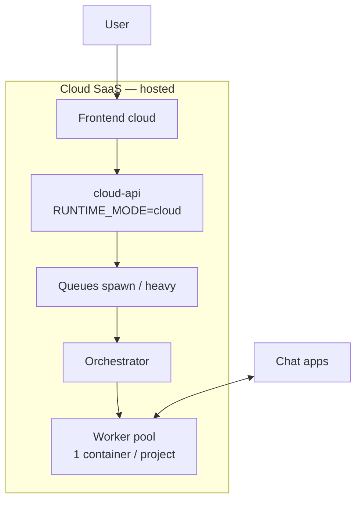

### Cloud — Tạo project (spawn container)

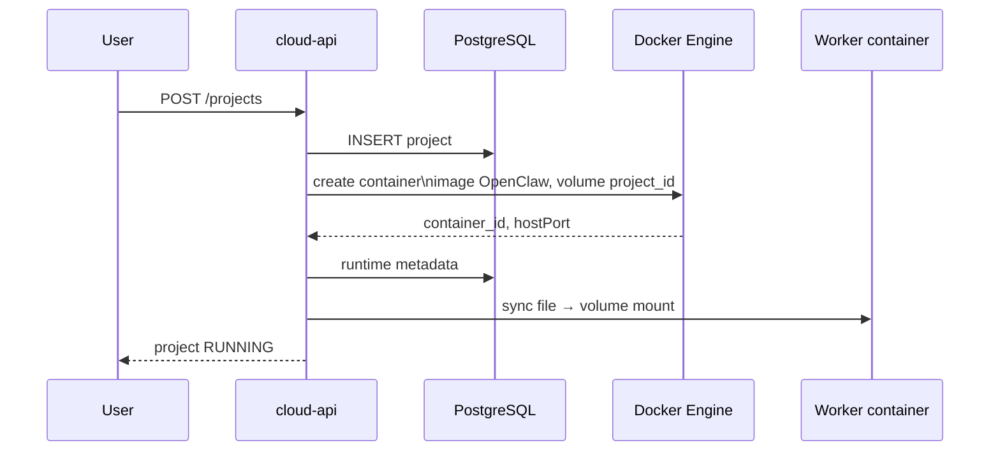

**OSS ↔ Cloud:** Cùng **project + sync file**; Cloud thêm **spawn per project**, billing, fleet, SLA. Khách cloud không chạy stack OSS tại nhà song song; migrate/import là luồng riêng.

---

## 9. Bảng so sánh nhanh

| Tiêu chí | OSS (community) | Cloud SaaS (hosted) |
| -------- | ----------------- | --------------------- |
| **Mô hình** | Self-host `docker compose up` | Đăng ký cloud, trả phí |
| **Tương tự thị trường** | Supabase self-host / n8n self-host | Supabase Cloud / n8n Cloud |
| **Gateway** | **1 service** stack, **:18789** cố định | **1 container / project**, port động |
| **MCP connectors** | **stdio do gateway spawn** (`@aucobot/mcp-*`, Google pre-bake) — không service riêng | Hosted MCP HTTP multi-tenant (`aucomcp`) |
| **Ai bật worker** | Compose (cùng lúc với api, db, web) | Orchestrator / Docker API |
| **docker.sock trên api** | **Không** | **Có** (hoặc remote Docker) |
| **Đồng bộ cấu hình** | DB + ghi file volume chung | DB + ghi file + spawn |
| **Auth API** | JWT | JWT + billing |
| `vps-worker` / `vps-heavy` | Không bắt buộc | Thường có |
| **Mã nguồn** | Repo public | OSS core + package đóng |

---

## 10. Liên kết tài liệu

| Chủ đề | File |
| ------ | ---- |
| Gateway upstream (RPC, channels, skills load) | `openclaw-architecture.md` |
| Agent-to-agent tools (`sessions_send`, …) — worker | `openclaw-architecture.md` §25.8 |
| Sync DB → disk, merge `openclaw.json`, collaboration allow list (AucoBot) | `workflow.md` §5.6 |
| Runtime plane `data/projects`, entity SSOT, gaps, checklist | `workflow.md` §5.8 |
| Sync, chat proxy, channels API (AucoBot) | `workflow.md` §5.5–5.7 |
| Connectors / MCP stdio | `workflow.md` §5.5.1 |
| MCP Hub, packages `@aucobot/mcp-*`, pre-bake Google | [`mcp.md`](mcp.md) |
| Merge implementation | `aucobot/packages/workspace-sync/` |
| Monorepo AucoBot, **4 service OSS**, compose, Phase migrate | `monorepoplan.md` §2, §14 |
| MCP packages (repo) | [`mcp`](../mcp/) → `@aucobot/mcp-*` |
| Giá, credit, quota (Cloud) | `billing-plan.md` |
| Proxy / ingress an toàn | `proxy-guide.md` |

---

*OSS: **4 services** (`web`, `api`, `gateway`, `postgres`) + volume — `web`/`api` build AucoBot; `gateway`/`postgres` pull upstream (gateway pre-bake `@aucobot/mcp-google-*`). Chat: web→api→gateway. Connectors: gateway **spawn MCP stdio** (`@aucobot/mcp-*`) — không service `mcp` HTTP (xem `mcp.md`). Cloud: **1 project = 1 container** + MCP HTTP. Skills: sync `{OPENCLAW_DATA_ROOT}/<projectId>/workspace/skills/<slug>/SKILL.md`.*

### E2E checklist — Skills (OSS)

1. Stack đang chạy: `gateway` healthy tại `:18789`.
2. Tạo skill trên dashboard → `POST /api/projects/:id/skills`.
3. Soạn body → `PUT` debounced → bật **Bật & sync**.
4. Kiểm tra file: `{OPENCLAW_DATA_ROOT}/<projectId>/workspace/skills/<slug>/SKILL.md`.
5. Trong gateway container: `openclaw skills list --eligible` (hoặc chat sau `/new`).
6. Tắt skill → xóa thư mục skill khỏi volume; agent không thấy ở lượt sau.
