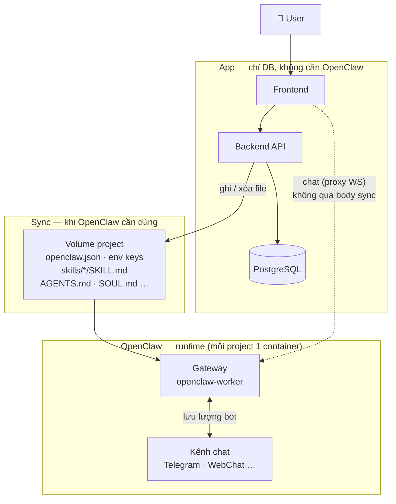
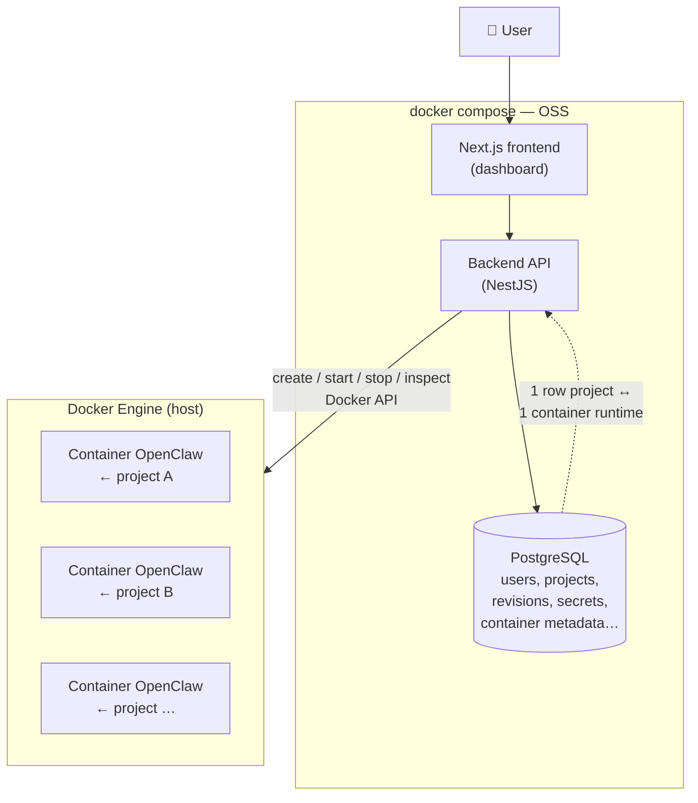
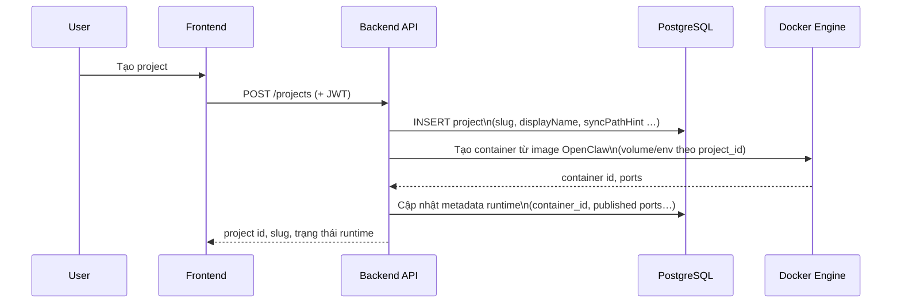
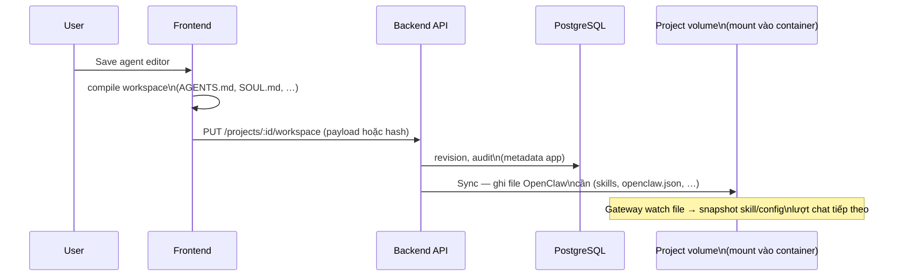
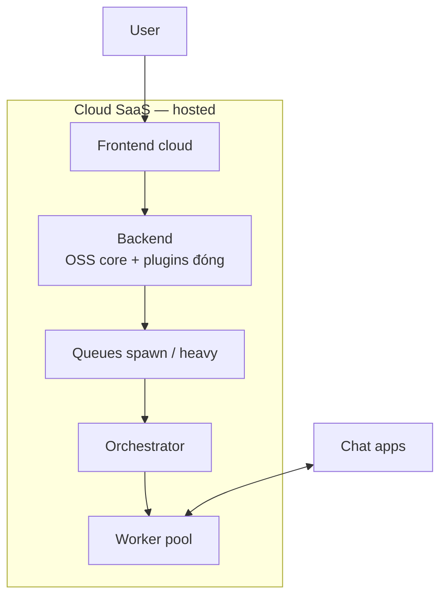

# OpenClaw SaaS — Workflow & kiến trúc vận hành

> **Cập nhật:** 2026-05-21  
> **Phân kỳ:**  
> - **OSS (mã nguồn mở):** một **`docker compose`** (frontend, backend, PostgreSQL) để user tự host; **mỗi project trong dashboard = một container** chạy từ image **OpenClaw / `openclaw-worker`** — metadata & workspace **lưu trong DB** (và volume theo `project_id` tùy triển khai). Backend điều phối vòng đời container qua **Docker API** (thường mount `docker.sock` trên host).  
> - **Cloud SaaS (hosted thương mại):** bạn **bán** bản cloud (đa tenant, vận hành thay khách), mô hình giống **[Supabase](https://supabase.com)** (engine mở + cloud trả phí) hay **[n8n](https://n8n.io)** (self-host mở + **n8n Cloud**). OSS **không** phải bản demo của Cloud — OSS là **sản phẩm gốc** cho community; Cloud **tái dùng** lõi OSS qua package/module, phần kinh doanh có thể **repo đóng**.  
> **Tham chiếu:** `openclaw-architecture.md`, `billing-plan.md` (Cloud SaaS), `proxy-guide.md`.

---

## Vai trò tài liệu

| Thuộc | Không thuộc |
| ----- | ----------- |
| Luồng vận hành **OSS (self-host)** | Chi tiết giá/credit hosted (→ `billing-plan.md`) |
| Sketch **Cloud SaaS** (cloud bạn bán) | Schema Prisma từng bảng (→ `backend/prisma/schema.prisma`) |
| Ranh OSS vs Cloud / proprietary | Danh sách sprint (→ `roadmap-plan.md`) |

**Thuật ngữ**

- **Project:** đơn vị trong dashboard (cấu hình agent, workspace, bí mật); đồng thời **map 1:1** tới **một container** OpenClaw (trạng thái runtime lưu trong DB hoặc label container).
- **Worker / Gateway:** tiến trình OpenClaw trong **container riêng của project**. **OSS:** container trên **cùng máy/VPS** với `docker compose` (hoặc Docker remote). **Cloud SaaS:** cùng mental model, runtime trên **hạ tầng bạn** + billing / quota / fleet.

---

## 1. OSS và Cloud SaaS

Cộng đồng và team muốn **UI + persistence** cho project/bot đa kênh, **không** phụ thuộc black box — đồng thời bạn muốn **engine mở** và **cloud trả phí** song song.

| Sản phẩm | Ai vận hành control plane & gateway | Mô hình |
| -------- | ------------------------------------- | ------- |
| **OSS** | Người dùng / tổ chức tự deploy repo mở | **Self-host**; source công khai; fork, PR, chạy infra riêng. |
| **Cloud SaaS** | Bạn (nhà cung cấp) | **Hosted** trả phí: provisioning, backup, SLA, billing, scale — khách không bắt buộc tự cài worker. |

- **OSS** giải “**một nguồn thật trong DB**” (user, project, revision workspace, secrets) + **mỗi project một container** OpenClaw nhận cấu hình / volume (`openclaw.json`, `AGENTS.md`, … — `openclaw-architecture.md` §4.5.1). Auth API self-host: **JWT**. Gateway: **`gateway.auth`** riêng (không dùng JWT dashboard cho chat).
- **Cloud SaaS** thêm multi-tenant, orchestration fleet, quota, billing — phần **không publish** (infra, abuse, cost) có thể **repo đóng** import lõi OSS; **không thay thế** cam kết maintain OSS cho community.

---

## 2. Tư duy vận hành — Control plane vs OpenClaw

App bạn xây = **control plane (DB + API + dashboard)** điều phối **runtime OpenClaw (container)**.  
OpenClaw **không đọc PostgreSQL** — chỉ đọc **file + `openclaw.json`** trên volume project.



### Quy tắc một dòng

| OpenClaw gateway **phải thấy** để chạy? | Chỉ tính năng **app** (billing, UI, tenant…)? |
| -------------------------------------- | --------------------------------------------- |
| **Sync DB → volume / `openclaw.json`** | **Giữ trên DB** — API đọc trực tiếp |

### Ví dụ nhanh

| Sync sang OpenClaw | Chỉ DB (app) |
| ------------------ | ------------ |
| API key provider → `env` trong `openclaw.json` | User, JWT, plan, invoice |
| Skill `enabled` → `workspace/skills/<slug>/SKILL.md` (bảng `project_skills`) | Skill draft metadata chỉ DB nếu chưa publish |
| Agent workspace → `AGENTS.md`, `SOUL.md`, … | `container_id`, `hostPort`, Docker lifecycle |
| Channel token (khi map workspace) | Danh sách project, slug hiển thị |

**Khi user chat:** không gọi “inject skill/config” từng tin — file đã sync sẵn; gateway **watch** + build prompt. Chi tiết skill: `openclaw-architecture.md` §11.5, §4.7.

**Sync khi nào:** khi user **lưu / bật / đổi** cấu hình — **không** sync lại mỗi tin nhắn chat.

---

## 3. OSS — Kiến trúc tổng quan

**Self-host một lần:** `docker compose up` khởi chạy **frontend**, **backend**, **PostgreSQL** (image OpenClaw build từ `openclaw-worker/`).



**Nguyên tắc OSS**

1. **Một project = một container** từ image OpenClaw. Backend **provision** qua Docker API; xóa/tắt project → dừng container (policy volume tùy runbook).
2. **PostgreSQL** = nguồn sự thật **app**. **OpenClaw chỉ đọc volume** — sync có chọn lọc (§2).
3. Lưu cấu hình/skill/agent: **lưu DB** + **sync file** → gateway **watch**.
4. **Không** bắt buộc BullMQ `vps-worker`, billing, heavy-job fleet trong **OSS core** (có thể stub no-op).

---

## 4. OSS — Luồng vận hành (theo người dùng)

### 4.1 Đăng ký / đăng nhập

```mermaid
sequenceDiagram
    participant U as User
    participant FE as Frontend
    participant API as Backend API
    participant DB as PostgreSQL

    U->>FE: Đăng ký / đăng nhập
    FE->>API: POST /auth/* (credential)
    API->>DB: user record
    API-->>FE: JWT (access ± refresh)
    FE-->>U: Session; Bearer cho API
```

- **Auth OSS:** **JWT**. Gateway OpenClaw **không** dùng JWT này — dùng `gateway.auth` riêng trên host/container.

### 4.2 Tạo project, metadata & container runtime



- **Một hàng `projects`** ↔ **một container**. Volume/bind mount theo `project_id` khuyến nghị cô lập dữ liệu.
- Backend cần quyền **Docker API** (`docker.sock` hoặc daemon remote).

### 4.3 Soạn trên dashboard → lưu DB → sync file (OpenClaw)



**Ghi chú kỹ thuật**

- **Lưu DB** = nguồn sự thật product; **sync file** = bản deploy cho gateway (§2).
- Agent compiler (backend): `backend/src/plugins/projects/agents/agent-workspace-compile.ts` → `workspace-{slug}/*.md` + `syncProjectRuntime` (provider keys → `agents.list`). Agent `main` implicit, không hiện tab Agent. Skill → `SKILL.md`.
- **OSS:** ghi volume container. **Cloud SaaS:** cùng sync; tuỳ chọn thêm `config.patch` RPC — `openclaw-architecture.md` §4.2, §4.5.1.

### 4.4 Kênh chat & lưu lượng thời gian thực

1. Mỗi project: **một container OpenClaw** — channel trong workspace container đó.
2. Lưu lượng bot **không** qua backend dashboard; API lo auth, CRUD, sync file, lifecycle container.
3. **Luồng mặc định OSS:** backend spawn container per project (không bắt buộc gateway manual ngoài compose).

---

## 5. OSS — Phạm vi backend (“có” / “chưa”)

| Hạng mục | OSS |
| -------- | --- |
| Auth JWT, user, session | Có |
| CRUD project, metadata, revision workspace trong DB | Có |
| **Một project = một container OpenClaw** (Docker API) | **Có** (mô hình đích) |
| Ghi workspace xuống volume container đọc | Có |
| Mã hóa bí mật lưu trữ (SecretCrypto) | Khuyến nghị |
| Health DB + logging | Có |
| Traefik wildcard, ingress fleet, autoscale | Tuỳ chọn / chủ yếu **Cloud SaaS** |
| BullMQ / `vps-worker` / idle-shutdown fleet | **Không** bắt buộc OSS core |
| Heavy jobs (FFmpeg, Playwright) + credits | **Không** (Cloud SaaS) |
| Worker callback nội bộ cho fleet hosted | **Không** bắt buộc OSS |

---

## 6. Cấu trúc mã — OSS public vs Cloud (Supabase-style)

**Không** đưa toàn bộ business logic lên repo public. Tách:

| Repo / package | License | Nội dung |
| -------------- | ------- | -------- |
| **`openclaw-saas` (public)** | Apache-2.0 / MIT | `frontend/`, `backend/` core + `plugins/projects/`, `openclaw-worker/`, compose |
| **`openclaw-cloud` (private)** hoặc `packages/cloud/` không publish | Proprietary | Billing, fleet (`vps-worker`), quota, ingress ops — **import** `@openclaw-saas/backend-core` |

```text
openclaw-saas/                    # PUBLIC — community self-host
├── frontend/                     # Dashboard OSS
├── backend/                      # NestJS — core + plugins/projects
│   └── src/plugins/projects/     # project, keys, sync, chat, Docker local
├── openclaw-worker/              # Image OpenClaw — 1 project = 1 container
├── vps-worker/                   # (tuỳ policy) có thể chỉ dùng Cloud
└── vps-heavy/                    # Heavy compute — chủ yếu Cloud SaaS

openclaw-cloud/                   # PRIVATE — bạn deploy hosted (sketch)
├── backend/                      # App Nest: import OSS core
│   └── plugins/
│       ├── billing/              # Stripe, plan, usage
│       └── cloud-runtime/        # VpsWorkerProvisioner, fleet
└── frontend-cloud/               # Shell branded (hoặc extend OSS FE)
```

**Tái dùng kỹ thuật (trong OSS public):**

- Interface `RuntimeProvisioner` — OSS: `DockerLocal`; Cloud: impl riêng repo đóng.
- Interface `PlanGuard` — OSS: `NoopPlanGuard`; Cloud: Stripe/quota.
- Cùng luồng **sync file → OpenClaw** — không copy CRUD project.

---

## 7. Cloud SaaS — Hosted (bạn bán)

**Mục tiêu:** khách **đăng ký trên cloud của bạn**, trả phí / free tier, **không** tự cài Docker; bạn lo vận hành, patch, scale, backup.

| Thành phần | Gợi ý |
| ---------- | ----- |
| **Control plane** | API + DB managed; tenant isolation; JWT do dịch vụ phát hành. |
| **Runtime** | Container/VM trên **hạ tầng bạn** — `vps-worker` / K8s, ingress (Traefik / LB). |
| **Kinh doanh** | Plans, metered usage — `billing-plan.md`. |
| **Heavy / queue** | `vps-heavy`, BullMQ (tuỳ sản phẩm). |
| **Mã nguồn** | **Import lõi OSS**; phần vận hành + billing **proprietary** (giống Supabase Cloud / n8n Cloud). |
| **Bảo mật** | JWT app ≠ `gateway.auth`; không public `POST /tools/invoke` — `openclaw-architecture.md`. |



**OSS ↔ Cloud:** cùng mental model **project + sync file**; Cloud thêm fleet, billing, SLA, observability — **song song** maintain OSS cho community. Khách cloud **không** chạy Backend OSS trên máy nhà song song; migrate/import là luồng riêng (export từ self-host).

---

## 8. Bảng so sánh nhanh

| Tiêu chí | OSS (community) | Cloud SaaS (hosted) |
| -------- | ----------------- | --------------------- |
| **Mô hình** | Self-host, fork, PR | Đăng ký cloud, trả phí / free tier |
| **Tương tự thị trường** | Postgres / n8n self-host | Supabase Cloud / n8n Cloud |
| Gateway chạy ở đâu | **1 container / project** — Docker user | Container trên **hạ tầng bạn** (fleet, quota) |
| Đồng bộ cấu hình | DB + **ghi file** volume project | Tương tự + orchestrator / billing |
| Auth | **JWT** (API self-host) | Auth cloud + billing |
| `vps-worker` / `vps-heavy` | Không bắt buộc core | Thường **có** |
| **Mã nguồn** | Repo **public** | Lõi OSS + repo/package **đóng** |

---

## 9. Liên kết tài liệu

| Chủ đề | File |
| ------ | ---- |
| Gateway HTTP, session API, config watch, skills sync | `openclaw-architecture.md` (§4.7, §11.5) |
| Giá, credit, quota (Cloud SaaS) | `billing-plan.md` |
| Proxy / ingress an toàn | `proxy-guide.md` |

---

*Ghi chú: mô hình đích **1 project = 1 container**; code `backend/` có thể chưa khớp orchestration đầy đủ. Tài liệu dùng nhãn **OSS** / **Cloud SaaS**. Skills: `project_skills` + sync disk (xem `ProjectSkillsService`).*

### E2E checklist — Skills

1. Tạo skill trên dashboard → `POST /api/projects/:id/skills`.
2. Soạn body → `PUT` debounced → bật **Bật & sync** hoặc Switch trên list.
3. Kiểm tra file: `{OPENCLAW_DATA_ROOT}/<projectId>/workspace/skills/<slug>/SKILL.md`.
4. Trong container: `openclaw skills list --eligible` (hoặc chat thử sau `/new`).
5. Tắt skill → thư mục skill bị xóa khỏi volume; agent không còn thấy ở lượt sau.
