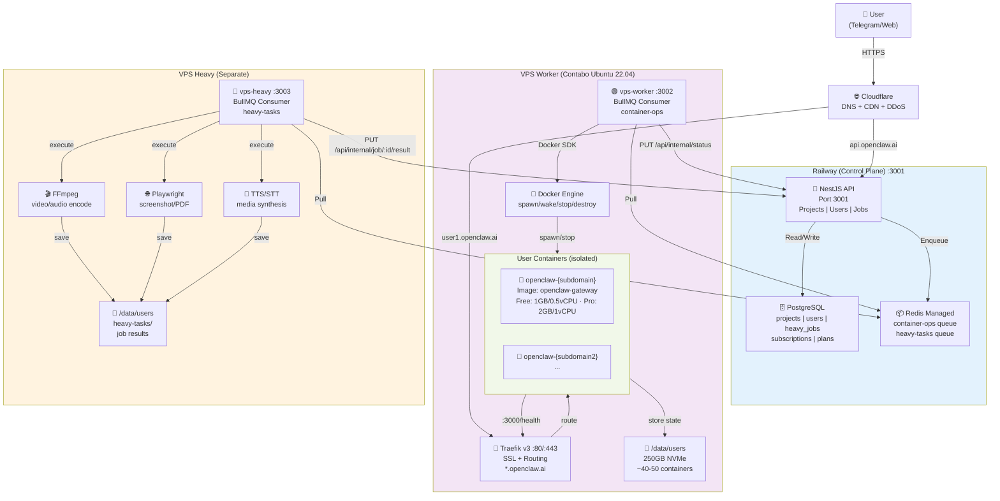
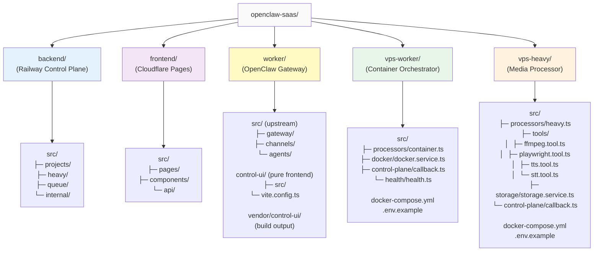
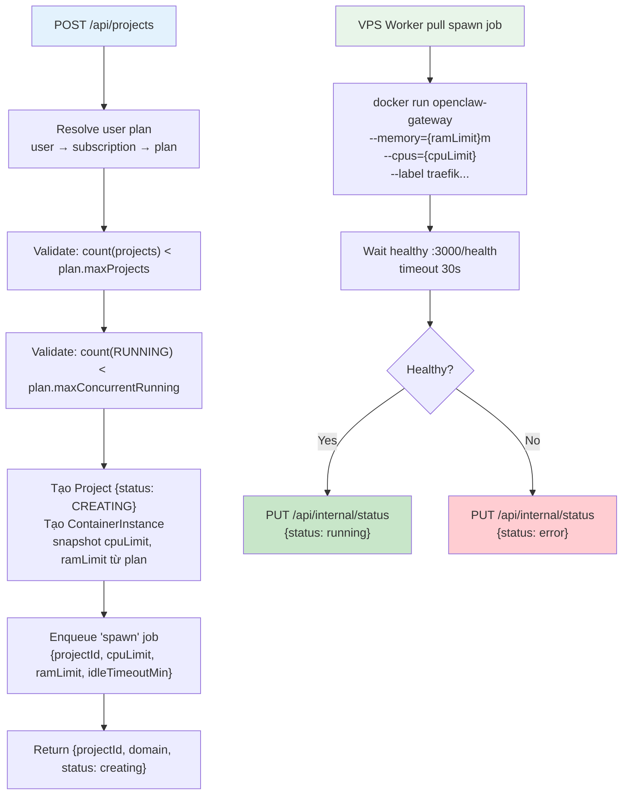
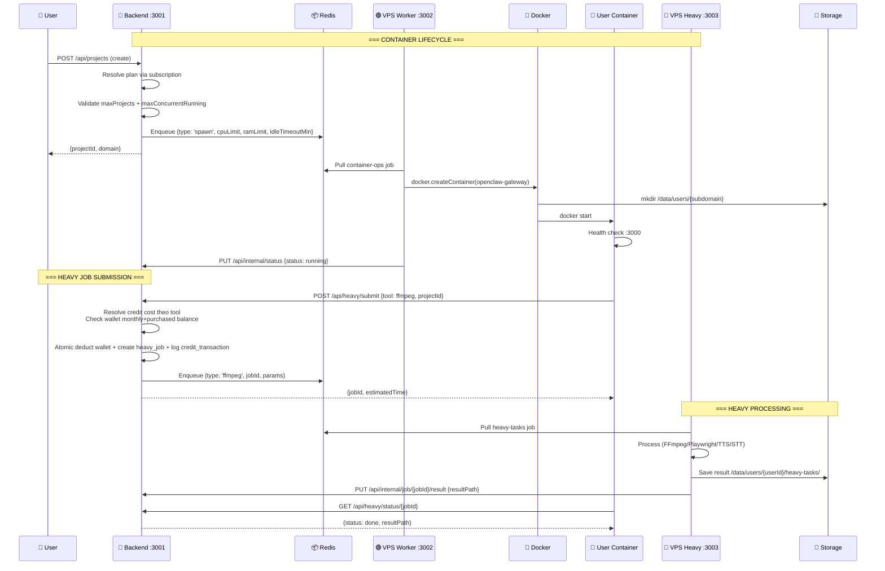
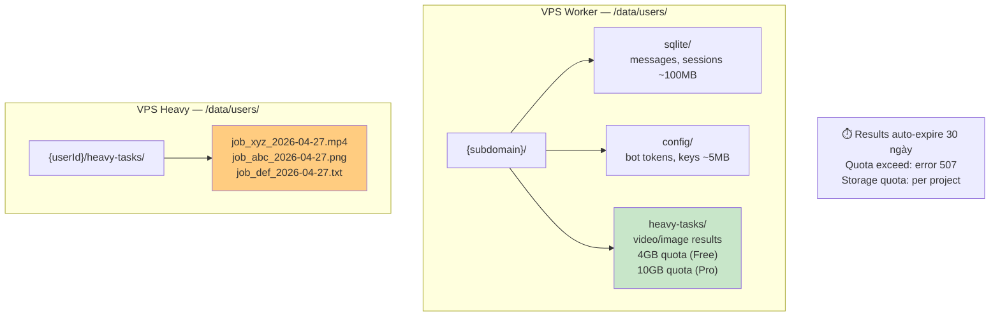
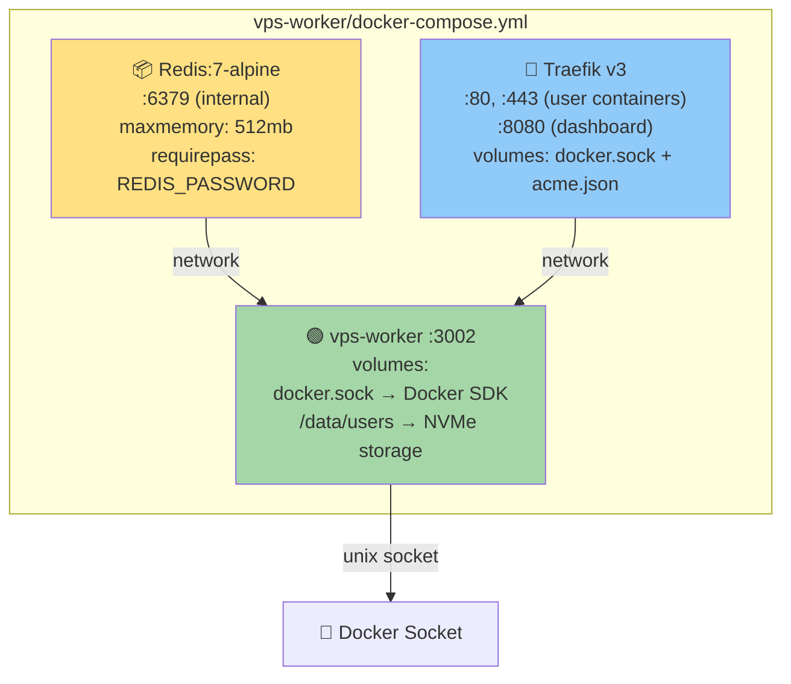
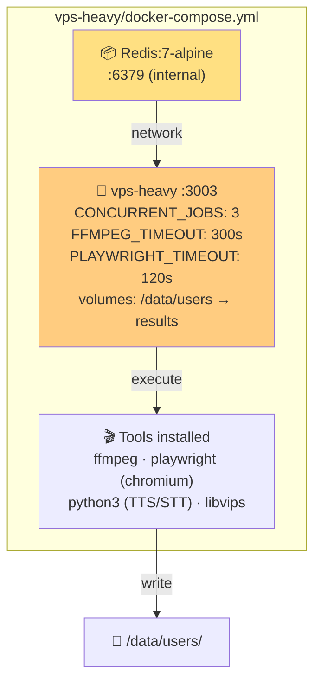
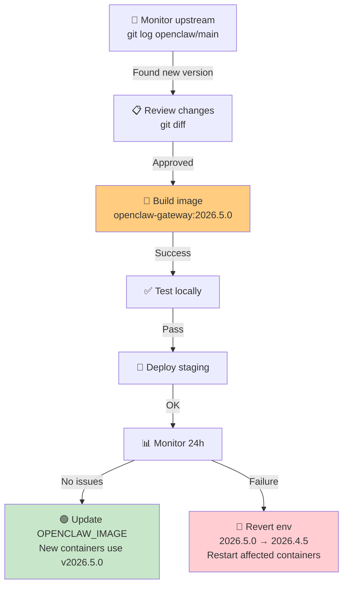
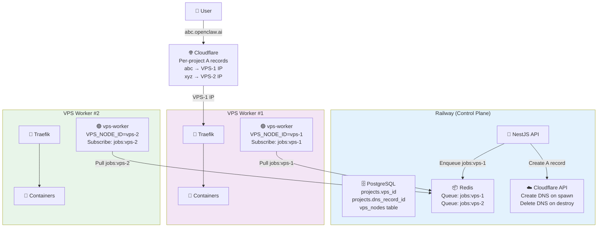
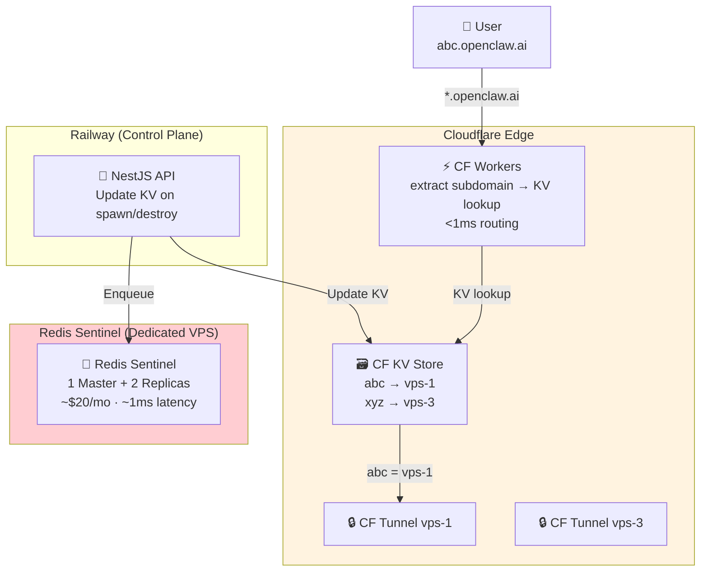

# OpenClaw SaaS — Workflow & Architecture

> **Updated:** 2026-04-27
> **MVP scope:** Free tier · Pro tier · multi-project/user · idle-shutdown · auto-wake
> **Related docs:** Billing policy in `billing-plan.md`; execution checklist in `roadmap-plan.md`

## Document Role

- **Purpose:** Kiến trúc hệ thống và runtime flow end-to-end.
- **Owns:** topology, lifecycle, queue flow, deployment phases.
- **Does not own:** pricing/quota policy chi tiết (xem `billing-plan.md`), checklist thực thi sprint (xem `roadmap-plan.md`).
- **Terminology note:** Dùng `project` làm đơn vị sản phẩm; runtime hiện tại map 1:1, tức **1 project = 1 container worker**.

---

## 1. Vấn đề cần giải quyết

Người dùng muốn chạy bot nhắn tin (Telegram, Zalo, WhatsApp, Discord, Slack, LINE) với AI tự động trả lời — không cần quản lý server. OpenClaw SaaS tổ chức theo đơn vị **project**; mỗi project có state riêng và được map tới worker runtime tương ứng.

> **Ghi chú chuẩn thuật ngữ:** Trong hệ thống hiện tại, **1 project = 1 container worker** (OpenClaw gateway runtime).

---

## 2. System Architecture



---

## 3. Monorepo Directory Structure



---

## 4. Kiến trúc theo giai đoạn scale

### Giai đoạn 1 — MVP (≤ ~500 users)

```
┌─────────────────────────────────────────────────┐
│  LAYER 1 — CONTROL  (Railway)                   │
│  NestJS/Fastify API + PostgreSQL                │
│  Redis managed (Railway) ← BullMQ broker        │
└──────────────────┬──────────────────────────────┘
                   │ BullMQ + REST API
        ┌──────────┴──────────┐
        │                     │
┌───────▼──────────┐  ┌──────▼─────────────┐
│ VPS WORKER       │  │ VPS HEAVY          │
│ (Mgmt Plane)     │  │ (Compute Plane)    │
│                  │  │                    │
│ openclaw-worker  │  │ openclaw-heavy     │
│ Traefik v3       │  │                    │
│ User containers  │  │ ├─ FFmpeg          │
│ ├─ 1-2GB/0.5-1vC │  │ ├─ Playwright      │
│ ├─ 4-10GB SSD    │  │ ├─ TTS/STT         │
│ × 40-50 ctnr     │  │ └─ Job processor   │
│ /data/users/     │  │                    │
│ /250GB NVMe      │  │ /100GB SSD         │
│                  │  │                    │
│ Contabo 12vCPU   │  │ Contabo 12vCPU     │
│ 48GB RAM         │  │ 48GB RAM           │
│ $40-50/mo        │  │ $40-50/mo          │
└──────────────────┘  └────────────────────┘
        │                     │
        └──────────┬──────────┘
                   │
┌──────────────────▼──────────────────────────────┐
│  CLOUDFLARE (DNS + CDN + DDoS)                  │
│  *.openclaw.ai  → VPS Worker IP                 │
│  app.openclaw.ai → Cloudflare Pages             │
└─────────────────────────────────────────────────┘
```

### Giai đoạn 2 — Multi-VPS (≤ ~10,000 users)

```
┌─────────────────────────────────────────────────┐
│  LAYER 1 — CONTROL  (Railway)                   │
│  NestJS API · PostgreSQL                        │
│  + Scheduler: chọn VPS node có capacity         │
│  Redis managed (Railway) ← vẫn dùng            │
└─────────┬──────────────────────┬────────────────┘
          │                      │
┌─────────▼────────┐   ┌─────────▼────────┐
│  VPS #1          │   │  VPS #2          │   ...
│  Worker          │   │  Worker          │
│  Traefik         │   │  Traefik         │
│  Containers      │   │  Containers      │
│  /data/users/    │   │  /data/users/    │
└──────────────────┘   └──────────────────┘
```

### Giai đoạn 3 — High Scale (> 10,000 users)

```
Thêm: 1 VPS Redis riêng (Redis Sentinel 1 master + 2 replica)
Thêm: Cloudflare Workers + KV routing (subdomain → VPS)
Thêm: Cloudflare Tunnels (không expose port VPS)
Thay đổi: chỉ đổi REDIS_URL trong worker env → không refactor code
```

---

## 5. Capacity Planning

```
VPS Contabo: 12 vCPU / 48GB RAM / 250GB NVMe

Reserved:
  OS + system:       ~1.0 GB
  Traefik:           ~100 MB
  openclaw-worker:   ~200 MB
  Buffer:            ~1.7 GB
  ──────────────────────────
  Available:         ~45 GB

Free container:  1GB RAM / 0.5vCPU
Pro container:   2GB RAM / 1.0vCPU

Với 100% Free users, idle-shutdown 10 phút (15% active rate):
  45 / 1GB = 45 đồng thời → 45/0.15 = ~300 users/VPS

Với 100% Pro users, idle-shutdown 60 phút (30% active rate):
  45 / 2GB = 22 đồng thời → 22/0.3 = ~73 users/VPS

Mixed thực tế (80% free + 20% pro):
  ~200 users/VPS thoải mái

Storage: 200 users × avg 200MB = 40GB → 250GB đủ cho MVP
```

---

## 6. Tech Stack

| Layer | Công nghệ | Spec | Ghi chú |
|---|---|---|---|
| **Frontend** | Next.js + Cloudflare Pages | Static | |
| **API** | NestJS + Fastify | Railway | Module hóa, type-safe |
| **Auth** | Better-Auth | Railway | OAuth2, session, magic link |
| **Database** | PostgreSQL | Railway | ACID, transaction |
| **Queue** | BullMQ + Redis | Railway MVP | Async job dispatch |
| **Queue (Scale)** | BullMQ + Redis Sentinel | Dedicated VPS | Khi >10k users |
| **Proxy** | Traefik v3 | VPS Worker | Auto-discover, wildcard SSL |
| **User Containers** | Docker image | Free: 1GB/0.5vCPU · Pro: 2GB/1.0vCPU | OpenClaw gateway |
| **User Storage** | Docker Volume + NVMe | /data/users/ | SQLite, config, 4-10GB quota |
| **Heavy Tasks** | Separate VPS | VPS Heavy | FFmpeg, Playwright, async |
| **DNS/CDN** | Cloudflare | Global | Wildcard SSL, DDoS, cache |

---

## 7. Billing, Quota, và Schema tham chiếu

Phần policy billing/quota và data model đã được tách riêng để tránh lặp:

- Xem **billing source of truth** tại `billing-plan.md`
- Xem **schema chi tiết backend** tại `backend-architecture.md`

Nguyên tắc áp dụng trong workflow này:

- Đơn vị runtime là `project`
- **1 project = 1 container worker**
- Heavy usage dùng **credit wallet theo user** (cross-project)

---

## 9. Container Lifecycle Flows

### 9.1 Spawn Container (user tạo project)



### 9.2 Idle Detection & Auto-Stop

```
Scheduler chạy mỗi 1 phút:
  → Query projects WHERE status=RUNNING
              AND lastActiveAt < NOW() - plan.idleTimeoutMin
              AND keepAlive = false
  → Với mỗi project stale:
      → Update Project.status = STOPPING
      → Enqueue "stop" job (priority thấp)

VPS Worker consume "stop":
  → docker stop openclaw-{subdomain}
  → POST /api/internal/status {status: stopped}
  → ContainerInstance.stoppedAt = NOW()

Container heartbeat (mỗi 5 phút khi có activity):
  → POST /api/internal/heartbeat {projectId}
  → Update Project.lastActiveAt = NOW() → reset idle timer
```

### 9.3 Auto Wake

**MVP — user bấm nút:**
```
Frontend → POST /api/projects/:id/start
  → Check Project.status = STOPPED
  → Update Project.status = STARTING
  → Tạo ContainerInstance mới
  → Enqueue "wake" (priority=1 — cao nhất)
  → Frontend poll GET /api/projects/:id/health mỗi 2s
  → Worker: docker start → health check pass
  → DB: {status: running} → Frontend tự reload
```

**V2 — Traefik wake-proxy (transparent):**
```
Request đến {sub}.openclaw.ai, container stopped
  → Traefik: không tìm thấy backend → route đến wake-proxy
  → wake-proxy: buffer request, trả 202 Accepted ngay
  → wake-proxy: POST /api/internal/wake/{projectId}
  → wake-proxy: trả HTML loading page (auto-refresh 3s)
  → ~3-5s container healthy → Traefik route bình thường
  → Refresh tự động → request pass through
```

| Giai đoạn | Cơ chế | Effort | UX |
|---|---|---|---|
| MVP | Frontend polling + nút "Start" | 2 giờ | Phải bấm nút, chờ ~5s |
| V2 | wake-proxy + Traefik fallback | 1 ngày | Tự động, loading page |
| V3 | Pre-warm pool trước idle timeout | 3 ngày | Zero cold start |

---

## 10. Queue & Job Flow



---

## 11. Queue Priority & Job Payloads

### Queue Priority

| Job | Priority | Retry | Lý do |
|---|---|---|---|
| wake | 1 (cao nhất) | 2 lần | User đang chờ |
| spawn | 5 | 3 lần exponential | Tạo mới, chấp nhận chờ |
| stop | 10 (thấp nhất) | 1 lần | Background, không gấp |
| destroy | 5 | KHÔNG retry | Tránh xóa nhầm 2 lần |

### Job Payload Schemas

**container-ops queue:**
```typescript
// spawn
{ projectId, userId, subdomain, imageVersion, cpuLimit, ramLimit, idleTimeoutMin }

// wake
{ projectId, userId }

// stop
{ projectId, userId }

// destroy
{ projectId, userId }
```

**heavy-tasks queue:**
```typescript
// ffmpeg
{ jobId, userId, projectId, tool: 'ffmpeg',
  params: { inputUrl?, format: 'mp4|webm|avi', quality: 'low|med|high', codec? } }

// playwright
{ jobId, userId, projectId, tool: 'playwright',
  params: { url?, html?, format: 'png|pdf', viewport: {w, h} } }

// tts
{ jobId, userId, projectId, tool: 'tts',
  params: { text, voice: 'en|vi', provider: 'google|elevenlabs' } }

// stt
{ jobId, userId, projectId, tool: 'stt',
  params: { inputUrl, language: 'en|vi', provider: 'openai|deepgram' } }
```

---

## 12. Storage Architecture



---

## 13. Docker Compose Stacks

### VPS Worker Stack



### VPS Heavy Stack



---

## 14. Version Management

### Update Cycle (~monthly)

```
Week 1: Monitor
  └─ git log origin/main → spot v2026.5.0 released

Week 2: Review
  └─ git diff v2026.4.5..v2026.5.0 → assess breaking changes

Week 3: Build
  ├─ git checkout v2026.5.0
  ├─ docker build worker/ → openclaw-gateway:2026.5.0
  └─ Quick smoke test locally

Week 4: Deploy (low-traffic window)
  ├─ Update OPENCLAW_IMAGE env var on VPS
  └─ Monitor 24h
```

### Upstream Version Update Workflow



**Version checklist:**
```
Pre-Update:
  ☐ Review upstream CHANGELOG
  ☐ Test locally (docker run + curl :3000)
  ☐ Check for breaking changes

During Update:
  ☐ docker build + tag: openclaw-gateway:YYYY.MM.DD
  ☐ Push to registry
  ☐ Update OPENCLAW_IMAGE env var
  ☐ Document in DEPLOY_LOG.md

Post-Update (48h):
  ☐ Monitor logs + container health
  ☐ CPU/Memory usage normal?
  ☐ Verify no data loss
```

---

## 15. Multi-VPS Architecture (Phase 2 — ≤ 10,000 users)



---

## 16. High Scale Architecture (Phase 3 — > 10,000 users)



### So sánh 3 phases

| Tiêu chí | Phase 1 MVP | Phase 2 Multi-VPS | Phase 3 High Scale |
|---|---|---|---|
| **Users** | ≤ 500 | ≤ 10,000 | > 10,000 |
| **DNS routing** | Wildcard `*` | Per-project A record | CF Workers + KV |
| **Queue** | 1 queue | N queues (per VPS) | N queues (per VPS) |
| **Redis** | Railway managed | Railway managed | Redis Sentinel (dedicated) |
| **Port exposed** | 80/443 | 80/443 | Không (CF Tunnel) |
| **DNS propagation** | Wildcard (instant) | 1-5 min (TTL) | <1ms (KV lookup) |
| **Infra cost/mo** | ~$80 | ~$200-500 | ~$700+ |

---

## 17. API Endpoints Reference

| Category | Endpoint | Mô tả |
|---|---|---|
| **Auth** | POST /api/auth/register | Email + password |
| | POST /api/auth/login | |
| | GET /api/auth/sign-in/google | OAuth redirect |
| **Projects** | GET /api/projects/mine | List user's projects |
| | POST /api/projects | Tạo project (validate plan) |
| | POST /api/projects/:id/start | Manual wake |
| | POST /api/projects/:id/stop | Manual stop |
| | GET /api/projects/:id/health | Status + domain |
| | DELETE /api/projects/:id | Destroy + cleanup |
| **Heavy** | POST /api/heavy/submit | Submit job (quota check cross-project) |
| | GET /api/heavy/status/:jobId | Poll status |
| | GET /api/credits/wallet | `{monthlyBalance, purchasedBalance, monthlyResetAt}` |
| | GET /api/credits/history | Credit transaction history |
| | GET /api/heavy/history | List jobs (filter by projectId) |
| **Internal** | POST /api/internal/status | VPS Worker callback |
| | POST /api/internal/heartbeat | Container activity ping |
| | PUT /api/internal/job/:jobId/result | VPS Heavy callback |

---

## 18. Quick Reference

| Component | Port | Host | Timeout |
|---|---|---|---|
| Backend API | 3001 | Railway | - |
| VPS Worker | 3002 | Contabo | - |
| VPS Heavy | 3003 | Contabo | - |
| Traefik (containers) | 80/443 | VPS Worker | - |
| Container health check | 3000 | User Container | 30s |
| FFmpeg job | - | VPS Heavy | 300s |
| Playwright job | - | VPS Heavy | 120s |
| TTS/STT job | - | VPS Heavy | 120s |

---

*Last updated: 2026-04-27*
