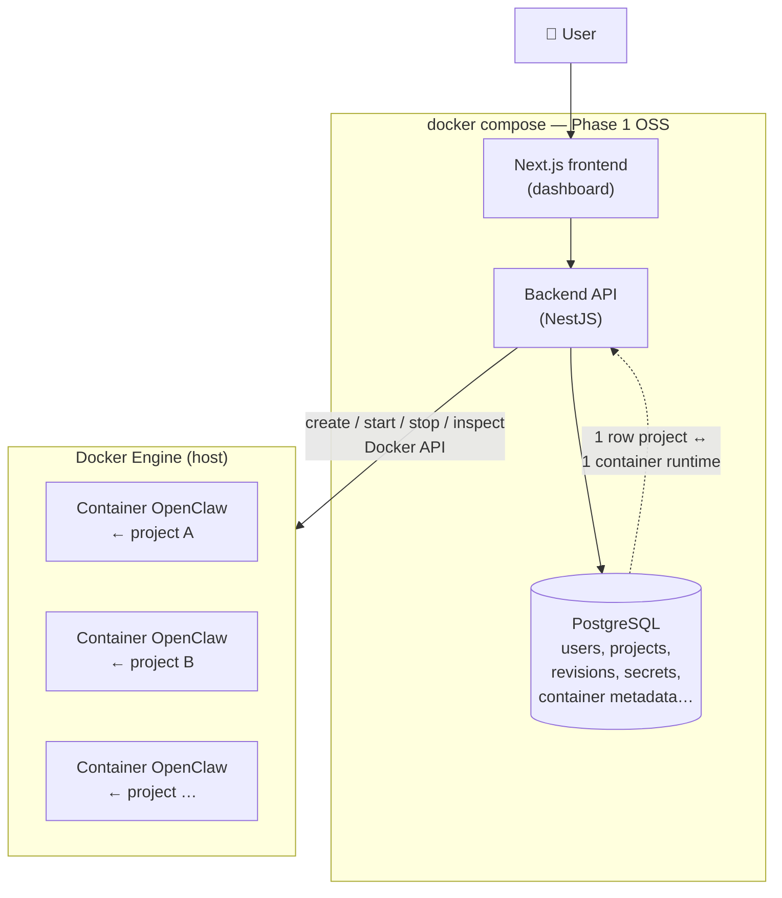
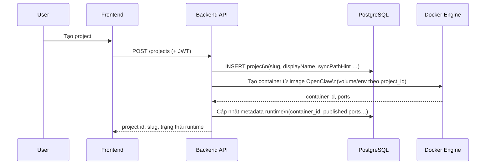
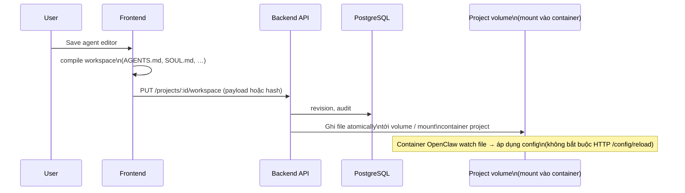

# OpenClaw SaaS — Workflow & kiến trúc vận hành

> **Cập nhật:** 2026-05-20  
> **Phân kỳ:**  
> - **Phase 1 — Mã nguồn mở (OSS):** một **`docker compose`** (frontend, backend, PostgreSQL) để user tự host; **mỗi project trong dashboard = một container** chạy từ image **OpenClaw / `openclaw-worker`** — metadata & workspace **lưu trong DB** (và volume theo `project_id` tùy triển khai). Backend điều phối vòng đời container qua **Docker API** (thường mount `docker.sock` trên host).  
> - **Phase 2 — Dịch vụ SaaS thương mại:** bạn **bán** bản **hosted** (đa tenant, vận hành thay khách), mô hình kinh doanh giống kiểu **[Supabase](https://supabase.com)** (sản phẩm mở + cloud trả phí) hay **[n8n](https://n8n.io)** (tự host mở + **n8n Cloud** do nhà phát hành vận hành) — không đồng nghĩa Phase 1 là “bản demo” của Phase 2; Phase 1 là **sản phẩm gốc** cho community.  
> **Tham chiếu:** `openclaw-architecture.md`, `billing-plan.md` (Phase 2), `proxy-guide.md`.

---

## Vai trò tài liệu

| Thuộc | Không thuộc |
| ----- | ----------- |
| Luồng vận hành **Phase 1 (OSS, self-host)** | Chi tiết giá/credit hosted (→ `billing-plan.md`) |
| Sketch **Phase 2** (cloud bạn bán) | Schema Prisma từng bảng (→ `backend/prisma/schema.prisma`) |
| Ranh OSS vs hosted commercial | Danh sách sprint (→ `roadmap-plan.md`) |

**Thuật ngữ**

- **Project:** đơn vị trong dashboard (cấu hình agent, workspace, bí mật); đồng thời **map 1:1** tới **một container** OpenClaw (trạng thái runtime lưu trong DB hoặc label container).
- **Worker / Gateway:** tiến trình OpenClaw trong **container riêng của project**. **Phase 1:** stack self-host — container chạy trên **cùng máy/VPS** với `docker compose` (hoặc Docker engine remote bạn cấu hình). **Phase 2:** cùng mental model nhưng runtime trên **hạ tầng SaaS** bạn vận hành + billing / quota / multi-tenant hardening.

---

## 1. Vấn đề & cách chia phase

Cộng đồng và team muốn **UI + persistence** cho project/bot đa kênh, **không** phụ thuộc black box — đồng thời bạn muốn một lộ trình **vừa mở cho community vừa có chỗ bán dịch vụ**.

| Phase | Ai vận hành control plane & gateway | Mô hình |
| ----- | ------------------------------------- | ------- |
| **1 — OSS** | Người dùng / tổ chức tự deploy repo mở | **Self-host**; source công khai; mọi người có thể fork, đóng góp, chạy trên infra riêng. |
| **2 — SaaS** | Bạn (nhà cung cấp) | **Hosted product** trả phí: provisioning, backup, SLA, billing, scale — tương tự cloud của Supabase / n8n (khách không bắt buộc tự cài worker). |

- **Phase 1** giải “**một nguồn thật trong DB**” (user, project, revision workspace, secrets) + **mỗi project một container** OpenClaw nhận cấu hình / volume tương ứng (`openclaw.json`, `AGENTS.md`, … — xem `openclaw-architecture.md` §4.5.1). Auth API self-host dùng **JWT**. Container gateway dùng **`gateway.auth`** riêng (không dùng JWT dashboard cho lưu lượng chat).
- **Phase 2** là **sản phẩm đám mây** bạn bán: multi-tenant, orchestration, quota, có thể kèm phần **không publish** (infra, abuse, cost controls) — **không thay thế** cam kết Phase 1 vẫn là nền mở cho community.

---

## 2. Phase 1 — Kiến trúc tổng quan

**Self-host một lần:** `docker compose up` khởi chạy **frontend**, **backend**, **PostgreSQL** (và biến môi trường trỏ tới image OpenClaw build từ `openclaw-worker/`).



**Nguyên tắc Phase 1**

1. **Một project = một container** từ image OpenClaw (tag tùy bạn, build từ `openclaw-worker`). Khi tạo (hoặc “bật”) project, backend **provision container**; khi xóa / tắt project, **dừng & gỡ** container (chính sách volume giữ/xóa tùy bạn ghi rõ trong runbook).
2. **Nguồn sự thật** cho slug, workspace revisions, secrets — **PostgreSQL**; runtime (container id, port published, trạng thái) **cũng lưu hoặc đồng bộ vào DB** để dashboard hiển thị và API kiểm soát.
3. Sau khi user lưu workspace trên dashboard, hệ thống **ghi revision vào DB** và **đẩy file vào volume/bind mount** của đúng container project (hoặc sync trước khi `start`) để gateway **watch** `openclaw.json` / file workspace — xem `openclaw-architecture.md` §4.5.1.
4. **Không** bắt buộc BullMQ `vps-worker`, billing, credit, heavy-job fleet trong **OSS Phase 1** (có thể stub); **SaaS Phase 2** thêm kinh tế hóa, quota, fleet lớn, ingress wildcard thương mại.

---

## 3. Phase 1 — Luồng vận hành (theo người dùng)

### 3.1 Đăng ký / đăng nhập

```mermaid
sequenceDiagram
    participant U as User
    participant FE as Frontend
    participant API as Backend API
    participant DB as PostgreSQL

    U->>FE: Đăng ký / đăng nhập
    FE->>API: POST /auth/* (credential)
    API->>DB: user record
    API-->>FE: JWT (access ± refresh)
    FE-->>U: Session; Bearer cho API
```

- **Auth chốt Phase 1:** **JWT** (access token + refresh theo policy bạn chọn). Gateway OpenClaw **không** dùng JWT này trực tiếp — nó dùng `gateway.auth` (token/password/…) riêng trên máy user.

### 3.2 Tạo project, metadata & container runtime



- **Một hàng `projects` trong DB** gắn với **đúng một container** (khi policy “luôn chạy” hoặc khi user “start”). Thuộc tính `sync_path_hint` có thể gợi ý mount path trên host; **volume có tên / bind mount theo `project_id`** khuyến nghị để cô lập dữ liệu.
- Yêu cầu triển khai: backend có quyền gọi **Docker API** (socket trên host khi compose chạy local, hoặc daemon từ xa).

### 3.3 Soạn agent / skill trên dashboard → biên dịch → sync file



**Ghi chú kỹ thuật**

- Compiler phía frontend/backend nên khớp quy ước file OpenClaw (đã có hướng `frontend/lib/agent-workspace-compile.ts`).
- **Phase 1:** ưu tiên **ghi file** vào **volume gắn với container của đúng project** (cùng quy ước path với `OPENCLAW_CONFIG_PATH` trong container). **Phase 2+** có thể bổ sung `config.patch` qua RPC hoặc `POST /tools/invoke` với operator token — xem `openclaw-architecture.md` §4.2, §4.5.1.

### 3.4 Kênh chat & lưu lượng thời gian thực

1. Mỗi project: **một container OpenClaw** (build từ `openclaw-worker` / image bạn publish) — channel (Telegram, …) được cấu hình trong workspace **trong container đó**.
2. Lưu lượng bot **không** đi qua backend dashboard; API chỉ lo **auth người dùng, CRUD project, sync file/revision, lifecycle container**.
3. **Tùy chọn nâng cao:** vẫn có thể chạy gateway “ngoài compose” (manual) nếu bạn hỗ trợ import/export; **luồng mặc định Phase 1 trong tài liệu này** là **do backend spawn container per project**.

---

## 4. Phase 1 — Phạm vi backend (“có” / “chưa”)

| Hạng mục | Phase 1 |
| -------- | ------- |
| Auth JWT, user, session | Có |
| CRUD project, metadata, revision workspace trong DB | Có |
| **Một project = một container OpenClaw** (start/stop/remove qua Docker API) | **Có** (mô hình OSS đích) |
| Ghi workspace xuống volume / mount mà container project đọc | Có |
| Mã hóa bí mật lưu trữ (SecretCrypto) | Khuyến nghị |
| Health DB + logging | Có |
| Traefik wildcard, ingress đa khách thương mại, autoscale fleet | Tuỳ chọn / chủ yếu **Phase 2** |
| BullMQ / `vps-worker` / idle-shutdown fleet toàn nền tảng | **Không** bắt buộc OSS core |
| Heavy jobs (FFmpeg, Playwright) + credits | **Không** (Phase 2) |
| Worker callback nội bộ (PUT /api/internal/status…) cho fleet SaaS | **Không** bắt buộc Phase 1 |

---

## 5. Phase 1 — Cấu trúc monorepo (tham chiếu)

```text
openclaw-saas/                    # Phase 1: công khai — community self-host
├── frontend/                     # Dashboard Next.js (OSS)
├── backend/                      # API NestJS (OSS)
├── openclaw-worker/              # Nguồn image OpenClaw — **mỗi project = một container** build/pull từ đây
├── vps-worker/                   # Chủ yếu cho Phase 2 hosted orchestrator (tuỳ policy công bố)
└── vps-heavy/                    # Phase 2 hosted heavy compute
```

*Gợi ý sản phẩm: **Phase 1** = những gì bạn **cam kết mở** và hướng dẫn deploy; **Phase 2** = pipeline + config + mã điều khiển cloud **của riêng bạn** (có thể không full OSS), tương tự cloud Supabase/n8n không phải 100% trùng repo self-host.*

---

## 6. Phase 2 — Dịch vụ SaaS trên cloud (bạn bán — kiểu Supabase / n8n)

**Mục tiêu:** khách **đăng ký tài khoản trên cloud của bạn**, trả phí (hoặc free tier), **không** bắt buộc tự cài Docker/gateway; bạn lo vận hành, patch, scale, backup.

**Đặc điểm (sketch — giống mô hình thị trường):**

| Thành phần | Gợi ý |
| ---------- | ----- |
| **Control plane** | Managed API + DB của bạn; tenant isolation; auth session/JWT do dịch vụ phát hành. |
| **Runtime bot/agent** | Worker/gateway (hoặc stack tương đương) chạy trên **hạ tầng bạn**; provisioning qua orchestrator (`vps-worker` hoặc K8s), ingress (Traefik / cloud LB). |
| **Kinh doanh** | Plans, metered usage, support — xem `billing-plan.md`. |
| **Heavy / queue** | Lane riêng (`vps-heavy`, BullMQ, …) nếu bạn bán tính năng nặng. |
| **Mã nguồn** | **Phase 1 OSS** vẫn là “engine + dashboard self-host”; **Phase 2** có thể gồm **repo riêng** hoặc phần **proprietary** (automation nội bộ, chi phí, chống abuse) — tương tự không phải mọi thứ trên Supabase Cloud / n8n Cloud đều là một-one public repo. |
| **Bảo mật** | JWT app vs `gateway.auth`; không public `POST /tools/invoke` — xem `openclaw-architecture.md`. |

```mermaid
flowchart TB
    subgraph P2["Phase 2 — Hosted SaaS\n(sản phẩm cloud bạn bán)"]
        FE2[Frontend\n(branded cloud)]
        API2[Backend API + billing]
        Q[Queues\nspawn / heavy]
        Orc[Orchestrator\n(proprietary ops có thể)]
        Pool[Worker pool\ncontainers / VMs]
        FE2 --> API2
        API2 --> Q
        Q --> Orc
        Orc --> Pool
    end
    User2[User] --> FE2
    Chat[Chat apps] <--> Pool
```

**Từ Phase 1 → Phase 2:** giữ **cùng mental model** “project + workspace files”; Phase 2 thêm **đẩy config xuống runtime hosted**, observability, SLA, **kinh tế hóa** chi phí vận hành — **song song** với việc Phase 1 OSS vẫn được maintain cho community (mô hình tương tự bản self-host vẫn chạy độc lập khi nhà phát hành bán cloud).

---

## 7. Bảng so sánh nhanh

| Tiêu chí | Phase 1 (OSS / community) | Phase 2 (SaaS hosted — bạn bán) |
| -------- | ------------------------- | ------------------------------- |
| **Mô hình** | Self-host, fork, PR | Đăng ký cloud, trả phí / free tier |
| **Tương tự thị trường** | Postgres self-host / n8n self-host | Supabase Cloud / n8n Cloud |
| Gateway chạy ở đâu | **Một container / project** trên Docker của người self-host | Container trên **hạ tầng bạn** (fleet, quota) |
| Đồng bộ cấu hình | **DB revisions** + **ghi file** vào volume container project | Tương tự + orchestrator / billing / multi-tenant hardening |
| Auth | **JWT** (API do người self-host chạy) | Auth do **dịch vụ cloud** bạn cung cấp + billing |
| `vps-worker` / `vps-heavy` | Không bắt buộc OSS core | Thường **có** cho fleet |
| **Cam kết mở** | Core dashboard + API + hướng dẫn deploy **công khai** | Phần vận hành cloud **tuỳ bạn** công bố hay giữ riêng |

---

## 8. Liên kết tài liệu

| Chủ đề | File |
| ------ | ---- |
| Gateway HTTP, session API, config watch, RPC `config.*` | `openclaw-architecture.md` |
| Giá, credit, quota (Phase 2+) | `billing-plan.md` |
| Proxy / ingress an toàn | `proxy-guide.md` |

---

*Ghi chú: tài liệu mô tả **mô hình đích** “**1 project = 1 container**”; code `backend/` (Docker API, cột metadata runtime) có thể **chưa** khớp — cần bổ sung migration/module orchestration. Tài liệu vẫn **phân tách** OSS community vs SaaS bạn kinh doanh; lược đồ fleet/heavy thương mại có thể tái dùng trong “Phase 2 runbook” hoặc `billing-plan.md`.*
